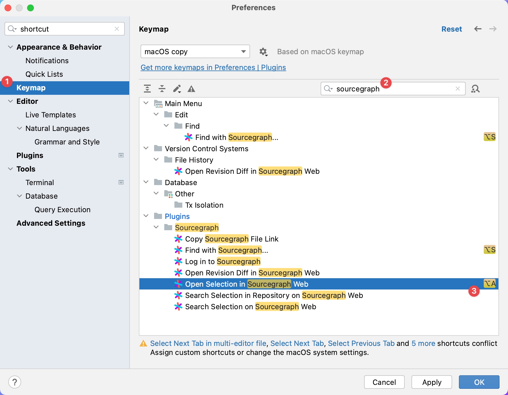

<!-- Plugin description -->

# Sourcegraph for JetBrains IDEs

- **New:** Search with Sourcegraph directly from inside the IDE
- Instantly search in all open source repos and your private code
- Peek into any remote repo in the IDE, without checking it out locally
- Create URLs to specific code blocks to share them with your teammates
- Open your files on Sourcegraph

<!-- Plugin description end -->

## Supported IDEs [](https://plugins.jetbrains.com/plugin/9682-sourcegraph)

The plugin works with all JetBrains IDEs, including:

- IntelliJ IDEA
- IntelliJ IDEA Community Edition
- PhpStorm
- WebStorm
- PyCharm
- PyCharm Community Edition
- RubyMine
- AppCode
- CLion
- GoLand
- DataGrip
- Rider
- Android Studio

**Exception:** Due to a Java bug, search doesn't work with IDE versions **2021.1** and **2021.2** for users with **Apple Silicone** CPUs.

## Installation

- Open settings
  - Windows: Go to `File | Settings` (or use <kbd>Ctrl+Alt+S</kbd>)
  - Mac: Go to `IntelliJ IDEA | Preferences` (or use <kbd>⌘,</kbd>)
- Click `Plugins` in the left-hand pane, then the `Marketplace` tab at the top
- Search for `Sourcegraph`, then click the `Install` button
- Make sure that the `git` command is available in your PATH. We’re going to [get rid of this dependency](https://github.com/sourcegraph/sourcegraph/issues/40452), but for now, the plugin relies on it.
- Restart your IDE if needed
- To search with Sourcegraph, press <kbd>Alt+S</kbd> (<kbd>⌥S</kbd> on Mac).
- To share a link to your code or search through the website, right-click in the editor, and choose an action under the `Sourcegraph` context menu item.
- To use your private Sourcegraph instance, open `Settings | Tools | Sourcegraph` and enter your URL and access token.

## Settings

You can configure the plugin on three levels:

1. **Project-level** settings take the highest priority.
2. **Application-level** settings are second: For _each specific setting_, if the plugin finds no project-level value, then the app-level setting is used.
3. **User-level** (legacy) settings take the lowest priority. Also, note that only three of the settings are available on the user level.

Here is each level in detail.

### Project level

These settings have the highest priority. You can set them in a less than intuitive way:

1. Create a new file at `{project root}/.idea/sourcegraph.xml` if it doesn't exist, with this content:
   ```xml
   <?xml version="1.0" encoding="UTF-8"?>
   <project version="4">
     <component name="Config">
       <option name="instanceType" value="DOTCOM" />
       <option name="url" value="https://company.sourcegraph.com/" />
       <option name="accessToken" value="" />
       <option name="defaultBranch" value="main" />
       <option name="remoteUrlReplacements" value="" />
       <option name="isGlobbingEnabled" value="false" />
     </component>
   </project>
   ```
   If the file already exists, then just add the option lines next to the original ones.
2. Reopen your project to let the IDE catch up with the changes. Now you have custom settings enabled for this project. In the future, when you have this project open and you edit your settings in the Settings UI, they will be saved to the **project-level** file.
3. To remove the project-level settings, open the XML again and remove the lines you want to set on the app level.

**Storage location:** `{project root}/.idea/sourcegraph.xml`

### Application level

This is what you edit when you go to Settings and make changes in the UI. That is, unless you have project-specific settings for your current project.

**Storage location:** App-level settings are stored in a file called `sourcegraph.xml` together with the rest of the IDE settings. [This article](https://intellij-support.jetbrains.com/hc/en-us/articles/206544519-Directories-used-by-the-IDE-to-store-settings-caches-plugins-and-logs) will help you find it if you should need it for anything.

### User level – ⚠️ DEPRECATED ⚠️

This type of settings take the lowest priority, and is something that's rarely used and is only kept for backwards compatibility, and might be removed in the future. So, the plugin is also configurable by removing all creating a file called `.sourcegraph-jetbrains.properties` in your home directory. Both the app-level and project-level XMLs override this, plus it only supports three settings:

```
url = https://sourcegraph.example.com
defaultBranch = example-branch
remoteUrlReplacements = git.example.com, git-web.example.com
```

### Git remote setting

By default, the plugin will use the git remote called `origin` to determine which repository on Sourcegraph corresponds to your local repository. If your `origin` remote doesn’t match Sourcegraph, you may instead configure a Git remote by the name of `sourcegraph`. It will take priority when creating Sourcegraph links.

## Managing Custom Keymaps



You can configure JetBrains to set custom keymaps for Sourcegraph actions:

1. Open the JetBrains preferences panel and go to to the Keymap page.
2. Filter by "sourcegraph" to see actions supplied by this plugin.
3. Now select an option to overwrite the keymap information and supply the new bindings.

## Questions & Feedback

If you have any questions, feedback, or bug report, we appreciate if you [open an issue on GitHub](https://github.com/sourcegraph/sourcegraph/issues/new?title=JetBrains:+&labels=jetbrains-ide).

## Uninstallation

- Open settings
  - Windows: Go to `File | Settings` (or use <kbd>Ctrl+Alt+S</kbd>)
  - Mac: Go to `IntelliJ IDEA | Preferences` (or use <kbd>⌘,</kbd>)
- Click `Plugins` in the left-hand pane, then the `Installed` tab at the top
- Find `Sourcegraph` → Right click → `Uninstall` (or uncheck to disable)

## Development

- Clone `https://github.com/sourcegraph/sourcegraph` (on Windows, you'll need to use WSL2)
- Run `yarn install` in the root directory to get all dependencies
- Run `yarn generate` in the root directory to generate graphql files
- Go to `client/jetbrains/` and run `yarn build` to generate the JS files, or `yarn watch` to watch for changes and regenerate on the fly
- You can test the “Find with Sourcegraph” window by running `yarn standalone` in the `client/jetbrains/` directory and opening [http://localhost:3000/](http://localhost:3000/) in your browser.
- Run the plugin in a sandboxed IDE by running `./gradlew runIde`. This will start the platform with the versions defined in `gradle.properties`, [here](https://github.com/sourcegraph/sourcegraph/blob/main/client/jetbrains/gradle.properties#L14-L16).
  - Note: 2021.3 or later is required for Macs with Apple Silicon chips.
- Build a deployable plugin artifact by running `./gradlew buildPlugin`. The output file is `build/distributions/Sourcegraph.zip`.

## Publishing a new version

The publishing process is based on the [intellij-platform-plugin-template](https://github.com/JetBrains/intellij-platform-plugin-template).

### Publishing from your local machine

1. Update `pluginVersion` in `gradle.properties`

- To create pre-release builds with the same version as a previous one, append `.{N}`. For example, `1.0.0-alpha`, then `1.0.0-alpha.1`, `1.0.0-alpha.2`, and so on.

2. Describe the changes in the `[Unreleased]` section of `client/jetbrains/CHANGELOG.md` then remove any empty headers
3. Go through the [manual test cases](https://docs.google.com/document/d/1LtYeBrSd3Q7mDxq4Qk4T3XRBSWBNux6IXRJOi2WAb6E/edit#) (private doc)
4. Make sure `runIde` is not running
5. Commit your changes
6. Run `PUBLISH_TOKEN=<YOUR TOKEN HERE> ./scripts/release.sh` from inside the `client/jetbrains` directory (You can [generate tokens on the JetBrains marketplace](https://plugins.jetbrains.com/author/me/tokens)).
7. Commit changes and create PR

## Version History

See [`CHANGELOG.md`](https://github.com/sourcegraph/sourcegraph/blob/main/client/jetbrains/CHANGELOG.md).

## Enable web view debugging

Parts of this extension rely on the [JCEF](https://plugins.jetbrains.com/docs/intellij/jcef.html) web view features built into the JetBrains platform. To enable debugging tools for this view, please follow these steps:

1. [Enable JetBrains internal mode](https://plugins.jetbrains.com/docs/intellij/enabling-internal.html)
2. Open Find Actions: (<kbd>Ctrl+Shift+A</kbd> / <kbd>⌘⇧A</kbd>)
3. Search for "Registry..." and open it
4. Find option `ide.browser.jcef.debug.port`
5. Change the default value to an open port (we use `9222`)
6. Restart IDE
7. Open the “Find with Sourcegraph” window (<kbd>Alt+A</kbd> / <kbd>⌥A</kbd>)
8. Switch to a browser window, go to [`localhost:9222`](http://localhost:9222), and select the Sourcegraph window. Sometimes it needs some back and forth to focus the external browser with the JCEF component also focused—you may need to move the popup out of the way and click the external browser rather than using <kbd>Alt+Tab</kbd> / <kbd>⌘Tab</kbd>.
