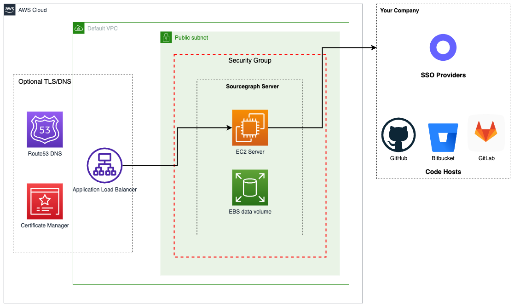

<style>
.launcher {
	margin:  0.5em;
  width: 100%;
}
.launcher > select {
  width: 70%;
  font-size: 1em;
	padding: 0.2em 1em;
	margin-right: 0.25em;
  display: inline-block;
  float: left;
}
</style>

# AWS One-Click Installation for Sourcegraph

To learn more about Sourcegraph, check out [Sourcegraph 101](../../../getting-started/index.md) and the [tour of features](../../../getting-started/tour.md) using real-world examples.

This page describes how to launch a verified and pre-configured Sourcegraph instance in just ~10 minutes using our one-click CloudFormation template and standard AMIs.

<small>Prefer manually installing on AWS yourself? See our [AMI](aws-ami.md) installation options or our [script-install](../single-node/script.md) installation options.</small>

---

## Prerequisites

* An AWS account <small>(most regions are supported, see our [Launcher](#deploy-sourcegraph) below for a complete list)</small>
* General familiarity with AWS
* An [EC2 keypair](https://docs.aws.amazon.com/AWSEC2/latest/UserGuide/create-key-pairs.html) for SSH access
* (optional) A Sourcegraph license to unlock features ([view plans](https://sourcegraph.com/pricing) or [learn how licenses work](../../subscriptions/index.md))

## What will be created

Using our wizard, a single EC2 instance will be created with the following:

- EBS root volume: 50GB
- EBS data volume: 500GB - your Sourcegraph data (code and search indices.)
- AWS Network Security Group
- The latest version of Sourcegraph
- (optional) DNS and TLS via AWS Load Balancer and AWS Certificate Manager

> NOTE: The instance will launch in the default VPC. If your AWS user does not have a default VPC, or the option `Auto-assign public IPv4 address` is not enabled for a subnet within that VPC, please see our [Manual AMI](aws-ami.md) instructions instead.

<a href="aws-oneclick-diagram.png"></img></a>

## Determine your instance size

The number of users and repositories you will use with Sourcegraph determines your instance size. If you fall between two sizes, choose the larger of the two.

<small>Example: With 8,000 users with 80,000 repositories, your instance size would be **L**. If you have 1,000 users with 80,000 repositories, then size **M**.</small>

|                      | **XS**      | **S**       | **M**       | **L**        | **XL**       |
| -------------------- | ----------- | ----------- | ----------- | ------------ | ------------ |
| **Users**            | _<=_ 500    | _<=_ 1,000  | _<=_ 5,000  | _<=_ 10,000  | _<=_ 20,000  |
| **Repositories**     | _<=_ 5,000  | _<=_ 10,000 | _<=_ 50,000 | _<=_ 100,000 | _<=_ 250,000 |
| **Recommended Type** | m6a.2xlarge | m6a.4xlarge | m6a.8xlarge | m6a.12xlarge | m6a.24xlarge |
| **Minimum Type**     | m6a.2xlarge | m6a.2xlarge | m6a.4xlarge | m6a.8xlarge  | m6a.12xlarge |

## Deploy Sourcegraph 🎉

> NOTE: For security, please follow [Amazon best practices](https://docs.aws.amazon.com/accounts/latest/reference/best-practices-root-user.html) and _do not deploy Sourcegraph using your AWS account root user._

> NOTE: By default the CloudFormation template will create standard EBS volumes. If you have special EBS volume encryption requirements, please see the [AWS EBS Encryption guide](https://docs.aws.amazon.com/AWSEC2/latest/UserGuide/EBSEncryption.html) and install Sourcegraph using our [Manual AMI](aws-ami.md) instructions instead.

Choose an AWS Region in the launcher below and click **Launch Stack**. When prompted, choose your **SSH Keypair** and **Sourcegraph Instance Size** per the chart above, then **Create Stack**.

<!-- ref: https://aws.amazon.com/blogs/devops/construct-your-own-launch-stack-url/ -->
<form class="launcher" name="launcher" action="" target="_blank" >
  <select name="region">
    <option value="us-east-2">us-east-2 (US East (Ohio))</option>
    <option value="us-east-1">us-east-1 (US East (N. Virginia))</option>
    <option value="us-west-1">us-west-1 (US West (N. California))</option>
    <option value="us-west-2">us-west-2 (US West (Oregon))</option>
    <option value="af-south-1">af-south-1 (Africa (Cape Town))</option>
    <option value="ap-east-1">ap-east-1 (Asia Pacific (Hong Kong))</option>
    <option value="ap-southeast-3">ap-southeast-3 (Asia Pacific (Jakarta))</option>
    <option value="ap-south-1">ap-south-1 (Asia Pacific (Mumbai))</option>
    <option value="ap-northeast-2">ap-northeast-2 (Asia Pacific (Seoul))</option>
    <option value="ap-southeast-1">ap-southeast-1 (Asia Pacific (Singapore))</option>
    <option value="ap-southeast-2">ap-southeast-2 (Asia Pacific (Sydney))</option>
    <option value="ap-northeast-1">ap-northeast-1 (Asia Pacific (Tokyo))</option>
    <option value="ca-central-1">ca-central-1 (Canada (Central))</option>
    <option value="eu-central-1">eu-central-1 (Europe (Frankfurt)</option>
    <option value="eu-west-1">eu-west-1 (Europe (Ireland))</option>
    <option value="eu-west-2">eu-west-2 (Europe (London)</option>
    <option value="eu-south-1">eu-south-1 (Europe (Milan))</option>
    <option value="eu-west-3">eu-west-3 (Europe (Paris))</option>
    <option value="eu-north-1">eu-north-1 (Europe (Stockholm))</option>
    <option value="me-south-1">me-south-1 (Middle East (Bahrain))</option>
    <option value="me-central-1">me-central-1 (Middle East (UAE))</option>
    <option value="sa-east-1">sa-east-1 (South America (São Paulo))</option>
  </select>
  <input class="submit-btn" formaction="https://console.aws.amazon.com/cloudformation/home#/stacks/quickcreate?stackName=Sourcegraph&templateURL=https://sourcegraph-cloudformation.s3.us-west-2.amazonaws.com/sg-basic.yaml" type="image" alt="aws-oneclick-button" src="https://s3.amazonaws.com/cloudformation-examples/cloudformation-launch-stack.png"/>
</form>

<small>Problem? See our <a href="/admin/troubleshooting">Troubleshooting guide</a></small>

### Confirm you can access Sourcegraph

Find the URL of your Sourcegraph instance in the **Outputs** section of the AWS Stack. On first launch, Sourcegraph may take ~5 minutes to start and may display a `404 not found` page temporarily.

### Executors
Executors are supported using [native kubernetes executors](../../../admin/executors/deploy_executors_kubernetes.md).

Executors support [auto-indexing](../../../code_navigation/explanations/auto_indexing.md) and [server-side batch changes](../../../batch_changes/explanations/server_side.md).

To enable executors you must do the following:
1. Connect to the AMI instance using `ssh`
2. Run `cd /home/ec2-user/deploy/install/`
3. Replace the placeholder `executor.frontendPassword` in `override.yaml`
4. Run the following command to update the executor
```
helm upgrade -i -f ./override.yaml --version "$(cat /home/ec2-user/.sourcegraph-version)" executor sourcegraph/sourcegraph-executor-k8s
```
5. Adding the following to the site-admin config using the password you chose previously
```
"executors.accessToken": "<exector.frontendPassword>",
"executors.frontendURL": "http://sourcegraph-frontend:30080",
"codeIntelAutoIndexing.enabled": true
```
6. Check `Site-Admin > Executors > Instances` to verify the executor connected successfully. If it does not appear try reboot the instance

To use server-side batch changes you will need to enable the `native-ssbc-execution` [feature flag](../../../admin/executors/native_execution.md#enable).

### Secure your instance

By default Sourcegraph will be available over HTTP on the public internet. To secure it you should now perform the following:

1. [Configure DNS and HTTPS/TLS](aws-ami.md#networking) using an AWS Load Balancer and AWS Certificate Manager.
2. [Configure user authentication](../../../admin/auth/index.md) (SSO, SAML, OpenID Connect, etc.)
3. [Review the new Network Security Group](https://docs.aws.amazon.com/vpc/latest/userguide/VPC_SecurityGroups.html) to prevent access from the public internet and follow the principle of least privilege.

## Managing Sourcegraph

### Backup and restore

We strongly recommend you taking [snapshots of the entire Sourcegraph data EBS volume](https://docs.aws.amazon.com/AWSEC2/latest/UserGuide/ebs-creating-snapshot.html) on an [automatic, scheduled basis](https://docs.aws.amazon.com/AWSEC2/latest/UserGuide/snapshot-lifecycle.html). Only the Sourcegraph data volume (500G) needs to be backed up.

To restore from a backup, simply follow our [upgrade instructions](https://docs.sourcegraph.com/admin/deploy/machine-images/aws-ami#upgrade) and skip directly to **Step 2: Launch a new instance** - choosing your desired Sourcegraph version and your backed up data volume.

### Upgrading your Sourcegraph instance

Updates are released every month, and upgrading is a simple process: backup your instance, detach the Sourcegraph data volume, and start a new instance using the latest AMI with your data volume attached. For step-by-step instructions [see here](aws-ami.md#upgrade).

### Monitoring & alerting

Sourcegraph comes with extensive built-in monitoring dashboards & the ability to configure alerts. Please see our [monitoring guide](../../how-to/monitoring-guide.md) for more information.

### Get Support

Feel free to reach out to support@sourcegraph.com if you have any questions.

Business support, training, Slack support, SLAs, and dedicated Technical Advisors are all available through [Business and Enterprise plans](https://sourcegraph.com/pricing).
