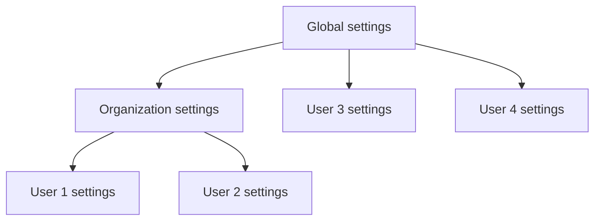

  # Settings cascade diagram

```mermaid
graph TD
  A[Global settings]
  B[Organization settings]
  C[User 1 settings]
  D[User 2 settings]
  E[User 3 settings]
  F[User 4 settings]

  	A --> B
    B --> C
    B -->D
    A --> E
    A --> F
```
