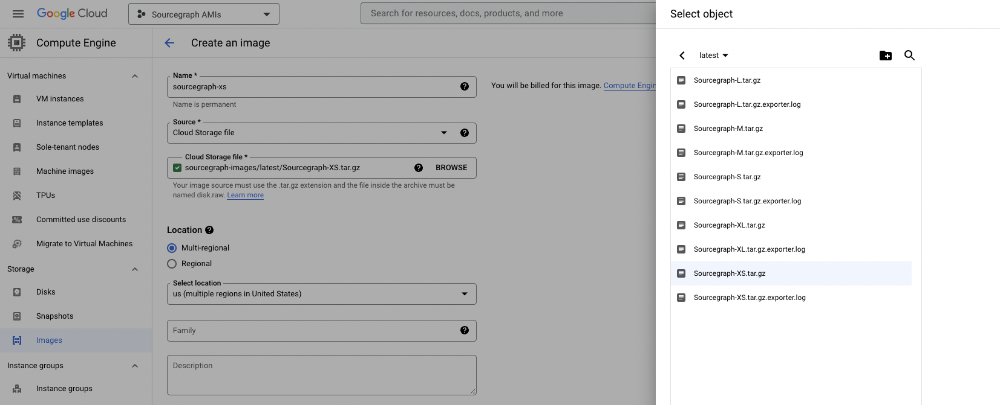
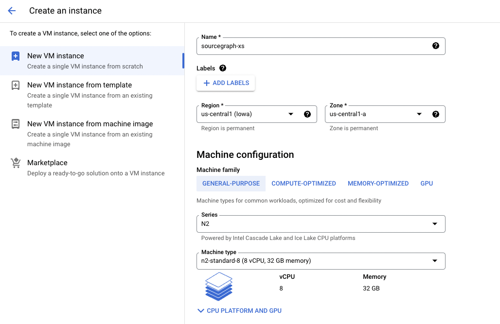
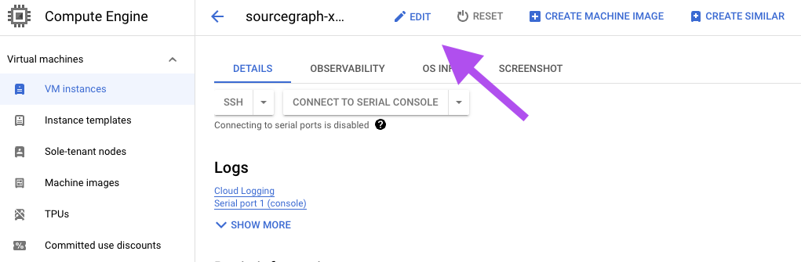

<style>
  .screenshot {
      min-width: 100%
  }
</style>

# Sourcegraph GCE Instances

Sourcegraph [Google Compute Engine (GCE) Images](https://cloud.google.com/compute/docs/images) allow you to quickly deploy a production-ready Sourcegraph instance tuned to your organization's scale in just a few clicks.

Following these docs will provision the following resources:

- A pre-configured Sourcegraph instance running on the latest version
- A root EBS volume with 50GB of storage
- An additional EBS volume for storing code and search indices

> WARNING: Connection to the internet is required to pull Docker images at first launch.

## Instance size chart

Select a deployment image and machine type according to the number of users and repositories you have using this table.

If you fall between two sizes, choose the larger of the two. For example, if you have 8,000 users with 80,000 repositories, your instance size would be **L**. If you have 1,000 users with 80,000 repositories, you should still go with size **M**.

|                  | **XS**     | **S**       | **M**       | **L**       | **XL**      |
|------------------|------------|-------------|-------------|-------------|-------------|
| **Users**        | _<=_ 500   | _<=_ 1,000  | _<=_ 5,000  | _<=_ 10,000 | _<=_ 20,000 |
| **Repositories** | _<=_ 5,000 | _<=_ 10,000 | _<=_ 50,000 | _<=_ 100,000| _<=_ 250,000|
| **Series**       | N2         | N2          | N2          | N2          | N2          |
| **Recommended**  | standard-8 | standard-16 | standard-32 | standard-48 | standard-96 |
| **Minimum**      | standard-8 | standard-8  | standard-16 | standard-32 | standard-64 |
| **Lastest Version Links**   | [download](https://storage.googleapis.com/sourcegraph-images/latest/Sourcegraph-XS.tar.gz) | [download](https://storage.googleapis.com/sourcegraph-images/latest/Sourcegraph-S.tar.gz) | [download](https://storage.googleapis.com/sourcegraph-images/latest/Sourcegraph-M.tar.gz) | [download](https://storage.googleapis.com/sourcegraph-images/latest/Sourcegraph-L.tar.gz) | [download](https://storage.googleapis.com/sourcegraph-images/latest/Sourcegraph-XL.tar.gz) |

> NOTE: Sourcegraph GCE images are optimized for the specific set of resources provided by the machine type, please ensure you use the correct GCE image for the associated GCE machine type. You can [resize your machine type anytime](https://cloud.google.com/compute/docs/instances/changing-machine-type-of-stopped-instance), but your Sourcegraph GCE image must match accordingly. If needed, follow the [upgrade steps](#upgrade) to switch to the correct GCE image that is optimized for your machine type.

---

## Deploy Sourcegraph

#### Step 1: Upload the Sourcegraph instance image to your Google Cloud Storage


1. Download the image (`tar.gz`) file that matches your deployment size from the [instance size chart](#instance-size-chart)
2. Navigate to [Google Cloud Storage](https://console.cloud.google.com/storage) and select a project where you will store the image and deploy the instance in
3. **Upload** the `tar.gz` file to a bucket (create one if needed)
4. Copy the **URL**
   
#### Step 2: Create a new custom image



1. Click **CREATE IMAGE** on top of the [GCE Images Console](https://console.cloud.google.com/compute/images)
   - Name: [Any]
   - Source: Cloud Storage file
   - Cloud Storage file: Click **Browse** and look for the image you uploaded in step 1
   - Select location: select one that works best for you
   - Family: sourcegraph
2. Click **CREATE** to create your custom image of Sourcegraph

#### Step 3: Launch a new instance



1. Create a new VM instance from your [GCE Console](https://console.cloud.google.com/compute)
2. Name the instance
3. Select a **machine type** (see [instance size chart](#instance-size-chart))
4. Under the **Boot disk** section, click **CHANGE** and navigate to the **CUSTOM IMAGES** tab
   - Image: Select the Sourcegraph image created in the previous step
   - Boot disk type: SSD persistent disk
5. Under the **Firewall** section
  - Allow both `HTTP` and `HTTPS` traffic if needed
6. Under the **Advanced options > Disk** section
   - Select **+ ADD NEW DISK**
   - Disk source type: Blank disk
   - Disk type: SSD persistent disk (REQUIRED)
   - Size: 500GB or more --_this should be at least 25-50% *more* than the size of all your repositories on disk. Please refer to the disk usage of your code host instances (eg. GitHub/BitBucket/GitLab) in order to adjust disk size accordingly._
   - Deletion rule: Keep disk
7. <span class="badge badge-note">RECOMMENDED</span> Configure your network setting under the **Advanced options > Network** section

> NOTE: Please allow ~5 minutes for Sourcegraph to initialize. During this time you may observe a `404 page not found` response. If you cannot access the Sourcegraph homepage after 10 minutes, please try reboot your instance.

### SSH

**sourcegraph** is the default username for all GCE image instances.

To SSH into the instance as user `sourcegraph`, add the username in front of your instance name. For example:

```bash
# sourcegraph is the username
$ gcloud compute ssh sourcegraph@your-instance-name --zone=us-central1-a
```
Your can also switch users in the terminal with the command below:

```bash
$ sudo su sourcegraph
```

### Executors
Executors are supported using [native kubernetes executors](../../../admin/executors/deploy_executors_kubernetes.md).

Executors support [auto-indexing](../../../code_navigation/explanations/auto_indexing.md) and [server-side batch changes](../../../batch_changes/explanations/server_side.md).

To enable executors you must do the following:
1. Connect to the instance using `ssh`
2. Run `cd /home/sourcegraph/deploy/install/`
3. Replace the placeholder `executor.frontendPassword` in `override.yaml`
4. Run the following command to update the executor
```
helm upgrade -i -f ./override.yaml --version "$(cat /home/sourcegraph/.sourcegraph-version)" executor sourcegraph/sourcegraph-executor-k8s
```
5. Adding the following to the site-admin config using the password you chose previously
```
"executors.accessToken": "<exector.frontendPassword>",
"executors.frontendURL": "http://sourcegraph-frontend:30080",
"codeIntelAutoIndexing.enabled": true
```
6. Check `Site-Admin > Executors > Instances` to verify the executor connected successfully. If it does not appear try reboot the instance

To use server-side batch changes you will need to enable the `native-ssbc-execution` [feature flag](../../../admin/executors/native_execution.md#enable).


---

## Networking

An ephemeral external IP address is assigned to all VM instances by default; however, the IP address is not static, meaning it changes everytime the VM is rebooted.

As a result, setting up a static IP for your Sourcegraph instance is strongly recommended in production so that you can point your DNS to the static IP easily.

## Upgrade

> WARNING: This upgrade process works with **Sourcegraph instances set up with GCE Images only**. Do not follow this upgrade procedure if you deployed Sourcegraph through other means.

Please take time to review the following before proceeding with the upgrades:

- [Changelog](https://docs.sourcegraph.com/CHANGELOG)
- [Update policy](https://docs.sourcegraph.com/admin/updates#update-policy)
- [Update notes](https://docs.sourcegraph.com/admin/updates/kubernetes)
- [Multi-version upgrade procedure](https://docs.sourcegraph.com/admin/updates/kubernetes#multi-version-upgrade-procedure)

<span class="badge badge-critical">IMPORTANT</span> **Back up your volumes before each upgrade**

#### Option 1

SSH into the VM as user `sourcegraph` and run the following command:

```bash
# Please update the version number according to the upgrade notes
helm upgrade -i -f /home/sourcegraph/deploy/install/override.yaml --version 5.2.4 sourcegraph sourcegraph/sourcegraph
# Note: /home/sourcegraph/deploy/install/override.yaml is the override file for your instance size
```

#### Option 2

##### Step 1: Stop the current instance



1. *Stop* your current Sourcegraph GCP Image instance from the [GCE Console](https://console.cloud.google.com/compute)
2. Navigate to your instance console after your instance is stopped
3. Detach the local disk
   - Click the **EDIT** button located on top of the page in your instance console
   - Remove the **Existing disk** under **Additional disks**
   - **SAVE** the changes

##### Step 2: Launch a new instance

1. Launch a new Sourcegraph instance from a GCE image with a newer version of Sourcegraph
2. Name the instance
3. Select the appropriate **machine type**
4. Under the **Firewall** section
  - Allow both `HTTP` and `HTTPS` traffic if needed
5. Under the **Advanced options > Disk** section
  - Select **+ ATTACH EXISTING DISK**
  - Select the volume you've detached in step 1
  - Deletion rule: Keep disk
6. Under the **Advanced options > Management > Automation** section
  - Copy and paste the following script into the `Startup script` box to upgrade to a specified version

  ```bash
  # Replace version number to the version you are trying to upgrade to
  VERSION='4.0.0'
  echo $VERSION | sudo tee home/sourcegraph/.sourcegraph-version
  ```

You can terminate the stopped Sourcegraph Google Image instance once you have confirmed the new instance is up and running.

> WARNING: You must follow the [multi-version upgrade procedure](https://docs.sourcegraph.com/admin/updates/kubernetes#multi-version-upgrade-procedure) if you are

## Downgrade

Please refer to the upgrade procedure above if you wish to rollback your instance.

---

## Networking

An ephemeral external IP address is assigned to all VM instances by default; however, the IP address is not static, meaning it changes everytime the VM is rebooted. As a result, setting up a static IP for your Sourcegraph instance is strongly recommended in production so that you can point your DNS to the static IP easily.

See the [official docs by Google on configuring IP addresses](https://cloud.google.com/compute/docs/ip-addresses/reserve-static-external-ip-address#promote_ephemeral_ip) for detailed instructions.

Alternatively, you can set up a GCP HTTP(S) Load Balancer for your Sourcegraph GCE Image instance. For more information, please refer to the [official load balancing docs by Google](https://cloud.google.com/load-balancing/docs/https), including [how to use self-managed SSL certificates](https://cloud.google.com/load-balancing/docs/ssl-certificates/self-managed-certs).

## Storage and Backups

We strongly recommend you taking [snapshots of the entire data volume](https://cloud.google.com/compute/docs/disks/create-snapshots) automatically using a [snapshot schedule](https://cloud.google.com/compute/docs/disks/scheduled-snapshots). You can also set up a [snapshot schedule](https://cloud.google.com/compute/docs/disks/scheduled-snapshots) after your instance has been created.

## Manual deploy on GCE

Click [here](../docker-compose/google_cloud.md) to view install instructions for deploying on GCE manually.

## Additional resources

- [GCP Docs: Resize a persistent disk](https://cloud.google.com/compute/docs/disks/resize-persistent-disk)
- [GCP Docs: Changing the machine type](https://cloud.google.com/compute/docs/instances/changing-machine-type-of-stopped-instance)
