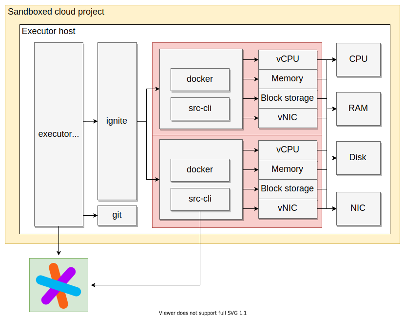

# Executors

<aside class="beta">

Beta This feature is in beta and might change in the future.

<b>We're very much looking for input and feedback on this feature.</b> You can either <a href="https://about.sourcegraph.com/contact">contact us directly</a>, <a href="https://github.com/sourcegraph/sourcegraph">file an issue</a>, or <a href="https://twitter.com/sourcegraph">tweet at us</a>.

</aside>

Executors are Sourcegraph's solution for running untrusted code in a secure and controllable way.

## Installation

To deploy executors to target your Sourcegraph instance, [follow our deployment guide](deploy_executors.md). We currently provide resources to deploy on Google Cloud, AWS, and bare-metal machines.

## Why use executors?

Running untrusted code is a core requirement of features such as precise code navigation [auto-indexing](../code_navigation/explanations/auto_indexing.md), and [running batch changes server-side](../batch_changes/explanations/server_side.md).

Auto-indexing jobs, in particular, require the invocation of arbitrary and untrusted code to support the resolution of project dependencies. Invocation of post-install hooks, use of insecure [package management tools](https://github.com/golang/go/issues/29230), and package manager proxy attacks can create opportunities in which an adversary can gain unlimited use of compute or exfiltrate data. The latter outcome is particularly dangerous for on-premise installations of Sourcegraph, which is the chosen option for companies wanting to maintain strict privacy of their code property.

Instead of performing this work within the Sourcegraph instance, where code is available on disk and unprotected internal services are available over the local network, we move untrusted compute into a sandboxed environment, the _executor_, that has access only to the clone of a single repository on disk (its _workspace_) and to the public internet.

## How it works

Compute jobs are coordinated by the executor binary, which polls a configured Sourcegraph instance for work over HTTPS. There is no need to forward ports or provide incoming firewall access, and the executors can be run across any number of machines and networks.

When a compute job is available, it will be handed out to an executor polling for work. After accepting a job, the executor spawns an empty [Firecracker](https://firecracker-microvm.github.io/) microVM via [Waveworks Ignite](https://ignite.readthedocs.io/en/stable/). A workspace prepared with the target repository is moved into the virtual machine. A series of Docker commands are invoked inside of the microVM, which generally produces an artifact on disk to send back to the Sourcegraph instance via [src CLI](../cli/index.md). The status and logs of this compute job are streamed back to the Sourcegraph instance as the job progresses.

We perform layered security/security in-depth at untrusted boundaries. Untrusted code is run only within a fresh virtual machine, and the host machine running untrusted code does not have privileged access to the Sourcegraph instance. The API to which the executor instances can authenticate provides only the exact data needed to perform the job. See [_Firecracker: Lightweight Virtualization for Serverless Applications_](https://www.amazon.science/publications/firecracker-lightweight-virtualization-for-serverless-applications) for an in-depth look at the isolation model provided by the Firecracker Virtual Machine Monitor (VMM).
