# Sourcegraph HTTP and HTTPS/SSL configuration

Overview:

- [Single Docker image (`sourcegraph/server`): NGINX](#sourcegraph-single-instance-docker)
- [Sourcegraph Cluster (Kubernetes): NGINX](#sourcegraph-cluster-kubernetes)
- [Docker Compose: Caddy 2](#sourcegraph-via-docker-compose-caddy-2)
- [Other Sourcegraph clusters (e.g. pure-docker)](#other-sourcegraph-clusters-e-g-pure-docker)

## Sourcegraph single Docker image and Sourcegraph Cluster (Kubernetes): NGINX

Sourcegraph's single Docker image and Kubernetes deployments use [NGINX](https://www.nginx.com/resources/glossary/nginx/) as a [reverse proxy](https://docs.nginx.com/nginx/admin-guide/web-server/reverse-proxy/) for the Sourcegraph front-end server, meaning NGINX proxies external HTTP (and [HTTPS](#nginx-ssl-https-configuration)) requests to the Sourcegraph front-end.



**Note**: Non-sighted users can view a [text-representation of this diagram](sourcegraph-nginx-mermaid.md).

### Sourcegraph single instance (Docker)

The first time Sourcegraph is run, it will create an [`nginx.conf`](https://github.com/sourcegraph/sourcegraph/blob/main/cmd/server/shared/assets/nginx.conf) file at:

- `~/.sourcegraph/config/nginx.conf` on the Docker/Sourcegraph host (presuming you're using the [quickstart `docker run` command](../index.md#quick-install))
- `/etc/sourcegraph/nginx.conf` inside the container

SSL support requires two things:

1. [Manual editing](#nginx-ssl-https-configuration) of the NGINX configuration file if using the [quickstart docker run command](../index.md#quick-install) as it presumes local or internal usage.
1. (Now that NGINX is listening on port 7443), we need to configure the Sourcegraph container to forward
443 to 7443 by adding `--publish 443:7443` to the `docker run` command:

```bash
docker container run \
  --rm  \
  --publish 7080:7080 \
  --publish 127.0.0.1:3370:3370 \
  --publish 443:7443 \
  \
  --volume ~/.sourcegraph/config:/etc/sourcegraph  \
  --volume ~/.sourcegraph/data:/var/opt/sourcegraph  \
  sourcegraph/server:5.2.4
```

### Sourcegraph Cluster (Kubernetes)

We use the [ingress-nginx](https://kubernetes.github.io/ingress-nginx/) for Sourcegraph Cluster running on Kubernetes. Refer to the [deploy-sourcegraph Configuration](deploy/kubernetes/configure.md#network-access) documentation for more information.

### NGINX SSL/HTTPS configuration

#### If you have a valid SSL certificate

**1.** Copy your SSL certificate and key to `~/.sourcegraph/config` (where the `nginx.conf` file is).

**2.** Edit `nginx.conf` so that port `7080` redirects to `7443` and `7443` is served with SSL. It should look like this:

```nginx
...
http {
    ...
    server {
        listen 7080;
        return 301 https://$host:7443$request_uri;
    }

    server {
        # Do not remove. The contents of sourcegraph_server.conf can change
        # between versions and may include improvements to the configuration.
        include nginx/sourcegraph_server.conf;

        listen 7443 ssl;
        server_name sourcegraph.example.com;  # change to your URL
        ssl_certificate         sourcegraph.crt;
        ssl_certificate_key     sourcegraph.key;

        location / {
            ...
        }
    }
}
```

#### If you need an SSL certificate

There are a few options:

**[1. Generate a browser-trusted certificate using Let's Encrypt (Certbot)](https://certbot.eff.org/)**<br />

1. On the Certbot homepage, select "Nginx" and the operating system of the machine hosting Sourcegraph.
1. Follow the instructions to install and run Certbot.
  1. If there is currently a process (e.g., Sourcegraph) listening on port 80, you'll
     need to stop it before running Certbot:

     ```
     docker stop $(docker ps | grep sourcegraph/server | awk '{ print $1 }')
     ```
  1. When you get to the step describing how to run Certbot, use the "certonly" command: `sudo certbot certonly --nginx`.
  1. When Certbot runs successfully, it will emit the key file `privkey.pem` and cert file
     `fullchain.pem`. These should be renamed to `sourcegraph.key` and `sourcegraph.crt`,
     respectively, if you are using the `nginx.conf` template mentioned in this doc.
  1. Kill the NGINX server that Certbot started: `killall nginx`. Restart Sourcegraph:

     ```
     docker start $(docker ps -a | grep sourcegraph/server | awk '{ print $1 }')
     ```
  1. Now visit your Sourcegraph instance at `https://${YOUR_URL}`. If there are issues, debug by examining the Docker logs:

     ```
     docker logs $(docker ps | grep sourcegraph/server | awk '{ print $1 }')
     ```

**[2. Generate a self-signed certificate](ssl_https_self_signed_cert_nginx.md)**<br />

_This step can be skipped if you already have a certificate from a [globally trusted Certificate Authority (CA) provider](https://en.wikipedia.org/wiki/Certificate_authority#Providers)._

**3. Use your CDN's HTTPS proxy feature**<br />

Some CDNs such as
[Cloudflare](https://support.cloudflare.com/hc/en-us/articles/200170416-End-to-end-HTTPS-with-Cloudflare-Part-3-SSL-options)
can handle the HTTPS connection from the user's browser while allowing the underlying service to
continue serving HTTP (or HTTPS with a self-signed certificate). View your CDN's documentation for
more details.

### Redirect to external HTTPS URL

The URL that clients should use to access Sourcegraph is defined in the `externalURL` property in [site configuration](config/site_config.md). To enforce that clients access Sourcegraph via this URL (and not some other URL, such as an IP address or other non-`https` URL), add the following to `nginx.conf` (replacing `https://sourcegraph.example.com` with your external URL):

``` nginx
# Redirect non-HTTPS traffic to HTTPS.
server {
    listen 80;
    server_name _;

    location / {
        return 301 https://sourcegraph.example.com$request_uri;
    }
}
```

### HTTP Strict Transport Security

[HTTP Strict Transport Security](https://en.wikipedia.org/wiki/HTTP_Strict_Transport_Security) instructs web clients to only communicate with the server over HTTPS. To configure it, add the following to `nginx.conf` (in the `server` block):

``` nginx
add_header Strict-Transport-Security "max-age=31536000; includeSubDomains" always;
```

See [`add_header` documentation](https://nginx.org/en/docs/http/ngx_http_headers_module.html#add_header) and "[Configuring HSTS in nginx](https://www.nginx.com/blog/http-strict-transport-security-hsts-and-nginx/)" for more details.

### Additional NGINX SSL configuration

See the [NGINX SSL Termination](https://docs.nginx.com/nginx/admin-guide/security-controls/terminating-ssl-http/) guide and [Configuring HTTPS Servers](https://nginx.org/en/docs/http/configuring_https_servers.html).

### Next steps

You should configure Sourcegraph's `externalURL` in the [site configuration](config/site_config.md) (and restart the frontend instances) so that Sourcegraph knows its URL.

## Sourcegraph via Docker Compose: Caddy 2

Sourcegraph's [Docker Compose deployment](deploy/docker-compose/index.md) uses [Caddy 2](https://caddyserver.com/) as its reverse proxy. The Docker Compose deployment ships with a few builtin templates that cover common scenarios for exposing Sourcegraph:

- plain HTTP
- HTTPS with automatically provisioned Let's Encrypt certificates
- HTTPS with custom certificates that you provide

Usage instructions are provided via [the `caddy` service's inline comments inside the `docker-compose.yaml` definition](https://github.com/sourcegraph/deploy-sourcegraph-docker/blob/3.14/docker-compose/docker-compose.yaml#L3:L58). Detailed steps are found below.

**Important:** When setting up caddy's automatic Lets Encrypt TLS certification for HTTPS we strongly recommended to test with the staging configuration first. However, the TLS certs provided by Lets Encrypt staging will not be verifiable, and will display an `unknown certificate` error. Once you are done testing, you will need to comment out the staging env variable and uncomment the production env variable for fully functional HTTPS.

### HTTPS with Custom Certificates in Docker Compose

**Important:**  [https.custom-cert.Caddyfile](https://github.com/sourcegraph/deploy-sourcegraph-docker/blob/master/caddy/builtins/https.custom-cert.Caddyfile) should not require any updates and should remain untouched. Updates should be made in the [docker-compose.yaml](https://github.com/sourcegraph/deploy-sourcegraph-docker/blob/master/docker-compose/docker-compose.yaml) file only and as described below.

In your [docker-compose.yaml](https://github.com/sourcegraph/deploy-sourcegraph-docker/blob/master/docker-compose/docker-compose.yaml) within the caddy section:
    
1. In the Environment section of the compose file uncomment & update this line with your Sourcegraph Site Address:

   ```
   - 'SRC_SITE_ADDRESS=sourcegraph.example.com'
   ```
1. In Volumes section of the compose file comment out the following line 

   ```
   - '../caddy/builtins/http.Caddyfile:/etc/caddy/Caddyfile'
   ```
1. In Volumes section of the compose file uncomment the following line: 

   ```
   - '../caddy/builtins/https.custom-cert.Caddyfile:/etc/caddy/Caddyfile' 
   ```
1. In Volumes section of the compose file uncomment and update the following line with your custom cert path:

   ```
   - '/LOCAL/CERT/PATH.pem:/sourcegraph.pem'
   ```
1. In Volumes section of the compose file uncomment and update the following line with your custom cert path:

   ```
   - '/LOCAL/KEY/PATH.key:/sourcegraph.key'
   ```
**NOTE**: When adding your certs to your instance, make sure they are in the `deploy-sourcegraph-docker` folder, not outside of it. They will not be recognized otherwise.

## Other Sourcegraph clusters (e.g. pure-Docker)

NGINX is not included in the [pure-Docker deployment](https://github.com/sourcegraph/deploy-sourcegraph-docker) as it's designed to be minimal and not tied to any specific reverse proxy.

If NGINX is your preferred reverse proxy, we suggest using [the official NGINX docker images](https://hub.docker.com/_/nginx) and following their instructions for [securing HTTP traffic with a proxied server](https://docs.nginx.com/nginx/admin-guide/security-controls/securing-http-traffic-upstream/).
