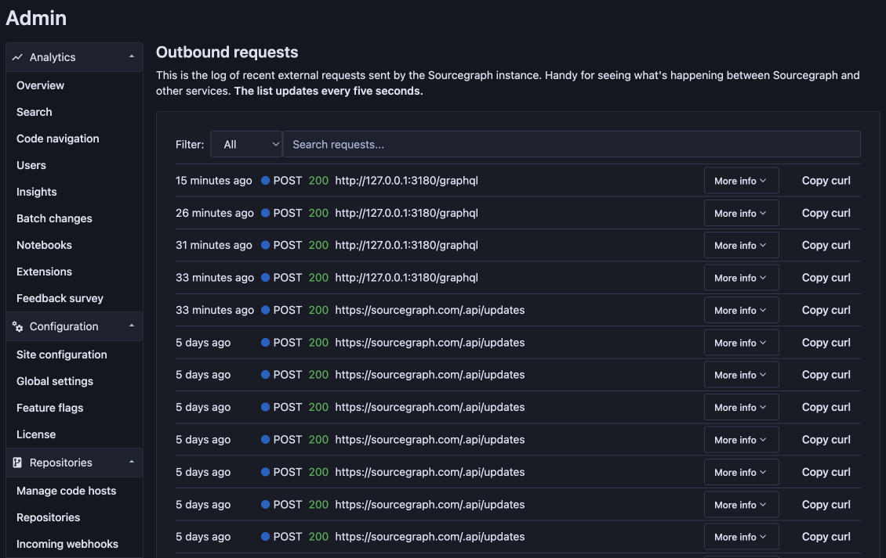

# Outbound request log

On the **Outbound requests** page, site admins can see all outbound requests generated by an instance. The page makes it easy to quickly see how Sourcegraph interacts with other systems, such as code hosts, without manually digging into logs, and is especially useful when debugging.

## Prerequisites

This document assumes you are a [site admin](../index.md).

## Enabling the logs

This feature is off by default. You can enable it by setting `outboundRequestLogLimit` to a non-zero value in the [site config](../config/site_config.md#outboundRequestLogLimit). The recommended value is `50`.

You can later disable it by setting `outboundRequestLogLimit` to `0`, or by removing the setting entirely.

## Privacy

HTTP headers that may be sensitive (such as `Authorization`) are being redacted before saving. Sensitive information is not stored in the logs.

Logs are stored in memory in Redis with an expiration of seven days. They are automatically cleared when you disable the feature.

## Logged data

This data is logged and displayed by the feature:

- The date and time when the request was sent
- The URL the request was sent to
- The HTTP status code of the response
- The duration of the request
- A stack trace to the code lines the request was sent by
- Any errors
- Request headers (with sensitive fields redacted)
- Response headers (with sensitive fields redacted)
- Request body

## Copying the cURL command

To recreate a request for debugging, you can copy the cURL command for any request by clicking the "Copy curl" button. Then you can paste the command into your terminal and run it, or paste it to something like [Postman](https://www.postman.com/) for further debugging.

Keep in mind that some headers might be redacted (you'll see the word "REDACTED" in their place), in which case you'll need to add the missing pieces manually.

Note: You can set the `redactOutboundRequestHeaders` [site config](../config/site_config.md#redactOutboundRequestHeaders) option to `false` to disable the redaction of headers and make the "Copy curl" function more convenient. But for security reasons, this setting is only respected in development environments. 

## Trouble Shooting

### Page failing to load, or loading slowly
If the Outbound Request Log page is failing to load, or loading slowly, you may need to allocate more resources to Redis. To confirm, please check the charts for Redis under the `provisioning indicators` dropdown in grafana. If these charts show that your CPU usage is consistently over the threshold,  allocate more resources to Redis. You can use our [resource estimator](../deploy/resource_estimator.md) as a guide.
