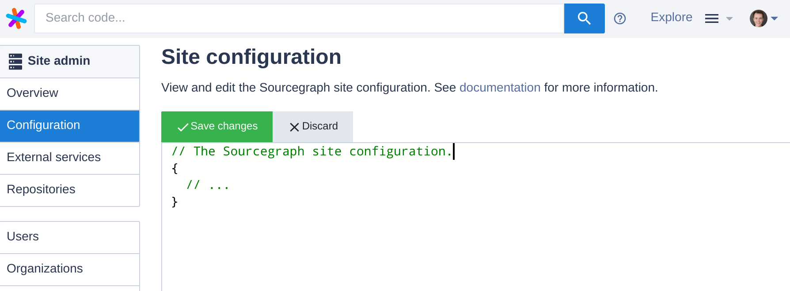

# Site configuration

Sourcegraph is configured by a site configuration JSON file.

To view and edit your site configuration on your Sourcegraph instance:

1.  Click on the user menu (with your username or avatar) in the top navigation bar.
1.  Select **Site admin**.
1.  In the left-hand navigation menu, select **Configuration**.

The URL is `https://sourcegraph.example.com/site-admin/configuration`.

For Kubernetes cluster deployments of Sourcegraph, edit the `config-file.ConfigMap.yaml` file and then use `kubectl apply -f ...` to update the resource.

---

## Next steps

See [all site configuration options](all.md), or read walkthroughs of common configuration use cases:

- [Add repositories to search from your code host](../repo/add.md)
- [Add user authentication providers (SSO)](../auth/index.md)
- [Configure search scopes](../../user/search/scopes.md)
- [Integrate with Phabricator](../../integration/phabricator.md)
- [Add organizations](../../user/organizations.md)
- [Set up HTTPS](../nginx.md)
- [Use a custom domain](../url.md)
- [Updating Sourcegraph Server](../updates.md)
