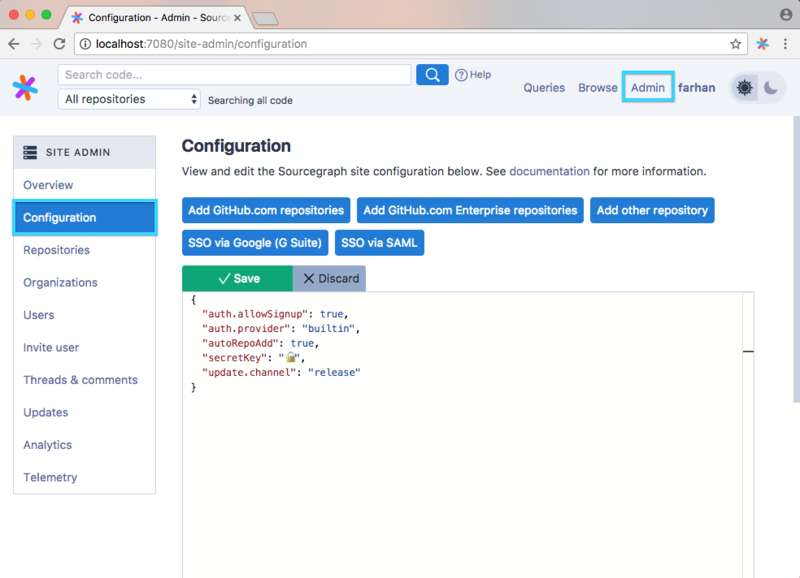

# Site configuration

Sourcegraph is configured by a site configuration JSON file. To view and edit your site configuration on the web-based site admin, go to the configuration page by clicking **Admin** in the top right of any page, and going to **Configuration** in the left side menu. (The URL is `https://sourcegraph.example.com/site-admin/configuration`.)

For Kubernetes cluster deployments of Sourcegraph, edit the `config-file.ConfigMap.yaml` file and then use `kubectl apply -f ...` to update the resource.

---

## Next steps

<!-- TODO!(sqs): emit all site config options -->

See [all site configuration options](all.md), or read walkthroughs of common configuration use cases:

- [Add repositories to search from your code host](../repo/add.md)
- [Add user authentication providers (SSO)](../auth/index.md)
- [Configure search scopes](../../user/search/scopes.md)
- [Integrate with Phabricator](../../integration/phabricator.md)
- [Add organizations](../../user/organizations.md)
- [Add a TLS/SSL certificate](../tls_ssl.md)
- [Use a custom domain](../url.md)
- [Updating Sourcegraph Server](../updates.md)
