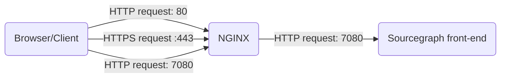

# NGINX and Sourcegraph diagram

```mermaid
graph LR

A(Browser/Client)
B(NGINX)
C(Sourcegraph front-end)

A-->|HTTP request: 80|B
A-->|HTTPS request :443|B
A-->|HTTP request: 7080|B
B-->|HTTP request: 7080|C
```
