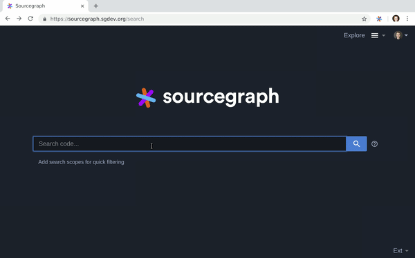

# Running a Sourcegraph trial/POC

If you're still fuzzy (all the code navigation puns intended) on how Sourcegraph can help your team [please reach out](https://about.sourcegraph.com/contact) — we love talking to prospective users, and we can share how some of the world's leading software companies use Sourcegraph internally.

However, if you already know deep down in your bones that Sourcegraph will greatly benefit your teams and you want to verify your hunch, or perhaps you need to prove out the ROI value to your manager; either way, one great way of accomplishing either is by running a Sourcegraph trial or POC (proof of concept) within your team.

## How to run a Sourcegraph trial

Sourcegraph has been deployed inside of thousands of organizations. From our experience working with those that have been successful, and those that haven't, we have collected a set of recommendations for running an effective trial.

> NOTE: Trying Sourcegraph during a Hackathon? Check out our [Hackathon offerings](https://about.sourcegraph.com/hackathons) and [let us know](https://twitter.com/@sourcegraph)!

## 1. Define trial success

What? You shouldn't start with [`docker run...`](../../index.md#quick-install)?

The single most important predictor of a successful trial is deciding and agreeing up-front why your organization needs Sourcegraph, and how you'll judge the results.

Trials typically last **2 to 4 weeks**, and include **25 to 500 initial users (i.e., one full team or organization).**

For measuring a trial, each company will be different. Common examples we find include:

* ### Technical validation

    When a company is replacing an existing and outdated search tool, sometimes simply validating that the deployment works, and is performant, is all that matters.

* ### User engagement

    Sourcegraph provides usage statistics to site admins, at https://sourcegraph.example.com/site-admin/usage-stats. This page will show you how many unique users used the product per day, week, and month, along with per-user metrics so you can validate the numbers.

    Many larger customers rely on usage metrics, such as the percentage of trial users that come back to use Sourcegraph per week or day, to determine whether it was successful.

* ### User surveys

    Sourcegraph provides a built-in survey at https://sourcegraph.example.com/survey, with summary results visible to management at https://sourcegraph.example.com/site-admin/survey-results. These surveys provide both quantitative (average and NPS score) and qualitative user feedback.

* ### Taking Sourcegraph away, and seeing who yells

    While we don't always encourage this, it can be instructive! Take Sourcegraph away for a day, and see who gets upset. Developers may feel like their superpowers were suddenly taken away.

We have helped hundreds of customers run trials and cannot overemphasize enough how much we can help guide you through this process. To encourage letting us help your trial be a success (not to mention take a lot of the trial's organization off your shoulders) we will grant you an Enterprise license key free of charge for the trial's duration! [Please reach out] https://about.sourcegraph.com/contact/sales and ask for your free license key.

## 2. Deploy Sourcegraph

Identify the correct site admin(s) — the person or team responsible for owning the technical deployment — so they can [deploy Sourcegraph internally](../../index.md#quick-install).

Site admins can get direct support from Sourcegraph Engineers in our open source repository's [public issue tracker](https://github.com/sourcegraph/sourcegraph/issues).

## 3. Share with the trial team

**The bare minimum for a successful trial is 25 users.**

As mentioned above, Sourcegraph trials are most successful when they start with a full team or organization (typically 25 to 500 users). If the cohort with access is smaller than that, we find users feel uncomfortable:
  (1) investing in the product and exploring features, as they don't expect it to stick around, and;
  (2) sharing links, telling others about it, posting search results, and other socializing.

Again, we really encourage you to run a trial with more than just the limit of free users on your instance, so please [reach out](https://about.sourcegraph.com/contact) and we'll provide an unlimited license key for up to a month, no questions asked.

A typical message to the team looks like:

>Team
>
>I set up Sourcegraph as a [solution for searching across all of our code | replacement for OpenGrok/Hound/etc.]! It provides regexp search across all of our repositories, with IDE-like features (hover tooltips, go-to-definition, find-references) on code views. [Describe the benefits vs. that are most relevant to your organization.]
>
>Try it out: 
>	- Search: [URL to an example search results page on your Sourcegraph instance] 
>	- Code browsing: [URL to a code file page on your Sourcegraph instance]
>
>[Include screenshots/gif of your Sourcegraph instance here or use sample below]
>

## 4. Deploy integrations

Sourcegraph is most useful when it's at your fingertips. Our [integrations](../../integration/index.md), including our [Chrome and Firefox extensions](../../integration/browser_extension.md) which provide code navigation in GitHub, GitLab, Bitbucket, Phabricator, and more, and also provide a search shortcut from the browser URL bar:

For short trials, however, companies often choose to only set up our search shortcut (or "omnibox") integration (though it provides less functionality, it may require fewer internal approvals). See [our guide for setting up search shortcuts](../../integration/browser_extension/how-tos/browser_search_engine.md).

## 5. Measure success

This looks different for every company. If you've defined success as a 60% net promoter score (NPS), or 50%+ of your trial team using Sourcegraph every week, this is the time to measure! 

Sourcegraph has built-in analytics that are provided to site-admins to help understand and measure the value developers are seeing. Analytics is a free-feature for all instances. [Learn more about our analytics](../../admin/analytics.md).

How did it go? Any feedback for us? [Tweet at us](https://twitter.com/@sourcegraph), and we'll send you some Sourcegraph swag!

## Let us know!

Whether your team found Sourcegraph to be successful or not, please let us know! If so, we'd love to talk about how to grow Sourcegraph internally on a plan that's right for you, and if not, we need to know how to improve.

[Contact us directly](https://about.sourcegraph.com/contact), [file an issue](https://github.com/sourcegraph/sourcegraph) with product feedback/problems/questions, or [tweet at us](https://twitter.com/sourcegraph)!
