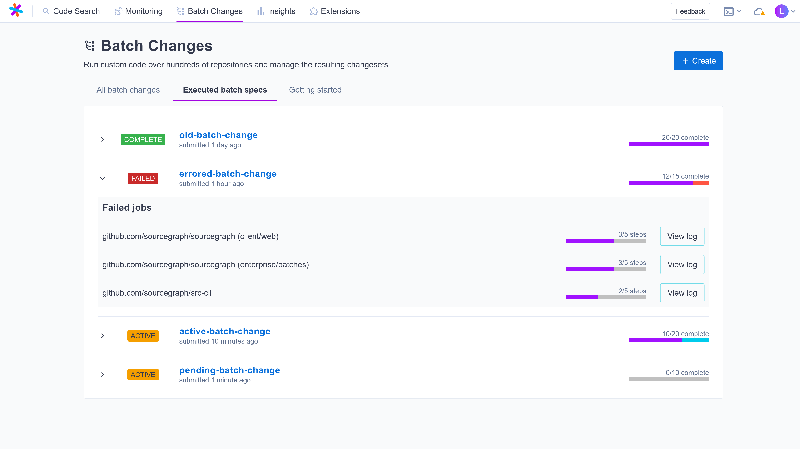

# Configuring Sourcegraph executors to compute Batch Changes

<style>
@import url(executors/draft.css);
</style>

<div id="draft"><span>DRAFT</span></div>

> Note: This is a draft documentation page describing the potential end state of a feature. It should serve only for discussion purposes.

By default, Batch Changes uses a command line interface in your local environment to compute diffs and create changesets. This can be impractical for creating batch changes affecting hundreds or thousands of repositories, with large numbers of workspaces, or if the batch change steps require CPU, memory, or disk resources that are unavailable locally.

<!-- aharvey: This is definitely not a sentence we'd generally write in a real documentation page of this nature, but I get the framing. -->
If you are on a developer tool team rolling out batch changes to your company, the requirement to create batch changes locally might make adoption more difficult for some of your users.

<!-- aharvey: Trying to make the point here that this is also (eventually) useful for Code Intel. -->
**The Sourcegraph executor is an application that allows users to offload expensive tasks, such as computing Batch Changes and generating LSIF data for [precise code intelligence](../../../code_intelligence/explanations/precise_code_intelligence.md).**

- If you use Sourcegraph enterprise on-premise, you can install Sourcegraph executors on infrastructure you own or manage.
- Sourcegraph.com offers a batch change execution environment based on Sourcegraph executor. You don't have to do anything to use it.

The Sourcegraph executor is written in [Go](https://golang.org), and is available to [Sourcegraph Enterprise](../../admin/subscriptions.md) customers.

## Getting started

1. [Ensure you meet the prerequisites.](#prerequisites)
2. [Choose your deployment model.](#deployment-models)

Then follow the instructions for your chosen deployment model:

* [Docker containers running on a server](pure-docker.md)
* [Jobs running in a Kubernetes cluster](kubernetes.md)

You can also read about [how Sourcegraph executors work](#how-executors-work).

## Prerequisites

- Sourcegraph executors can be installed on any operating system that is supported by Go, but we recommend and test primarily against Linux.
- As Sourcegraph executor tasks are run in containers, access to either Docker or Kubernetes is required.
- Sourcegraph executor usage requires requires Sourcegraph version 3.XX.
- As Sourcegraph executors run arbitrary user-submitted code, take care to place the executors within an appropriately secured part of your infrastructure. Network access to Sourcegraph is required, and your users will likely need read only access to internal resources required to run typical Batch Changes, such as internal package repositories and proxies. In general, you should trust Sourcegraph executors as much as you trust your Sourcegraph users to spawn and run services within your infrastructure.

**Network requirements**
Executors need network access to:
- Sourcegraph
- Docker Hub, or a proxy that can deliver the `sourcegraph/src-batch-change-volume-workspace` image
- Any other Docker image source the actual batch spec needs. Also see [pulling from private container registries](https://docs.sourcegraph.com/batch_changes/references/faq#can-i-pull-containers-from-private-container-registries-in-a-batch-change).


## Deployment models

Two deployment models are supported:

1. [**Docker containers running on a server.**](pure-docker.md) In this model, changesets are computed in Docker containers run directly on the server. This model fits well in environments that do not use Kubernetes, have high I/O performance requirements, and that expect relatively steady usage of Batch Changes over time.
1. [**Jobs running in a Kubernetes cluster.**](kubernetes.md) In this model, changeset steps are run as separate Kubernetes jobs. By configuring a namespace for Sourcegraph executor use, limits can be placed on the resources that will be used by executors, and nodes can be scaled in ways that make sense for your environment.

The linked pages provide instructions on installing and configuring Sourcegraph executors in their respective environments.

## Registering the executor

The Sourcegraph executor should register itself automatically when started with a valid `EXECUTOR_FRONTEND_URL` and `EXECUTOR_REGISTRATION_TOKEN`, as described in [configuration](configuration.md). Once registered, it will appear in the executors page within the Sourcegraph site admin, and the following output will appear in the container log:

```
✱ Sourcegraph executor connected to https://sourcegraph.com; listening for jobs
```

If the executor fails to register, check the output of the executor container: it should include an error that points towards the problem. If not, please contact Sourcegraph support!

# Using executors

If one or more Batch Changes executors are registered with the Sourcegraph instance, they will be used to create changesets by default. You can choose to use your local environment to compute the changeset by adding the `--local` flag to the CLI command.

When running a batch change, the executor will attempt to pull missing container images. The environment running the executor must have access to the Docker registry hosting the requested images.

## Who has access to executors

All Batch Changes users on your Sourcegraph instance have access to executors.

## Debugging

You can view your active and recent executed batch specs by going to the **Executed Batch Specs** tab on the Batch Changes page. This will display a list of batch specs that you have executed and their progress:



Batch specs that had one or more failures are marked with the red **Failed** badge. You can expand those batch specs to drill into the details of which jobs failed, and access the logs from the executor. These logs will include all output to stdout and stderr from executing the steps in the batch spec.

> NOTE: Previously executed batch specs are removed after one week.

## Scheduling

Jobs are executed on a FIFO-basis. Users can interrupt a job from the interface.

Each executor will run at least one job at a time: you should scale the number of executors and configure the `EXECUTOR_MAX_NUM_JOBS` environment variable to the maximum concurrency you wish to support. Kubernetes users should also be mindful of [scaling Kubernetes executors](kubernetes.md#scaling).


<!-- # Administering and monitoring executors
aharvey: Executors are currently stateless from the perspective of the backend, as far as I can tell. This likely means we can't build a sensible UI right now for administration or monitoring. Do we want to drop this section?
malomarrec: commented out for now.
-->

# How executors work

Each executor connects to Sourcegraph on startup and waits for jobs to execute. When a batch spec is submitted to Sourcegraph for execution, they are distributed out to available executors on a FIFO basis.

When the executor has a job to run, it uses the [backend](configuration.md) to either start a series of Docker containers, one per step, or a Kubernetes job that in turn runs the required containers. Upon completion, the changeset spec is uploaded to Sourcegraph and a batch change is created, updated, or previewed.

# Executor vs CLI workflow comparison

With the CLI workflow, the changeset creation step has to be ran locally, which can take a long time for large, complex batch changes. With the executor workflow, the changeset creation steps are offloaded to the executor(s), which means that processing is offloaded to the executor, and creating a batch change can be done using the GUI only.


# Limitations

The current version of Sourcegraph executors has known limitations

- access control: if a executor is enabled, all Batch Changes users on the instance can submit jobs to it. In future versions, we may allow site admin to authorize only a group of users.

# FAQ

#### Can large batch changes execution be distributed on multiple executors?

They can! Each changeset that is computed can be run concurrently, provided there are enough executors available. See the [scheduling](#scheduling) section for more detail.

#### I have several machines configured as executors, and they don't have the same specs (eg. memory). Can I submit some batch changes specifically to a given machine?

No, all executors are equal in the eyes of Sourcegraph. We suggest making all executors equal, or using [Kubernetes resource limits](kubernetes.md) to place whatever limits are required for relatively even job distribution.

#### What happens if the execution of a step fails?
If the execution of a step on a given repository fails, that repository will be skipped, and execution on the other repositories will continue. Standard error and output will be available to the user for debugging purposes.
