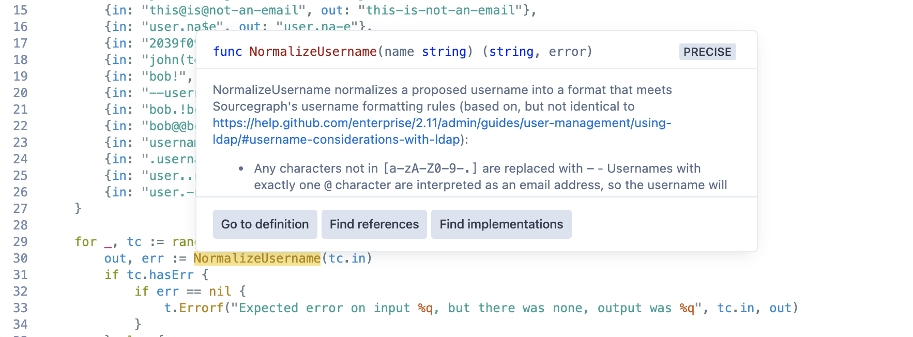
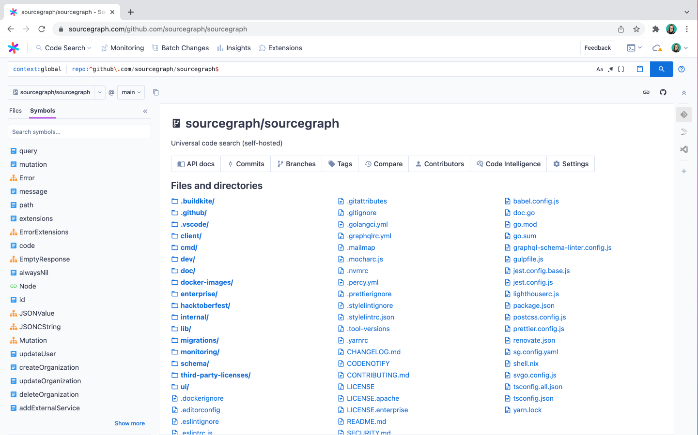

# Code navigation features

Using our [integrations](../../../integration/index.md), all code navigation features are available everywhere you read code! This includes in browsers and GitHub pull requests.

## Popover

Popovers allow you to quickly glance at the type signature and accompanying documentation of a symbol definition without having to context switch to another source file (which may or may not be available while browsing code).

## Go to definition

When you click on the 'Go to definition' button in the popover or click on a symbol's name (in the sidebar or code view), you will be navigated directly to the definition of the symbol.

## Find references

When you select 'Find references' from the popover, a panel will be shown at the bottom of the page that lists all of the references found for both precise and search-based results (from search heuristics). This panel will separate references by repository, and you can optionally group them by file.

> NOTE: When a particular token returns a large number of references, we truncate the results to < 500 to optimize for browser loading speed. We are planning to improve this in the future with the ability to view it as a search so that users can utilize the powerful filtering of Sourcegraph's search to find the references they are looking for.

## Beta Dependency navigation

Dependency navigation enables "Find references" and "Go to definition" to show usages across multiple repositories, including transitive dependencies.
For example, the animation below demonstrates how to trigger "Find references" in the repository `github.com/Netflix/Hystrix` and navigate to results in the Java standard library (JDK).

The instructions to setup dependency navigation are different depending on what language ecosystem you use.

* **Go**: Setup [auto-indexing](auto_indexing.md).
* **Java, Scala, Kotlin**: Setup [auto-indexing](auto_indexing.md) and a [JVM dependencies code host](../../integration/jvm.md).
* **JavaScript, TypeScript**: Setup [auto-indexing](auto_indexing.md) and a [npm dependencies code host](../../integration/npm.md).

> NOTE: This feature is in beta and is not available for other language ecosystems at the moment.

## Find implementations

If precise code navigation is enabled for your repositories, you can click on “Find Implementations” to navigate to a symbol’s interface definition. If you’re at the interface definition itself, clicking on “Find Implementations” will show all the places where the interface is being implemented, allowing you to explore how it’s being used by other users across repositories. It can also show which interfaces a struct implements.

> NOTE: See [this table](../references/indexers.md#quick-reference) for an overview of which languages support this feature.

## Symbol search

We use [Ctags](https://github.com/universal-ctags/ctags) to index the symbols of a repository on-demand. These symbols are used to implement symbol search, which will match declarations instead of plain-text.

### Symbol sidebar

We use [Ctags](https://github.com/universal-ctags/ctags) to index the symbols of a repository on-demand. These symbols are also used for the symbol sidebar, which categorizes declarations by type (variable, function, interface, etc). Clicking on a symbol in the sidebar jumps you to the line where it is defined.

### Symbol search behavior and performance

Here is the query path for symbol searches:

- **Zoekt**: if [indexed search](../../admin/search.md#indexed-search) is enabled and the search is for the tip commit of an indexed branch, then Zoekt will service the query and it should respond quickly. Zoekt indexes the default branch (usually `master` or `main`) and can be configured for [multi-branch indexing](https://docs.sourcegraph.com/code_search/explanations/features#multi-branch-indexing-experimental). The high commit frequency of monorepos reduces the likelihood that Zoekt will be able to respond to symbol searches. Zoekt **eagerly** indexes by listening to repository updates, whereas the symbols service **lazily** indexes the commit being searched.
- **Symbols service with Rockskip enabled**: if [Rockskip](rockskip.md) is enabled, it'll search for symbols stored in Postgres. After initial indexing, queries should be resolved quickly.
- **Symbols service with an index for the commit**: if the symbols service has already indexed this commit (i.e. someone has visited the commit before) then the query should be resolved quickly. Indexes are deleted in LRU fashion to remain under the configured maximum disk usage which [defaults to 100GB](./search_based_code_navigation.md#what-configuration-settings-can-i-apply).
- **Symbols service with an index for a different commit**: if the symbols service has already indexed a **different** commit in the same repository, then it will make a copy of the previous index on disk then run [ctags](https://github.com/universal-ctags/ctags#readme) on the files that changed between the two commits and update the symbols in the new index. This process takes roughly 20 seconds on a monorepo with 40M LOC and 400K files.
- **Symbols service without any indexes (cold start)**: if the symbols service has never seen this repository before, then it needs to run ctags on all symbols and construct the index from scratch. This process takes roughly 20 minutes on a monorepo with 40M LOC and 400K files.

Once the symbols service has built an index for a commit, here's the query performance:

- Exact matches `^foo$` are optimized to use an index
- Prefix matches `^foo` are optimized to use an index
- General regex queries `foo.*bar` are optimized to use an index when using [Rockskip](rockskip.md), otherwise the default implementation needs to scan every symbol
- Path filtering `file:^cmd/` helps narrow the search space

Search-based code navigation uses exact matches `^foo$` and the symbols sidebar uses prefix matches on paths `file:^cmd/` to respond quickly.
