# Code graph data uploads

[Code graph indexers](../references/indexers.md) analyze source code and produce an index file. This file is [uploaded to a Sourcegraph instance](../how-to/index_other_languages.md#4-upload-lsif-data) via [Sourcegraph CLI](../../cli/index.md) for processing. Once processed, its data is available to [precise code navigation queries](precise_code_navigation.md).

## Lifecycle of an upload

Uploaded index files are processed asynchronously from a queue. Each upload has an attached _state_ that can change over time as work associated with that data is performed. The following diagram shows transition paths from one possible state of an upload to another.

The general happy-path for an upload is: _UPLOADING_, _QUEUED_, _PROCESSING_, then _COMPLETED_. 

Processing of a code graph index file may occur due to malformed input or due to transient errors related to the network (for example). An upload will enter the `FAILED` state on the former type of error and the `ERRORED` state. Errored uploads may be retried a number of times before moving into the `FAILED` state.

At any point, the upload record may be deleted. This can happen because the record is being replaced by a newer upload, due to [age of the upload record](../how-to/configure_data_retention.md), or due to explicit deletion by the user. Deleting a record that could be used to resolve to code navigation queries will first move into the `DELETING` state. Moving temporarily into this state allows Sourcegraph to smoothly transition the set of code graph uploads that are visible for query resolution.

Changing the state of an upload to or from the `COMPLETED` state requires that the [repository commit graph](#repository-commit-graph) be [updated](https://sourcegraph.com/search?q=context:global+repo:%5Egithub%5C.com/sourcegraph/sourcegraph%24+file:%5Eenterprise/cmd/worker/internal/codeintel/commitgraph/updater%5C.go+func+%28u+*Updater%29+update%28ctx&patternType=literal). This process can be computationally expensive for the worker service and/or postgres database.
## Lifecycle of an upload (via UI)

After successful upload of an index file, the Sourcegraph CLI will display a URL on the target instance that shows the progress of that upload.

Alternatively, users can see code graph data uploads for a particular repository by navigating to the code graph page in the target repository's index page.

Administrators of a Sourcegraph instance can see a global view of code graph data uploads across all repositories from the _Site Admin_ page.

## Repository commit graph

Sourcegraph keeps a mapping from a commit of a repository to the set of upload records that can resolve a query for that commit. When an upload record moves into or away from the `COMPLETED` state, the set of eligible uploads change and this mapping must be recalculated.

When an upload changes state, we flag the repository as needing to be updated. Then the [`worker` service](https://docs.sourcegraph.com/admin/workers#codeintel-commitgraph)
will update the commit graph and unset the flag for that repository asynchronously.

While this flag is set, the repository's commit graph is considered _stale_. This simply means that there may be some upload records in a `COMPLETED` state that aren't yet being used to resolve code navigation queries (as might be expected).

The state of a repository's commit graph can be seen in the code graph data page in the target repository's index page.

Once the commit graph has updated (and no subsequent changes to that repository's uploads have occurred), the repository commit graph is no longer considered stale.

