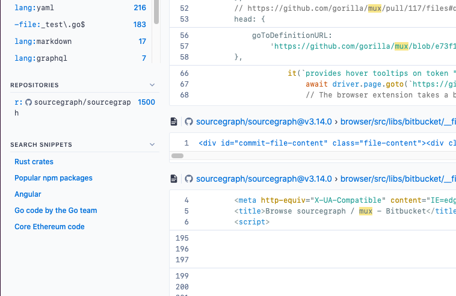

# Search snippets

Every project and team has a different set of repositories they commonly work with and queries they perform regularly. Custom search snippets enable users and organizations to quickly filter existing search results with search fragments matching those use cases.

A search snippet is any valid query. For example, a search snippet that defines all repositories in the "example" organization would be `repo:^github\.com/example/`. After adding this snippet to your settings, it would appear in the search snippet panel in the search sidebar under a label of your choosing (as of v3.29).

_NOTE: Search snippets are temporarily named search.scopes in site configuration files._

---

## Creating custom search snippets

Custom search snippets can be specified at 3 different levels:

- By site admins for all users: in the **Global settings** in the site admin area.
- By organization admins for all organization members: in the organization profile **Settings** section
- By users for themselves only: in the user profile **Settings** section

You can configure search snippets by setting the `search.scopes` to a JSON array of `{name, value}` objects.

The `value` of a search snippet can be any valid query and can include any [search token](../reference/queries.md) (such as `repo:`, `file:`, etc.).

For example, this JSON will create two search snippets:

```json
{
  // ...
  "search.scopes": [
    {
      "name": "Test code",
      "value": "file:(test|spec)"
    },
    {
      "name": "Non-vendor code",
      "value": "-file:vendor/ -file:node_modules/"
    }
  ]
  // ...
}
```

After editing and saving the configuration settings JSON in the profile page, your search snippets will be shown as suggested filters on search results pages.


