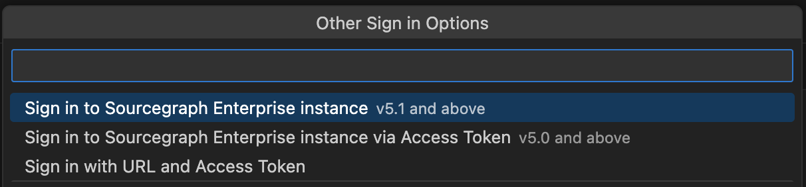
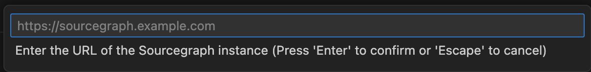
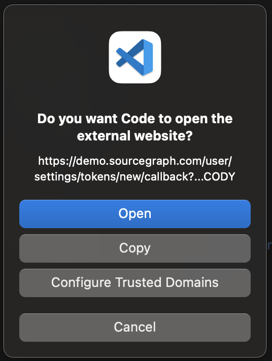
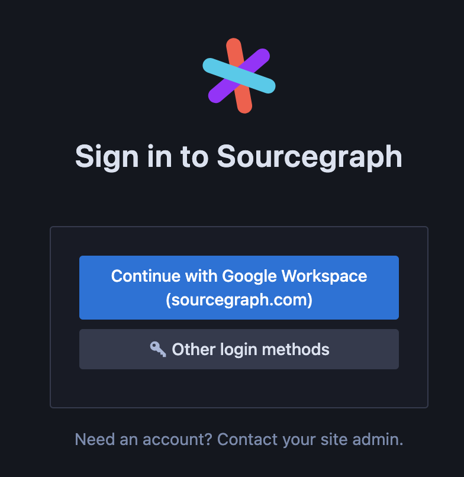
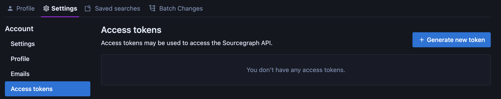
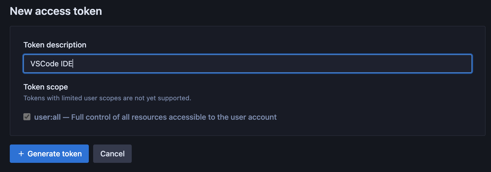
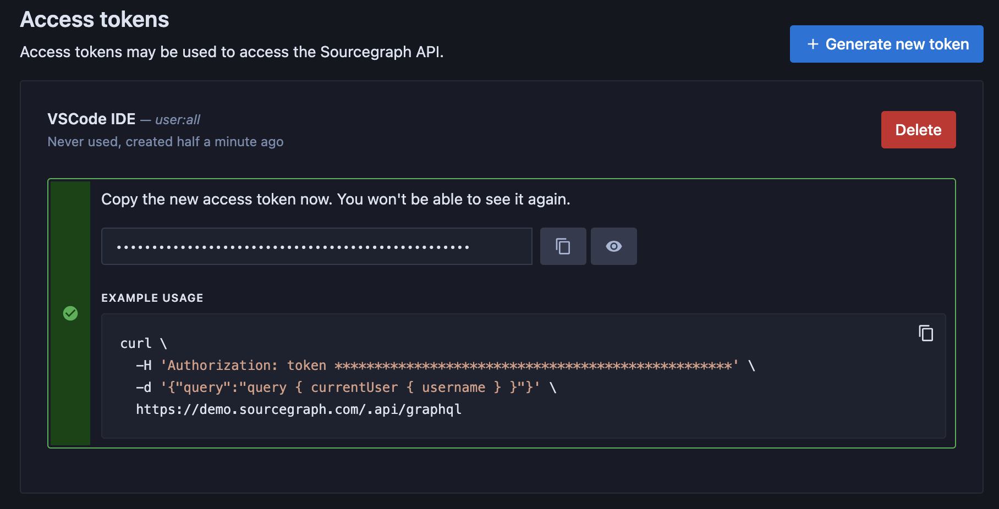
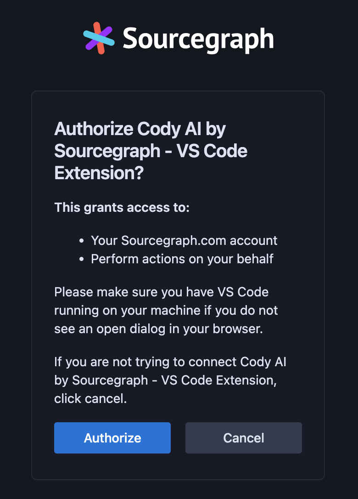
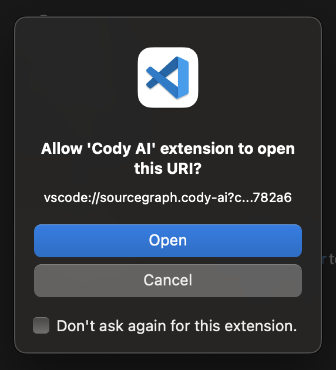

<style>

.markdown-body .cards {
  display: flex;
  align-items: stretch;
}

.markdown-body .cards .card {
  flex: 1;
  margin: 0.5em;
  color: var(--text-color);
  border-radius: 4px;
  border: 1px solid var(--sidebar-nav-active-bg);
  padding: 1.5rem;
  padding-top: 1.25rem;
}

.markdown-body .cards .card:hover {
  color: var(--link-color);
}

.markdown-body .cards .card span {
  color: var(--link-color);
  font-weight: bold;
}

.limg {
  list-style: none;
  margin: 3rem 0 !important;
  padding: 0 !important;
}
.limg li {
  margin-bottom: 1rem;
  padding: 0 !important;
}

.limg li:last {
  margin-bottom: 0;
}

.limg a {
  display: flex;
  flex-direction: column;
  transition-property: all;
  transition-timing-function: cubic-bezier(0.4, 0, 0.2, 1);
  transition-duration: 350ms;
  border-radius: 0.75rem;
  padding-top: 1rem;
  padding-bottom: 1rem;

}

.limg a {
  padding-left: 1rem;
  padding-right: 1rem;
  background: rgb(113 220 232 / 19%);
}

.limg p {
  margin: 0rem;
}
.limg a img {
  width: 1rem;
}

.limg h3 {
  display:flex;
  gap: 0.6rem;
  margin-top: 0;
  margin-bottom: .25rem

}

</style>


# Installing Cody in VS Code

The Cody extension by Sourcegraph enhances your coding experience in VS Code by providing intelligent code suggestions, context-aware autocomplete, and advanced code analysis. This guide will walk you through the steps to install and set up Cody within your VS Code environment.

<ul class="limg">
  <li>
    <a class="card text-left" target="_blank" href="https://marketplace.visualstudio.com/items?itemName=sourcegraph.cody-ai">
    <h3> Cody: VS Code Extension</h3>
    <p>Install Cody's free extension for VS Code.</p>
    </a>
  </li>
</ul>

## Prerequisites

- You have the latest version of [VS Code](https://code.visualstudio.com/) installed
- You have a Free or Pro account through Sourcegraph.com or a Sourcegraph Enterprise account

## Install the VS Code extension

Follow these steps to install the Cody AI extension for VS Code:

- Open VS Code editor on your local machine
- Click the **Extensions** icon in the Activity Bar on the side of VS Code, or use the keyboard shortcut `Cmd+Shift+X` (macOS) or `Ctrl+Shift+X` (Windows/Linux)
- Type **Cody AI** in the search bar and click the **Install** button
- After installing, you may be prompted to reload VS Code to activate the extension


Alternatively, you can also [download and install the extension from the VS Code Marketplace][cody-vscode-marketplace] directly.

## Connect the extension to Sourcegraph

After a successful installation, the Cody icon appears in the [Activity sidebar](https://code.visualstudio.com/api/ux-guidelines/activity-bar). 

### Cody Free or Cody Pro Users

Cody Free and Cody Pro users can sign in to their Sourcegraph.com accounts through GitHub, GitLab, or Google.


### Sourcegraph Enterprise Cody Users

Note: if you currently installed a previous version of Cody, uninstall it and reload VS Code before proceeding to the next steps. Search for "Cody AI” in your VS Code extension marketplace, install it again, and reload VSCode.

Sourcegraph Enterprise users should connect Cody to their Enterprise instance by clicking **Sign In to Your Enterprise Instance**.

You'll be prompted to choose how to sign-in, select **Sign In to Sourcegraph Instances v5.1 and above**.

  

Enter the URL of your Enterprise instance. If you are unsure, please contact your adminstrator.

  

A pop-up will ask if you want to Open the URL in a new window. Click **Open** to open the URL in a new window.


<br>
<br>
Sign in to your instance. If you do not yet have a login, please contact your adminstrator. <br><br>



Create an access token from Account Settings - Access Tokens. Click **+ Generate new token**

  

Name the token and click **+ Generate token**.

  

Copy the token and return to VSCode.

  

Again, click **Sign In to Your Enterprise Instance** and choose **Sign In to Sourcegraph Instances v5.1 and above**. Enter the URL of your instance.

You should now be prompted to authorize Sourcegraph to connect to your VSCode extension using the token you created. Click **Authorize**.



Finally, you will be asked to allow the extension access. CLick **Open**.



VSCode should now display the Cody panel and you're ready to go. 


## Verifying the installation

Once connected, click the Cody icon from the sidebar again. The Cody extension will open in a configurable side panel.


Let's create an autocomplete suggestion to verify that the Cody extension has been successfully installed and is working as expected.

Cody provides intelligent code suggestions and context-aware autocompletions for numerous programming languages like JavaScript, Python, TypeScript, Go, etc.

- Create a new file in VS Code, for example, `code.js`
- Next, type the following algorithm function to sort an array of numbers

```js
function bubbleSort(array){
```

- As you start typing, Cody will automatically provide suggestions and context-aware completions based on your coding patterns and the code context
- These autocomplete suggestions appear as grayed text. To accept the suggestion, press the `Tab` key

<video width="1920" height="1080" loop playsinline controls style="width: 100%; height: auto; max-width: 50rem">
  <source src="https://storage.googleapis.com/sourcegraph-assets/Docs/Media/cody-in-action.mp4" type="video/mp4">
</video>

## Chat

Cody chat in VS Code is available in a tab next to your code. Once connected to Sourcegraph, a **New Chat** button opens the chat window on the right. You can have multiple Cody Chats going simultaneously in separate tabs.

All previous and existing chats are stored under the chats panel on the left. You can download these to share or use later in a `.json` file, or delete them altogether.

### Enhanced Context Selector

Cody's Enhanced Context enables Cody to leverage search and embeddings-based context. Community users can generate local embeddings for their projects by clicking the icon next to the chat input. Users can also disable Enhanced Context or configure more granular control of Cody’s context by including `@-files` or `@#-symbols` in the chat input. This feature only supports local files and paths relative to your workspace. Start typing `@`, and Cody will suggest files for you to include.

> Note: Embeddings for Enterprise users are controlled by their administrators.


The following tables shows what happens when Enhanced Context Selection is enabled or disabled.

|                          | Opened Files                 | Highlighted Code            | Embeddings (If available)  | Search (as backup)            |
|--------------------------|------------------------------|-----------------------------|-----------------------------|-----------------------------|-----------------------------|
| Enhanced Context Enabled  | ✅                           | ✅                          | ✅                          | ✅                          |
| Enhanced Context Disabled | ❌                           | ❌                          | ❌                          | ❌                          |

### LLM Selection

Cody Free users get chat responses supported by Claude 2.0. Cody Pro users can choose the LLM from a drop-down list they'd like Cody to use for chats. For Enterprise users, the administrator determines the LLM, and cannot be changed within the editor.


## Commands

Cody offers quick, ready-to-use [Commands](./../capabilities.md#commands) for common actions to write, describe, fix, and smell code. These allow you to run predefined actions with smart context-fetching anywhere in the editor, like:

- Ask Cody a question
- Add code documentation
- Edit code with instructions
- Explain code
- Identify code smells
- Generate unit tests
- Custom commands

Let's understand how the `/doc` command generates code documentation for a function.

<video width="1920" height="1080" loop playsinline controls style="width: 100%; height: auto; max-width: 50rem">
  <source src="https://storage.googleapis.com/sourcegraph-assets/Docs/Media/code-comments-cody.mp4" type="video/mp4">
</video>


### Custom Commands

<aside class="beta">
<p>
<span class="badge badge-beta">Beta</span>
Custom Commands are currently available in Beta for all users.
</p>
</aside>

For customization and advanced use cases, you can create **Custom Commands** tailored to your requirements. Custom Commands are currently supported by Cody for the VS Code extension version 0.8 and above.

Learn more about [Custom Commands here →](./../capabilities/commands.md#custom-commands)

## Cody VS Code actions

Cody VS Code extension users can also use the **Code Actions** feature to `fix`, `explain`, and `edit` code. These Code Actions are triggered by the following:

- Ask Cody to Fix
- Ask Cody to Explain
- Ask Cody to Edit

These **Code Actions** can be initiated by clicking the **lightbulb** icon in your code file. Highlight a selection of code or click on the red error warnings that indicate a syntax error and use the lightbulb icon to open **Cody QuickFix** options.

- Select **Ask Cody to fix** option
- A **Cody is working** notice will appear
- Once the fix has been applied, the Code Lens will display options to view the diff (**Edits Applied**), **Retry**, **Undo**, or accept the fix (**Done**)

Here's a demo that shows how Code Actions work to fix an error:

<video width="1920" height="1080" loop playsinline controls style="width: 100%; height: auto; max-width: 50rem">
  <source src="https://storage.googleapis.com/sourcegraph-assets/Docs/Media/code-actions.mp4" type="video/mp4">
</video>

A similar process applies to explain and edit Code Actions.

## Cody Natural Language Search

<aside class="beta">
<p>
<span class="badge badge-beta">Beta</span>
Cody Natural Language Search is currently available in Beta for all users on VS Code extension.
</p>
</aside>

Cody's **Natural Language Search** is an AI-powered code search that allows users to input a natural language search query and look for it within their project. For example, "password hashing" or "connection retries".

In the left-hand panel, type your queries in the **Search** field, and the search results are displayed. You can select one of the search results and verify that the correct file opens in a new tab. Natural Language Search works for all Cody users with the ability to search across your entire local codebase from within the IDE.

## Updating the extension

VS Code will typically notify you when updates are available for installed extensions. Follow the prompts to update the Cody AI extension to the latest version.

## More resources

For more information on what to do next, we recommend the following resources:

<div class="cards">
  <a class="card text-left" href="./../quickstart"><b>Cody Quickstart</b><p>This guide recommends how to use Cody once you have installed the extension in your VS Code editor.</p></a>
  <a class="card text-left" href="./../capabilities/commands"><b>Commands in VS Code</b><p>Explore how Cody supports reusable prompts called Commands from within the VS Code extension.</p></a>
</div>

[cody-with-sourcegraph]: cody-with-sourcegraph.md
[cody-with-sourcegraph-config-graph]: cody-with-sourcegraph.md#configure-code-graph-context-for-code-aware-answers
[enable-cody-enterprise]: enable-cody-enterprise.md
[enable-cody-enterprise-config-graph]: enable-cody-enterprise.md#enabling-codebase-aware-answers
[cody-vscode-marketplace]: https://marketplace.visualstudio.com/items?itemName=sourcegraph.cody-ai
