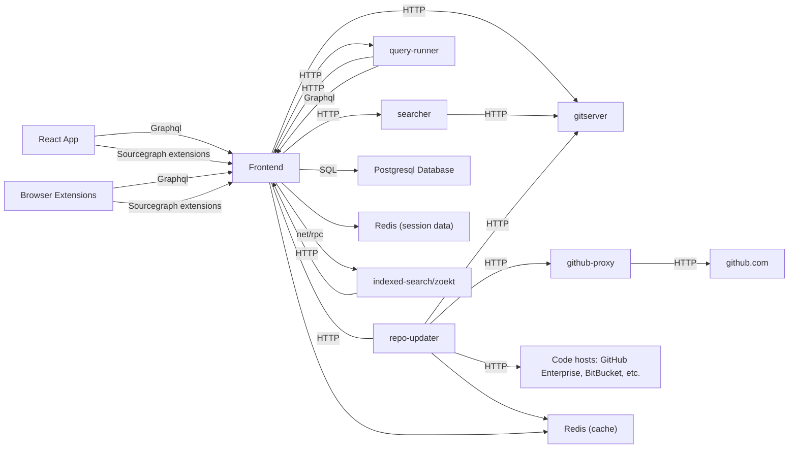

# Sourcegraph Architecture diagram

```mermaid
graph LR
    Frontend-- HTTP -->gitserver
    searcher-- HTTP -->gitserver

    query-runner-- HTTP -->Frontend
    query-runner-- Graphql -->Frontend
    repo-updater-- HTTP -->github-proxy
    github-proxy-- HTTP -->github[github.com]

    repo-updater-- HTTP -->codehosts[Code hosts: GitHub Enterprise, BitBucket, etc.]
    repo-updater-->redis-cache

    Frontend-- HTTP -->query-runner
    Frontend-->redis-cache["Redis (cache)"]
    Frontend-- SQL -->db[Postgresql Database]
    Frontend-->redis["Redis (session data)"]
    Frontend-- HTTP -->searcher
    Frontend-- HTTP ---repo-updater
    Frontend-- net/rpc -->indexed-search
    indexed-search[indexed-search/zoekt]-- HTTP -->Frontend

    repo-updater-- HTTP -->gitserver

    react[React App]-- Graphql -->Frontend
    react[React App]-- Sourcegraph extensions -->Frontend

    browser_extensions[Browser Extensions]-- Graphql -->Frontend
    browser_extensions[Browser Extensions]-- Sourcegraph extensions -->Frontend
```
