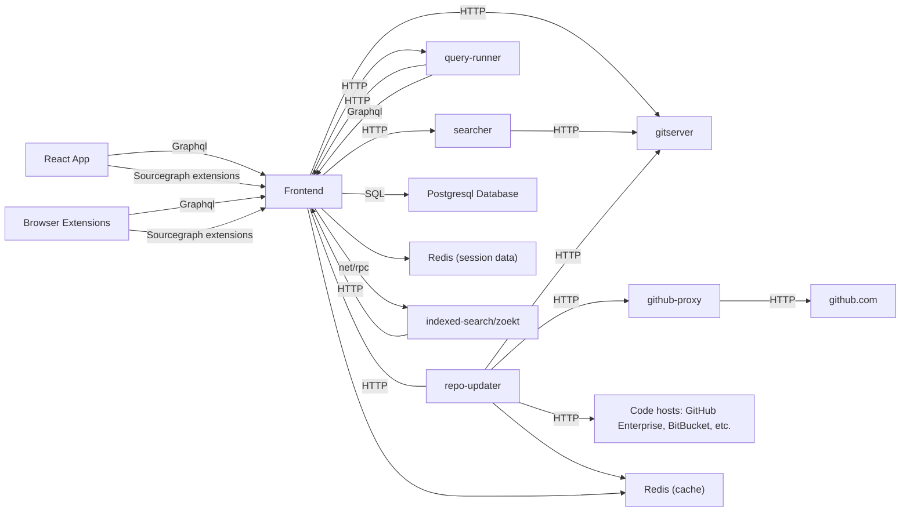

# Sourcegraph architecture overview

This is a high level overview of our architecture at Sourcegraph so you can understand how our services fit together.

## Diagram

To view this diagram in its rendered form on GitHub, [install the Sourcegraph browser extension](https://docs.sourcegraph.com/integration/browser_extension).

## Services

Here are the services that compose Sourcegraph.

### frontend ([code](https://github.com/sourcegraph/sourcegraph/tree/master/cmd/frontend))

The frontend serves our [web app](web_app.md) and hosts our [GraphQL API](../api/graphql.md).

Application data is stored in our Postgresql database.

Session data is stored in redis.

### github-proxy ([code](https://github.com/sourcegraph/sourcegraph/tree/master/cmd/github-proxy))

Proxies all requests to github.com to keep track of rate limits and prevent triggering abuse mechanisms.

### gitserver ([code](https://github.com/sourcegraph/sourcegraph/tree/master/cmd/gitserver))

Mirrors repositories from their code host. All other Sourcegraph services talk to gitserver when they need data from git. Requests for fetch operations, however, should go through repo-updater.

### Sourcegraph extensions

[Sourcegraph extensions](../extensions/index.md) add features to Sourcegraph, including language support. Many extensions rely, in turn, on language servers (implementing the [Language Server Protocol](https://microsoft.github.io/language-server-protocol/)) to provide code intelligence (hover tooltips, jump to definition, find references).

### query-runner ([code](https://github.com/sourcegraph/sourcegraph/tree/master/cmd/query-runner))

Periodically runs saved searches and sends notification emails.

### repo-updater ([code](https://github.com/sourcegraph/sourcegraph/tree/master/cmd/repo-updater))

Repo-updater (which may get renamed since it does more than that) tracks the state of repos, and is responsible for automatically scheduling updates ("git fetch" runs) using gitserver. Other apps which desire updates or fetches should be telling repo-updater, rather than using gitserver directly, so repo-updater can take their changes into account.

### searcher ([code](https://github.com/sourcegraph/sourcegraph/tree/master/cmd/searcher))

Provides on-demand search for repositories. It scans through a git archive fetched from gitserver to find results.

### indexed-search/zoekt ([code](https://github.com/sourcegraph/zoekt))

Provides search results for repositories that have been indexed.

We forked https://github.com/google/zoekt.

### symbols ([code](https://github.com/sourcegraph/sourcegraph/tree/master/cmd/symbols))

Indexes symbols in repositories using Ctags.

### syntect ([code](https://github.com/sourcegraph/syntect_server))

Syntect is a Rust service that is responsible for syntax highlighting.

### Browser extensions ([code](https://github.com/sourcegraph/sourcegraph/tree/master/client/browser) | [docs](https://docs.sourcegraph.com/integration/browser_extension))

We publish browser extensions for Chrome, Firefox, and Safari, that provide code intelligence (hover tooltips, jump to definition, find references) when browsing code on code hosts. By default it works for open-source code, but it also works for private code if your company has a Sourcegraph deployment.

It uses GraphQL APIs exposed by the frontend to fetch data.

### Editor extensions ([docs](https://docs.sourcegraph.com/integration/editor))

Our editor extensions provide lightweight hooks into Sourcegraph, currently.
