# Sourcegraph Architecture Overview

This is a high level overview of our architecture at Sourcegraph so you can understand how our services fit together.

<!--
Updating the architecture image

TODO: Automate this or replace mermaidjs diagrams

TLDR: Get @ryan-blunden to render a new svg after making changes to architecture.mermaid.

After changing architecture.mermaid, render the new diagram at https://mermaidjs.github.io/mermaid-live-editor/, set "theme" to be "neutral" in the config textarea, then download and replace img/architecture.svg. But there's one more step.

if you try rendering the downloaded SVG as is, the text is cut off in most boxes. This is because the  downloaded SVG is missing font styles that were present in the live editor page.

To fix, open the new architecture.svg, then add the following to the first class (`#mermaid-numbers .label`).

  font-size: 14px;
  font-variant: tabular-nums;
  line-height: 1.5;

Save architecture.svg, view architecture.md and the labels should now render correctly.
-->

## Services

Here are the services that compose Sourcegraph.

### frontend ([code](https://github.com/sourcegraph/sourcegraph/tree/master/cmd/frontend))

The frontend serves our [web app](web_app.md) and hosts our [GraphQL API](../api/graphql.md).

Application data is stored in our Postgresql database.

Session data is stored in redis.

#### Scaling

Typically there are multiple replicas running in production to scale with load.

frontend tends to use a large amount of memory. For example our search architecture does a scatter and gather amongst the search backends in the frontend. The gathering of results can result in a lot of memory usage, even though the final result set returned to the user is much smaller. There are a few more examples of these since our frontend has a monolithic architecture. Additionally we haven't optimized for memory usage since it hasn't caused us issues in production since we can just scale it out.

### github-proxy ([code](https://github.com/sourcegraph/sourcegraph/tree/master/cmd/github-proxy))

Proxies all requests to github.com to keep track of rate limits and prevent triggering abuse mechanisms.

There is only one replica running in production. However, we can have multiple replicas to increase our rate limits (rate limit is per IP).

### gitserver ([code](https://github.com/sourcegraph/sourcegraph/tree/master/cmd/gitserver))

Mirrors repositories from their code host. All other Sourcegraph services talk to gitserver when they need data from git. Requests for fetch operations, however, should go through repo-updater.

#### Scaling

gitserver's memory usage consists of short lived git subprocesses.

This is an IO and compute heavy service since most Sourcegraph requests will trigger 1 or more git commands. As such we shard requests for a repo to a specific replica. This allows us to horizontally scale out the service. 

The service is stateful (maintaining git clones). However, it only contains data mirrored from upstream code hosts.

### Sourcegraph extensions

[Sourcegraph extensions](../extensions/index.md) add features to Sourcegraph, including language support. Many extensions rely, in turn, on language servers (implementing the [Language Server Protocol](https://microsoft.github.io/language-server-protocol/)) to provide code intelligence (hover tooltips, jump to definition, find references).

### query-runner ([code](https://github.com/sourcegraph/sourcegraph/tree/master/cmd/query-runner))

Periodically runs saved searches and sends notification emails. Only one replica should be running.

### repo-updater ([code](https://github.com/sourcegraph/sourcegraph/tree/master/cmd/repo-updater))

Repo-updater (which may get renamed since it does more than that) tracks the state of repos, and is responsible for automatically scheduling updates ("git fetch" runs) using gitserver. Other apps which desire updates or fetches should be telling repo-updater, rather than using gitserver directly, so repo-updater can take their changes into account. Only one replica should be running.

### searcher ([code](https://github.com/sourcegraph/sourcegraph/tree/master/cmd/searcher))

Provides on-demand search for repositories. It scans through a git archive fetched from gitserver to find results.

This service should be scaled up the more on-demand searches that need to be done at once. For a search the frontend will scatter the search for each repo@commit across the replicas. The frontend will then gather the results. Like gitserver this is an IO and compute bound service. However, its state is a cache which can be lost at anytime.

### indexed-search/zoekt ([code](https://github.com/sourcegraph/zoekt))

Provides search results for repositories that have been indexed.

This service can only have one replica. Typically large customers provision a large node for it since it is memory and CPU heavy. Note: We could shard across multiple replicas to scale out. However, we haven't had a customer were this is necessary yet so haven't written the code for it yet.

We forked [zoekt](https://github.com/google/zoekt) to add some Sourcegraph specific integrations. See our [fork's README](https://github.com/sourcegraph/zoekt/blob/master/README.md) for details.

### symbols ([code](https://github.com/sourcegraph/sourcegraph/tree/master/cmd/symbols))

Indexes symbols in repositories using Ctags. Similar in architecture to searcher, except over ctags output.

### syntect ([code](https://github.com/sourcegraph/syntect_server))

Syntect is a Rust service that is responsible for syntax highlighting.

Horizontally scalable, but typically only one replica is necessary.

### Browser extensions ([code](https://github.com/sourcegraph/sourcegraph/tree/master/client/browser) | [docs](https://docs.sourcegraph.com/integration/browser_extension))

We publish browser extensions for Chrome, Firefox, and Safari, that provide code intelligence (hover tooltips, jump to definition, find references) when browsing code on code hosts. By default it works for open-source code, but it also works for private code if your company has a Sourcegraph deployment.

It uses GraphQL APIs exposed by the frontend to fetch data.

### Editor extensions ([docs](https://docs.sourcegraph.com/integration/editor))

Our editor extensions provide lightweight hooks into Sourcegraph, currently.
