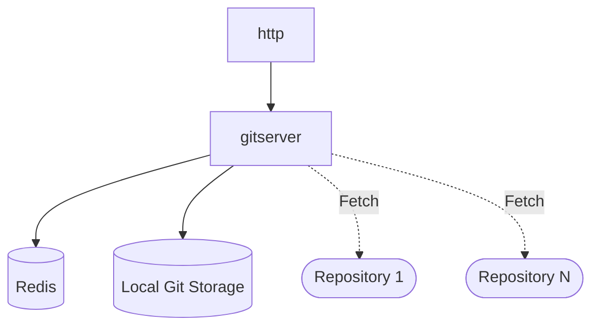

# gitserver

Link: https://github.com/sourcegraph/sourcegraph/tree/master/cmd/gitserver

## TLDR

Mirrors repositories from their code host. All other Sourcegraph services talk to gitserver when they need data from git. Requests for fetch operations, however, go through repo-updater.

## Config

- `HONEYCOMB_TEAM`: The key used for Honeycomb event tracking. (value: "")
- `INSECURE_DEV`: Running in insecure dev (local laptop) mode (value: "false")
- `LIGHTSTEP_INCLUDE_SENSITIVE`: send span logs to LightStep (value: "")
- `NO_COLOR`: Disable colored output (value: "")
- `REDIS_CACHE_ENDPOINT`: redis used for cache data. Default redis-cache:6379 (value: "")
- `REDIS_ENDPOINT`: redis endpoint. Used as fallback if REDIS_CACHE_ENDPOINT or REDIS_STORE_ENDPOINT is not specified. (value: "")
- `REDIS_STORE_ENDPOINT`: redis used for persistent stores (eg HTTP sessions). Default redis-store:6379 (value: "")
- `SG_HTTP_TRACE`: additional logging for each HTTP request (value: "false")
- `SITE_CONFIG_ESCAPE_HATCH_PATH`: Path where the site-config.json escape-hatch file will be written. (value: "\$HOME/site-config.json")
- `SOURCEGRAPHDOTCOM_MODE`: run as Sourcegraph.com, with add'l marketing and redirects (value: "false")
- `SRC_FRONTEND_INTERNAL`: HTTP address for internal frontend HTTP API. (value: "sourcegraph-frontend-internal")
- `SRC_GITSERVER_REFSPECS`: EXPERIMENTAL: override refspec we fetch. Space separated. (value: "")
- `SRC_GITSERVER_TRACE`: Toggles trace logging to stderr (value: "false")
- `SRC_LOG_FORMAT`: log format (logfmt, condensed) (value: "logfmt")
- `SRC_LOG_LEVEL`: upper log level to restrict log output to (dbug, info, warn, error, crit) (value: "dbug")
- `SRC_PROF_HTTP`: net/http/pprof http bind address. (value: ":6060")
- `SRC_PROF_SERVICES`: list of net/http/pprof http bind address. (value: "[]")
- `SRC_REDIS_WAIT_FOR`: Duration to wait for Redis to become ready before quitting (value: "90s")
- `SRC_REPOS_DESIRED_PERCENT_FREE`: Target percentage of free space on disk. (value: "10")
- `SRC_REPOS_DIR`: Root dir containing repos. (value: "/data/repos")
- `SRC_REPOS_JANITOR_INTERVAL`: Interval between cleanup runs (value: "1m")
- `SRC_RUN_REPO_CLEANUP`: Periodically remove inactive repositories. (value: "")

## Diagram

## Notes

- Had to get all options from `--help`, but `--help` does not print the other `--` options
- API Definition
  - Example API call
- Scoped diagram
- The [architecture document](https://docs.sourcegraph.com/dev/architecture/life-of-a-repository) says "repo-updater will periodically list all repositories from all sources and update the table". Where is the SQL configuration?
