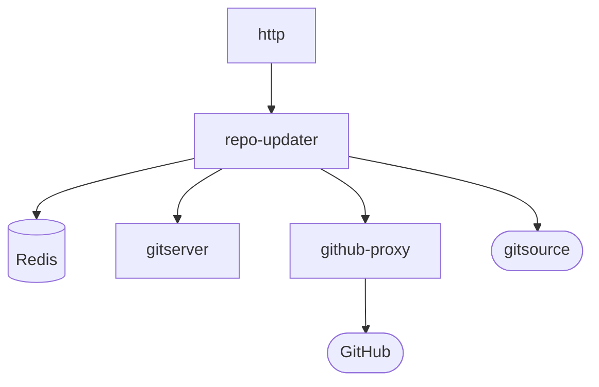

# repo-updater

Link: https://github.com/sourcegraph/sourcegraph/tree/master/cmd/repo-updater

Repo-updater tracks the state of repos, and is responsible for automatically scheduling updates ("git fetch" runs) using gitserver.

## Config

- `GITHUB_BASE_URL`: base URL for GitHub.com API (used for github-proxy) (value: "http://github-proxy")
- `INSECURE_DEV`: Running in insecure dev (local laptop) mode (value: "false")
- `LIGHTSTEP_INCLUDE_SENSITIVE`: send span logs to LightStep (value: "")
- `NO_COLOR`: Disable colored output (value: "")
- `REDIS_CACHE_ENDPOINT`: redis used for cache data. Default redis-cache:6379 (value: "")
- `REDIS_ENDPOINT`: redis endpoint. Used as fallback if REDIS_CACHE_ENDPOINT or REDIS_STORE_ENDPOINT is not specified. (value: "")
- `REDIS_STORE_ENDPOINT`: redis used for persistent stores (eg HTTP sessions). Default redis-store:6379 (value: "")
- `SG_HTTP_TRACE`: additional logging for each HTTP request (value: "false")
- `SITE_CONFIG_ESCAPE_HATCH_PATH`: Path where the site-config.json escape-hatch file will be written. (value: "\$HOME/site-config.json")
- `SOURCEGRAPHDOTCOM_MODE`: run as Sourcegraph.com, with add'l marketing and redirects (value: "false")
- `SRC_FRONTEND_INTERNAL`: HTTP address for internal frontend HTTP API. (value: "sourcegraph-frontend-internal")
- `SRC_GITHUB_DISABLE`: disables communication with GitHub instances. Used to test GitHub service degredation (value: "false")
- `SRC_LOG_FORMAT`: log format (logfmt, condensed) (value: "logfmt")
- `SRC_LOG_LEVEL`: upper log level to restrict log output to (dbug, info, warn, error, crit) (value: "dbug")
- `SRC_PROF_HTTP`: net/http/pprof http bind address. (value: ":6060")
- `SRC_PROF_SERVICES`: list of net/http/pprof http bind address. (value: "[]")
- `SRC_REDIS_WAIT_FOR`: Duration to wait for Redis to become ready before quitting (value: "90s")

## Diagram

