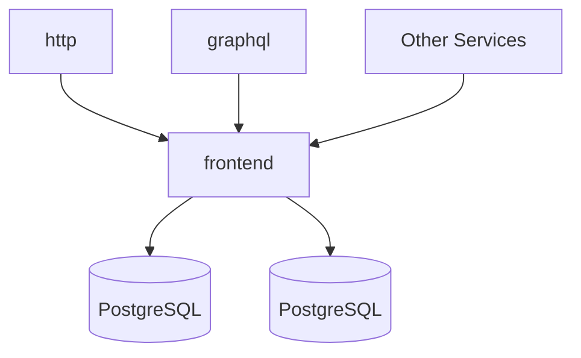

# Frontend

Link: https://github.com/sourcegraph/sourcegraph/tree/master/cmd/frontend

The frontend serves our web application and hosts our GraphQL API. It also provides configuration to other services.

## Config

- `ASSETS_ROOT`: URL to web assets. (value: "/.assets")
- `CACHE_DIR`: directory to store cached archives. (value: "/tmp")
- `CONFIGURATION_MODE`: ???
- `DISABLE_SECURITY`: disables security upgrade notices. (value: "false")
- `EXTSVC_CONFIG_ALLOW_EDITS`: When EXTSVC_CONFIG_FILE is in use, allow edits in the application to be made which will be overwritten on next process restart. (value: "false")
- `GLOBAL_SETTINGS_ALLOW_EDITS` When GLOBAL_SETTINGS_FILE is in use, allow edits in the application to be made which will be overwritten on next process restart. (value: "false")
- `GRAFANA_SERVER_URL`: URL at which Grafana can be reached. (value: "")
- `HTTP_TRACE`: dump HTTP requests (including body) to stderr. (value: "false")
- `JAEGER_SERVER_URL`: URL at which Jaeger UI can be reached. (value: "")
- `LOGO`: print Sourcegraph logo upon startup. (value: "false")
- `OVERRIDE_AUTH_SECRET`: X-Override-Auth-Secret HTTP request header value used to authenticate site-admin-authed sessions (use X-Override-Auth-Username header to set username). (value: "")
- `PGDATABASE`: PostgreSQL database name. (value: "")
- `PGHOST`: PostgreSQL database host. (value: "")
- `PGPASSWORD`: PostgreSQL database password. (value: "")
- `PGPORT`: PostgreSQL database port. (value: "")
- `PGSSLMODE`: Connect to PostgreSQL using SSL. (value: "")
- `PGUSER`: PostgreSQL database user. (value: "")
- `PUBLIC_REPO_REDIRECTS`: ???
- `PUBSUB_DOTCOM_EVENTS_TOPIC_ID`: Pub/sub dotcom events topic ID is the pub/sub topic id where Sourcegraph.com events are published. (value: "")
- `PUBSUB_TOPIC_ID`: Pub/sub pings topic ID is the pub/sub topic id where pings are published. (value: "")
- `REPLACER_URL`: replacer server URL. (value: "http://replacer:3185")
- `ROBOTS_TXT_ALLOW`: allow search engines to index the site. (value: "")
- `SENTRY_DSN_BACKEND`: Sentry/Raven DSN used for tracking of backend errors. (value: "")
- `SITE_CONFIG_ALLOW_EDITS`: When SITE_CONFIG_FILE is in use, allow edits in the application to be made which will be overwritten on next process restart. (value: "false")
- `SOURCEGRAPHDOTCOM_MODE`: run as Sourcegraph.com, with add'l marketing and redirects. (value: "false")
- `SRC_HTTP_ADDR_INTERNAL`: HTTP listen address for internal HTTP API. This should never be exposed externally, as it lacks certain authz checks. (value: ":3090")
- `SRC_HTTP_ADDR`: HTTP listen address for app and HTTP API. (value: ":3080")
- `SRC_LOG_TRACE_THRESHOLD`: show traces that take longer than this. (value: "")
- `SRC_LOG_TRACE`: space separated list of trace logs to show. Options: all, HTTP, build, github. (value: "HTTP")
- `SRC_NGINX_HTTP_ADDR`: HTTP listen address for nginx reverse proxy to SRC_HTTP_ADDR. Has preference over SRC_HTTP_ADDR for ExternalURL. (value: "")
- `SRC_SESSION_COOKIE_KEY`: secret key used for securing the session cookies. (value: "")
- `USE_ENHANCED_LANGUAGE_DETECTION`: Enable more accurate but slower language detection that uses file contents. (value: "true")

## Diagram

