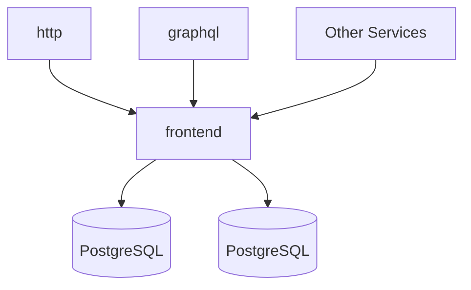

# Frontend

## TLDR

The frontend serves our web application and hosts our GraphQL API. It also serves configuration to other services.

## Config

TBD

## Diagram

```mermaid
graph TD
  http --> frontend
  graphql --> frontend
  serviceN[Other Services] --> frontend
  frontend --> db[(PostgreSQL)]
  frontend --> cache[(PostgreSQL)]
```
