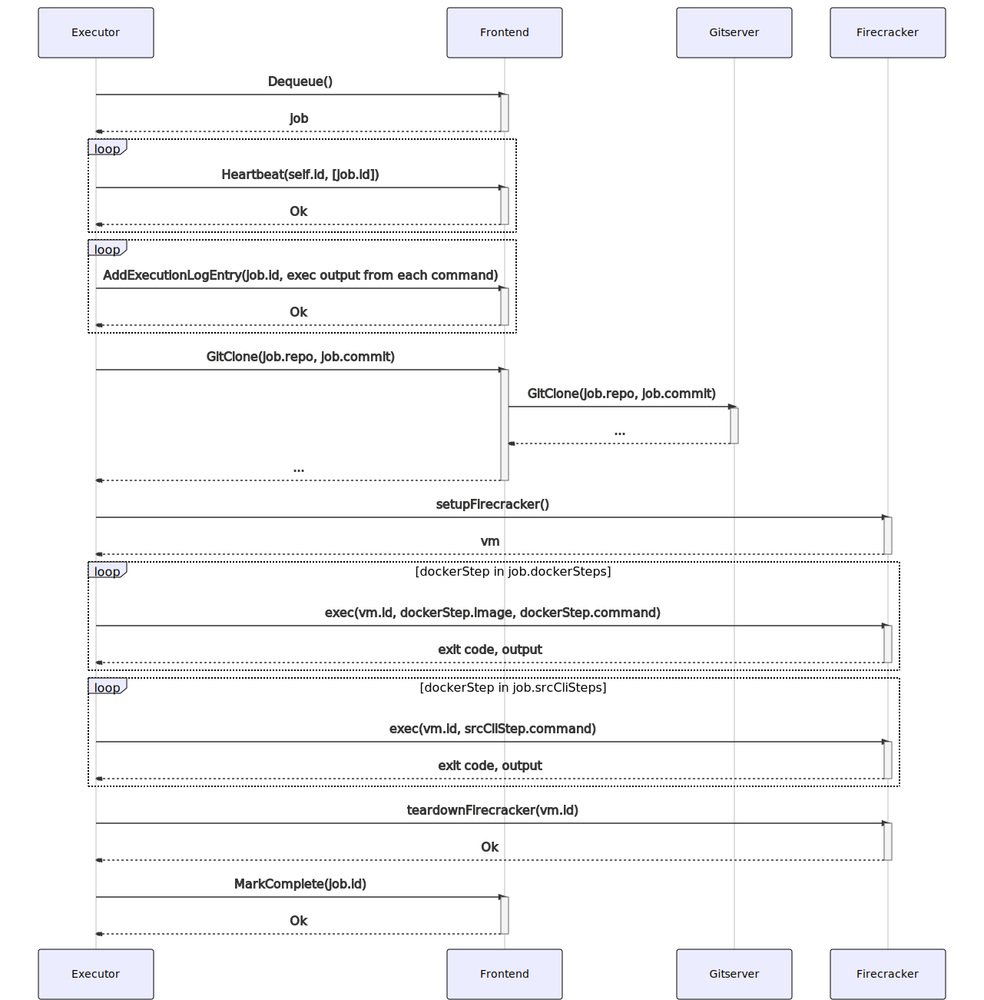

# How Sourcegraph auto-indexes source code

_Auto-indexing is enabled only in the Cloud environment and are written to work well for the usage patterns found there. Once we have proven that auto-indexing would also be beneficial in private instances, we will consider making the feature available there as well._

## Scheduling

Currently, scheduling is based primarily around repository groups (but the configuration and details are actively being worked on).

Once the set of repositories to index have been determined, the set of steps required to index the repository are determined.

If a user has explicitly configured indexing steps for this repository, the configuration may be found in the [database](https://sourcegraph.com/search?q=context:global+repo:%5Egithub%5C.com/sourcegraph/sourcegraph%24%40main+file:%5Einternal/codeintel/autoindex/enqueuer/index_records%5C.go+func+%28s+*IndexEnqueuer%29+getIndexRecordsFromConfigurationInDatabase%28&patternType=literal) (configured via the UI), or in the [sourcegraph.yaml](https://sourcegraph.com/search?q=context:global+repo:%5Egithub%5C.com/sourcegraph/sourcegraph%24%40main+file:%5Einternal/codeintel/autoindex/enqueuer/index_records%5C.go+func+%28s+*IndexEnqueuer%29+getIndexRecordsFromConfigurationInRepository%28&patternType=literal) configuration file in the root of the repository.

If no explicit configuration exists, the steps are [inferred from the repository structure](https://sourcegraph.com/search?q=context:global+repo:%5Egithub%5C.com/sourcegraph/sourcegraph%24%40main+file:%5Einternal/codeintel/autoindex/enqueuer/index_records%5C.go+func+%28s+*IndexEnqueuer%29+inferIndexRecordsFromRepositoryStructure%28&patternType=literal). We currently support detection of projects in the following languages:

- [Go](https://sourcegraph.com/search?q=context:global+repo:%5Egithub%5C.com/sourcegraph/sourcegraph%24%40main+file:%5Elib/codeintel/autoindex/inference/go%5C.go+func+InferGoIndexJobs%28&patternType=literal)
- [TypeScript](https://sourcegraph.com/search?q=context:global+repo:%5Egithub%5C.com/sourcegraph/sourcegraph%24%40main+file:%5Elib/codeintel/autoindex/inference/typescript%5C.go+func+InferTypeScriptIndexJobs%28&patternType=literal)

The steps to index the repository are serialized into an index record and [inserted into a task queue](https://sourcegraph.com/search?q=context:global+repo:%5Egithub%5C.com/sourcegraph/sourcegraph%24%40main+file:%5Einternal/codeintel/stores/dbstore/indexes%5C.go+func+%28s+*Store%29+InsertIndexes%28&patternType=literal) to be processed asynchronously by a pool of task executors.

## Processing

Because indexing an arbitrary code base may require arbitrary commands to be run (e.g., dependency gathering, compilation steps, code generation, etc), we process each index job in a [Firecracker](https://firecracker-microvm.github.io/) virtual machine managed by [Weave Ignite](https://ignite.readthedocs.io/en/stable/). These virtual machines are coordinated by the [executor](https://github.com/sourcegraph/sourcegraph/tree/main/cmd/executor) service which is [deployed directly on GCP compute nodes](./deployment.md).

The executor, deployed externally to the rest of the cluster, makes requests to the [frontend](https://github.com/sourcegraph/sourcegraph/tree/main/enterprise/cmd/frohtend) and to [gitserver](https://github.com/sourcegraph/sourcegraph/tree/main/cmd/gitserver) via proxy routes in the frontend protected by a shared token.

When idle, the executor process will periodically poll the frontend asking for an index job from a specific queue (configured via an environment variable on the executor). A periodic heartbeat request between the executor and the frontend will ensure that jobs do not stay permanently locked if the executor crashes or becomes partitioned from the Sourcegraph instance.

On dequeue, a row from the `lsif_indexes` table is transformed into a generic (non-code-intel-specific) task to be sent back to the executor. This payload consists of a sequence of docker and src-cli commands to run.

Once the executor receives a job, it will clone the target repository and checkout a target commit. A Firecracker virtual machine is started and the local git clone is copied into it. The commands encoded in the dequeued job are invoked inside of the virtual machine. Once done, the virtual machine is removed and a request is made to the frontend to mark the index as successfully processed.

### Code appendix

- Executor: [Handle](https://sourcegraph.com/search?q=context:global+repo:%5Egithub%5C.com/sourcegraph/sourcegraph%24%40main+file:%5Eenterprise/cmd/executor/internal/worker/handler%5C.go+func+%28h+*handler%29+Handle%28&patternType=literal)
- Frontend: [newExecutorQueueHandler](https://sourcegraph.com/search?q=context:global+repo:%5Egithub%5C.com/sourcegraph/sourcegraph%24%401198fda+file:%5Ecmd/frontend/internal/executorqueue/queuehandler%5C.go%24+newExecutorQueueHandler&patternType=literal), [handleDequeue](https://sourcegraph.com/search?q=context:global+repo:%5Egithub%5C.com/sourcegraph/sourcegraph%24%40main+file:%5Ecmd/frontend/internal/executorqueue/handler/routes.go%24+func+%28h+*handler%29+handleDequeue%28&patternType=literal), [handleHeartbeat](https://sourcegraph.com/search?q=context:global+repo:%5Egithub%5C.com/sourcegraph/sourcegraph%24%40main+file:%5Ecmd/frontend/internal/executorqueue/handler/routes.go%24+func+%28h+*handler%29+handleHeartbeat%28&patternType=literal), [handleAddExecutionLogEntry](https://sourcegraph.com/search?q=context:global+repo:%5Egithub%5C.com/sourcegraph/sourcegraph%24%40main+file:%5Ecmd/frontend/internal/executorqueue/handler/routes.go%24+func+%28h+*handler%29+handleAddExecutionLogEntry%28&patternType=literal), [handleMarkComplete](https://sourcegraph.com/search?q=context:global+repo:%5Egithub%5C.com/sourcegraph/sourcegraph%24%40main+file:%5Ecmd/frontend/internal/executorqueue/handler/routes.go%24+func+%28h+*handler%29+handleMarkComplete%28&patternType=literal), [transformRecord](https://sourcegraph.com/search?q=context:global+repo:%5Egithub%5C.com/sourcegraph/sourcegraph%24%40main+file:%5Ecmd/frontend/internal/executorqueue/queues/codeintel/transform.go%24+func+transformRecord%28&patternType=literal)
- Firecracker: [setupFirecracker](https://sourcegraph.com/search?q=context:global+repo:%5Egithub%5C.com/sourcegraph/sourcegraph%24%40main+file:%5Eenterprise/cmd/executor/internal/command/firecracker%5C.go+func+setupFirecracker%28&patternType=literal), [teardownFirecracker](https://sourcegraph.com/search?q=context:global+repo:%5Egithub%5C.com/sourcegraph/sourcegraph%24%40main+file:%5Eenterprise/cmd/executor/internal/command/firecracker%5C.go+func+teardownFirecracker%28&patternType=literal), [formatFirecrackerCommand](https://sourcegraph.com/search?q=context:global+repo:%5Egithub%5C.com/sourcegraph/sourcegraph%24%40main+file:%5Eenterprise/cmd/executor/internal/command/firecracker%5C.go+func+formatFirecrackerCommand%28&patternType=literal)
