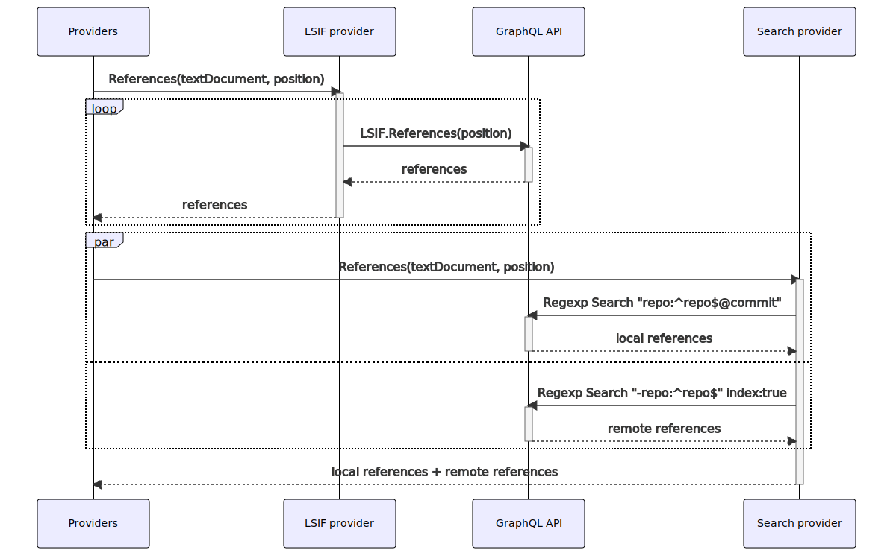
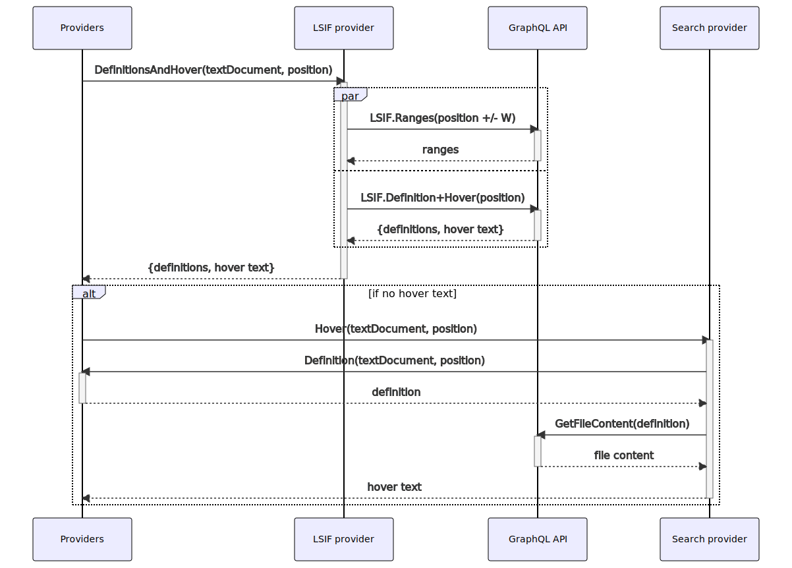

# How code navigation extensions resolve hovers

Definition, reference, and hover providers are invoked from the code intel API when the user hovers over a symbol in a code view.

These providers receive the current text document (denoting a repository, commit, and path) and the position the user is hovering (a line and column offset within the file). The providers return results as an asynchronous iterator, which allows additional results to be streamed into the UI as they are received from the backend.

Code navigation queries are resolved favoring [precise](https://docs.sourcegraph.com/code_navigation/explanations/precise_code_navigation) code navigation, if available, then falling back to [search-based](https://docs.sourcegraph.com/code_navigation/explanations/search_based_code_navigation).

## Definitions

The definitions provider returns the set of locations that define the symbol at the hover location. This provider supports the `Go to definition` button on the hover tooltip. If there is only one result, the button will act as a link to that location. If there are multiple results, they are shown in a definitions panel at the bottom of the screen.

<a href="diagrams/code-intel-definitions.svg" target="_blank">
  
</a>

The index data provider is invoked first. This provider will make two types of queries:

1. A `ranges` query that requests data for all symbols within a window centered around a hover position. Range query results returns only _local_ data. This includes hover text and locations in the same index, but will exclude any cross-repository locations. Range query results are cached so that subsequent hover actions (within _W_ lines of a previous query) are likely to already have the data they need available in memory.
1. A `definition + hover` query that requests the definition and hover text for the exact hover position. This will resolve cross-repository definitions.

The index data provider will first check if there is a range window in memory for the target position. If so, then it will try to extract the definition from that data and will fall back to an explicit request for that position if no data is available. If there is no range data for the target position, both queries are made in parallel. This populates the cache with the window for subsequent queries without slowing down the first result within a fresh window.

If the index data provider did not return any results (due to the repository or the target definition code not being fully indexed), the search providers are invoked as a fallback. The search providers perform a set of symbol searches using the text of the hovered symbol as the base of the query. The first search will look only within the same repository and commit in order to favor local declarations of the symbol. If the repository does not define this symbol, a second search is made that _excludes_ the source repository.

## References

The definitions provider returns the set of locations that reference the symbol at the hover location. This provider supports the `Find references` button on the hover tooltip. These results are shown in a references panel at the bottom of the screen.

<a href="diagrams/code-intel-references.svg" target="_blank">
  
</a>

The index data provider is invoked first. This provider will make a paginated `References` query, returning each page of results to the extension host as they are resolved (up to a maximum number of pages).

This result set is then supplemented by results from the search provider. The search provider will perform two regexp searches using the text of the hovered symbol as the base of the query. One search will look only within the same repository and commit, and the other search will _exclude_ the source repository. Both searches are made in parallel. Results from the search provider for a location in a file that also contains a precise result are filtered before being sent to the extension host to avoid littering the result set.

## Hover

The definitions provider returns the hover text associated with the symbol at the hover location. This provider populates the text shown in the hover tooltip.

<a href="diagrams/code-intel-hover.svg" target="_blank">
  
</a>

The index data provider is invoked first. This provider will make two types of queries:

1. A `ranges` query that requests data for all symbols within a window centered around a hover position. Range query results returns only _local_ data. This includes hover text and locations in the same index, but will exclude any cross-repository locations. Range query results are cached so that subsequent hover actions (within _W_ lines of a previous query) are likely to already have the data they need available in memory.
1. A `definition + hover` query that requests the definition and hover text for the exact hover position. This will resolve hover text for symbols defined in an external repository. For most indexers, the local range data is enough to completely resolve the hover data; we have, however, seen indexes in which cross-repository symbols do not link their hover text correctly. An explicit hover query is required in these circumstances.

The index data provider will first check if there is a range window in memory for the target position. If so, then it will try to extract the hover text from that data and will fall back to an explicit request for that position if no data is available. If there is no range data for the target position, both queries are made in parallel. This populates the cache with the window for subsequent queries without slowing down the first result within a fresh window.

If the index data provider did not return any results (due to the repository or the target definition code not being fully indexed), the search providers are invoked as a fallback. The search providers perform a recursive definitions request (note that this may invoke an index data provider). The hover text is then extracted from the source code around the definition.

## Query appendix

Definition queries take the following form, where `searchToken` and `ext[i]` are replaced with the symbol user is hovering and set of file extensions for the current text document's language, respectively.

```
^{searchToken}$ type:symbol patternType:regexp case:yes file:.({ext[0]}|{ext[1]}|...)$
```

Reference queries take the following form, using the same placeholders as described above.

```
\b{searchToken}\b type:file patternType:regexp case:yes file:.({ext[0]}|{ext[1]})$
```

#### Indexed search queries

The definition and reference queries performed above are _first_ performed unindexed so that the commit hash included in the repo term is respected. This will yield results within the same git tree rather than yielding results on a distinct commit, which is favorable.

After a five-second delay we _also_ perform the same query with the commit hash suffix removed from the `repo` filter, and the term `index:yes` added to the query. The first request to return will be used (and if the unindexed search returns before this delay, only one request is made).

In some deployments with very large repositories, the performance of unindexed search may always exceed this delay. In these situations, the setting `basicCodeIntel.indexOnly` can be set to completely disable unindexed searches from the code intel extensions.

#### Repository type filtering

Queries will also include the term `fork:yes` if the setting `basicCodeIntel.includeForks` is set to true, and the term `archived:yes` if the setting `basicCodeIntel.includeArchives` is set to true.

## Code appendix

- Index data providers: [definitionAndHover](https://sourcegraph.com/search?q=context:global+repo:%5Egithub%5C.com/sourcegraph/code-intel-extensions%24%40master+file:%5Etemplate/src/lsif/providers%5C.ts+function+definitionAndHover%28&patternType=literal), [references](https://sourcegraph.com/search?q=context:global+repo:%5Egithub%5C.com/sourcegraph/code-intel-extensions%24%40master+file:%5Etemplate/src/lsif/providers%5C.ts+function+references%28&patternType=literal)
- Search providers: [definition](https://sourcegraph.com/search?q=context:global+repo:%5Egithub%5C.com/sourcegraph/code-intel-extensions%24%40master+file:%5Etemplate/src/search/providers%5C.ts+const+definition+%3D&patternType=literal), [references](https://sourcegraph.com/search?q=context:global+repo:%5Egithub%5C.com/sourcegraph/code-intel-extensions%24%40master+file:%5Etemplate/src/search/providers%5C.ts+const+references+%3D&patternType=literal), [hover](https://sourcegraph.com/search?q=context:global+repo:%5Egithub%5C.com/sourcegraph/code-intel-extensions%24%40master+file:%5Etemplate/src/search/providers%5C.ts+const+hover+%3D&patternType=literal)
- Combined providers: [createDefinitionProvider](https://sourcegraph.com/search?q=context:global+repo:%5Egithub%5C.com/sourcegraph/code-intel-extensions%24%40master+file:%5Etemplate/src/providers%5C.ts+function+createDefinitionProvider%28&patternType=literal), [createReferencesProvider](https://sourcegraph.com/search?q=context:global+repo:%5Egithub%5C.com/sourcegraph/code-intel-extensions%24%40master+file:%5Etemplate/src/providers%5C.ts+function+createReferencesProvider%28&patternType=literal), [createHoverProvider](https://sourcegraph.com/search?q=context:global+repo:%5Egithub%5C.com/sourcegraph/code-intel-extensions%24%40master+file:%5Etemplate/src/providers%5C.ts+function+createHoverProvider%28&patternType=literal)
