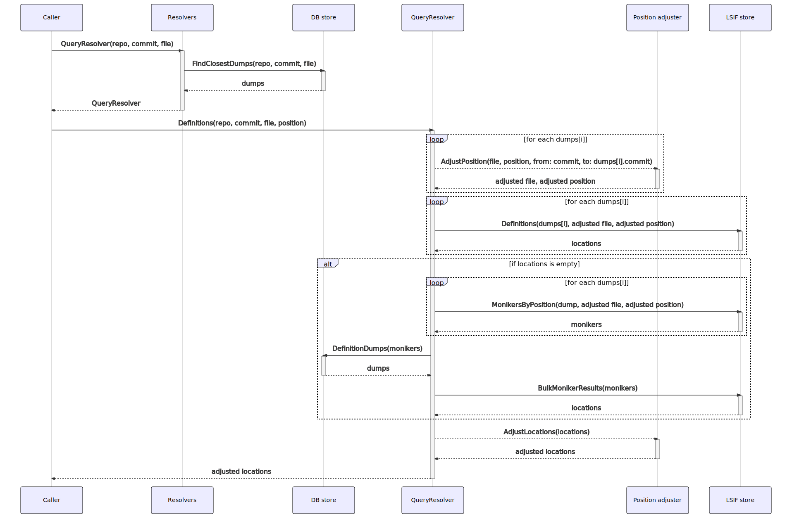
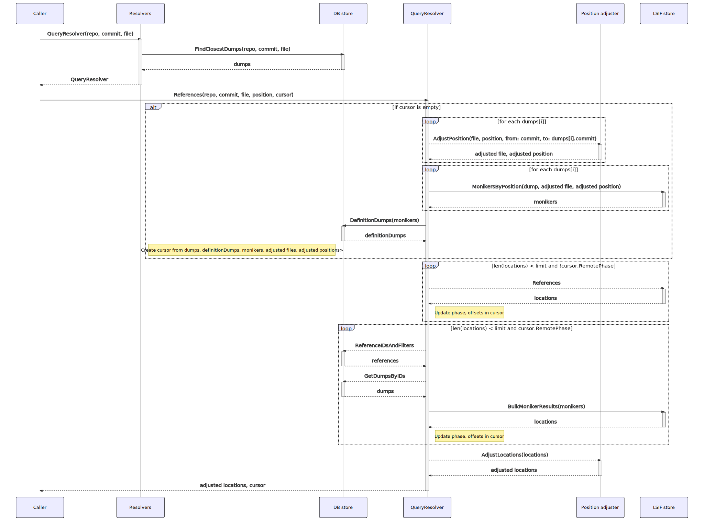
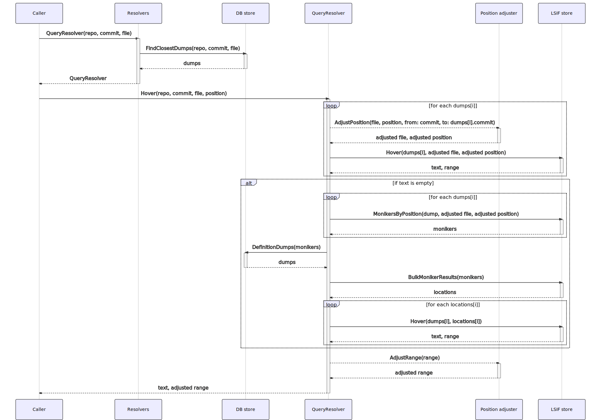

# How precise code navigation queries are resolved

Precise code navigation results are obtained by making [GraphQL requests](https://sourcegraph.com/api/console#%7B%22operationName%22%3A%22DefinitionAndHover%22%2C%22query%22%3A%22query%20DefinitionAndHover\(%24repository%3A%20String!%2C%20%24commit%3A%20String!%2C%20%24path%3A%20String!%2C%20%24line%3A%20Int!%2C%20%24character%3A%20Int!\)%20%7B%5Cn%20%20repository\(name%3A%20%24repository\)%20%7B%5Cn%20%20%20%20commit\(rev%3A%20%24commit\)%20%7B%5Cn%20%20%20%20%20%20blob\(path%3A%20%24path\)%20%7B%5Cn%20%20%20%20%20%20%20%20lsif%20%7B%5Cn%20%20%20%20%20%20%20%20%20%20definitions\(line%3A%20%24line%2C%20character%3A%20%24character\)%20%7B%5Cn%20%20%20%20%20%20%20%20%20%20%20%20nodes%20%7B%5Cn%20%20%20%20%20%20%20%20%20%20%20%20%20%20resource%20%7B%5Cn%20%20%20%20%20%20%20%20%20%20%20%20%20%20%20%20path%5Cn%20%20%20%20%20%20%20%20%20%20%20%20%20%20%20%20repository%20%7B%5Cn%20%20%20%20%20%20%20%20%20%20%20%20%20%20%20%20%20%20name%5Cn%20%20%20%20%20%20%20%20%20%20%20%20%20%20%20%20%7D%5Cn%20%20%20%20%20%20%20%20%20%20%20%20%20%20%20%20commit%20%7B%5Cn%20%20%20%20%20%20%20%20%20%20%20%20%20%20%20%20%20%20oid%5Cn%20%20%20%20%20%20%20%20%20%20%20%20%20%20%20%20%7D%5Cn%20%20%20%20%20%20%20%20%20%20%20%20%20%20%7D%5Cn%20%20%20%20%20%20%20%20%20%20%20%20%20%20range%20%7B%5Cn%20%20%20%20%20%20%20%20%20%20%20%20%20%20%20%20start%20%7B%5Cn%20%20%20%20%20%20%20%20%20%20%20%20%20%20%20%20%20%20line%5Cn%20%20%20%20%20%20%20%20%20%20%20%20%20%20%20%20%20%20character%5Cn%20%20%20%20%20%20%20%20%20%20%20%20%20%20%20%20%7D%5Cn%20%20%20%20%20%20%20%20%20%20%20%20%20%20%20%20end%20%7B%5Cn%20%20%20%20%20%20%20%20%20%20%20%20%20%20%20%20%20%20line%5Cn%20%20%20%20%20%20%20%20%20%20%20%20%20%20%20%20%20%20character%5Cn%20%20%20%20%20%20%20%20%20%20%20%20%20%20%20%20%7D%5Cn%20%20%20%20%20%20%20%20%20%20%20%20%20%20%7D%5Cn%20%20%20%20%20%20%20%20%20%20%20%20%7D%5Cn%20%20%20%20%20%20%20%20%20%20%7D%5Cn%20%20%20%20%20%20%20%20%20%20hover\(line%3A%20%24line%2C%20character%3A%20%24character\)%20%7B%5Cn%20%20%20%20%20%20%20%20%20%20%20%20markdown%20%7B%5Cn%20%20%20%20%20%20%20%20%20%20%20%20%20%20text%5Cn%20%20%20%20%20%20%20%20%20%20%20%20%7D%5Cn%20%20%20%20%20%20%20%20%20%20%20%20range%20%7B%5Cn%20%20%20%20%20%20%20%20%20%20%20%20%20%20start%20%7B%5Cn%20%20%20%20%20%20%20%20%20%20%20%20%20%20%20%20line%5Cn%20%20%20%20%20%20%20%20%20%20%20%20%20%20%20%20character%5Cn%20%20%20%20%20%20%20%20%20%20%20%20%20%20%7D%5Cn%20%20%20%20%20%20%20%20%20%20%20%20%20%20end%20%7B%5Cn%20%20%20%20%20%20%20%20%20%20%20%20%20%20%20%20line%5Cn%20%20%20%20%20%20%20%20%20%20%20%20%20%20%20%20character%5Cn%20%20%20%20%20%20%20%20%20%20%20%20%20%20%7D%5Cn%20%20%20%20%20%20%20%20%20%20%20%20%7D%5Cn%20%20%20%20%20%20%20%20%20%20%7D%5Cn%20%20%20%20%20%20%20%20%7D%5Cn%20%20%20%20%20%20%7D%5Cn%20%20%20%20%7D%5Cn%20%20%7D%5Cn%7D%5Cn%22%2C%22variables%22%3A%22%7B%5Cn%20%20%5C%22repository%5C%22%3A%20%5C%22github.com%2Fsourcegraph%2Fsourcegraph%5C%22%2C%5Cn%20%20%5C%22commit%5C%22%3A%20%5C%2288ba1ebe3422fd93c07cbf0084dc177dea393df4%5C%22%2C%5Cn%20%20%5C%22path%5C%22%3A%20%5C%22monitoring%2Fprecise_code_intel_indexer.go%5C%22%2C%5Cn%20%20%5C%22line%5C%22%3A%2012%2C%5Cn%20%20%5C%22character%5C%22%3A%2012%5Cn%7D%22%7D) to the frontend service. The [code navigation extensions](https://github.com/sourcegraph/code-intel-extensions) are example consumer of this API, and its [documentation](./extensions.md) details how code navigation results are used.

<!-- TODO(efritz): range queries -->
<!-- TODO(efritz): diagnostic queries -->

## Definitions

A definitions request returns the set of locations that define the symbol at a particular location (defined uniquely by a repository, commit, path, line offset, and character offset). The sequence of actions required to resolve a definitions query is shown below (click to enlarge).

First, the repository, commit, and path inputs are used to determine the set of uploads that can answer queries for that data. Such an upload may have been indexed on another commit. In this case, the output of `git diff` between the two commits is used to adjust the input path and line number.

The adjusted path and position is used to query the definitions at that position using the selected upload data. If a definition is local to the upload, the upload store can resolve the query without any additional data. If the definition is remote (defined in a different root of the same repository, or defined in a different repository), the _import_ monikers of the symbol at the adjusted path and position in the selected upload are determined, as are the package information data of those monikers. Using an upload that provides one of the selected packages, definitions of the associated moniker are queried from the codeintel database.

If the resulting locations were provided by an upload that was indexed on a commit distinct from the input commit, `git diff` is used to again re-adjust the results to the target commit.

### Code appendix

- Resolvers: [QueryResolver](https://sourcegraph.com/search?q=context:global+repo:%5Egithub%5C.com/sourcegraph/sourcegraph%24%40main+file:%5Ecmd/frontend/internal/codeintel/resolvers/resolver%5C.go+func+%28r+*resolver%29+QueryResolver%28&patternType=literal)
- DB store: [FindClosestDumps](https://sourcegraph.com/search?q=context:global+repo:%5Egithub%5C.com/sourcegraph/sourcegraph%24%40main+file:%5Einternal/codeintel/stores/dbstore/dumps%5C.go+func+%28s+*Store%29+FindClosestDumps%28&patternType=literal), [DefinitionDumps](https://sourcegraph.com/search?q=context:global+repo:%5Egithub%5C.com/sourcegraph/sourcegraph%24%40main+file:%5Einternal/codeintel/stores/dbstore/xrepo%5C.go+func+%28s+*Store%29+DefinitionDumps%28&patternType=literal)
- QueryResolver: [Definitions](https://sourcegraph.com/search?q=context:global+repo:%5Egithub%5C.com/sourcegraph/sourcegraph%24%40main+file:%5Ecmd/frontend/internal/codeintel/resolvers/query_definitions%5C.go+func+%28r+*queryResolver%29+Definitions%28&patternType=literal)
- Upload store: [Definitions](https://sourcegraph.com/search?q=context:global+repo:%5Egithub%5C.com/sourcegraph/sourcegraph%24%40main+file:%5Einternal/codeintel/stores/lsifstore/locations%5C.go+func+%28s+*Store%29+Definitions%28&patternType=literal), [MonikersByPosition](https://sourcegraph.com/search?q=context:global+repo:%5Egithub%5C.com/sourcegraph/sourcegraph%24%40main+file:%5Einternal/codeintel/stores/lsifstore/monikers%5C.go+func+%28s+*Store%29+MonikersByPosition%28&patternType=literal), [BulkMonikerResults](https://sourcegraph.com/search?q=context:global+repo:%5Egithub%5C.com/sourcegraph/sourcegraph%24%40main+file:%5Einternal/codeintel/stores/lsifstore/monikers%5C.go+func+%28s+*Store%29+BulkMonikerResults%28&patternType=literal)
- Position adjuster: [AdjustPosition](https://sourcegraph.com/search?q=context:global+repo:%5Egithub%5C.com/sourcegraph/sourcegraph%24%40main+file:%5Ecmd/frontend/internal/codeintel/resolvers/position%5C.go+func+%28p+*positionAdjuster%29+AdjustPosition%28&patternType=literal), [AdjustRange](https://sourcegraph.com/search?q=context:global+repo:%5Egithub%5C.com/sourcegraph/sourcegraph%24%40main+file:%5Ecmd/frontend/internal/codeintel/resolvers/position%5C.go+func+%28p+*positionAdjuster%29+AdjustRange%28&patternType=literal)

## References

A references request returns the set of locations that reference the symbol at a particular location (defined uniquely by a repository, commit, path, line offset, and character offset). Unlike the set of definitions, which should generally have only member, the set of references can unbounded for popular repositories. The resolution of references is therefore done in chunks, allowing the user to request reference results page-by-page. The sequence of actions required to resolve a references query is shown below (click to enlarge).

First, the repository, commit, and path inputs are used to determine the set of uploads that can answer queries for that data. Such an upload may have been indexed on another commit. In this case, the output of `git diff` between the two commits is used to adjust the input path and line number.

A references request optionally supplies a cursor that encodes the state of the previous request (if any). If a cursor is supplied, it is decoded and validated. Otherwise, one is created with some additional state including the repository, commit, adjusted path and position, the selected indexes providing intelligence for this result set, monikers attached to the range intersecting the input position, and the index defining the target symbol (if remotely defined). Note that this step may be repeated over multiple uploads: each upload returned in the previous step will have its own cursor, encoded/decoded independently at the GraphQL resolver layer.

The cursor decoded or created above is used to drive the resolution of the current page of results. While the number of results in the current page is less than the requested number of results, another batch of locations is requested using the current cursor and it is appended to the current page. This cursor is ultimately sent back to the client so they can make a subsequent request, and is also used as the new _current_ cursor if a subsequent batch of locations is requested.

Each batch of locations is fetched using the contents of the request's cursor. If the cursor is not in its _remote phase_, it will fetch additional locations from the index that is providing intelligence. Once these locations are exhausted, the cursor switches to the _remote phase_. In this phase, a batch of remote dumps referencing one of the monikers attached to the range intersecting the input position is used as the set of indexes from which to fetch the next sequence of location results.

For each returned batch of locations, if the resulting locations were provided by an upload that was indexed on a commit distinct from the input commit (only possible for non-remote locations), `git diff` is used to again re-adjust the results to the target commit.

### Code appendix

- Resolvers: [QueryResolver](https://sourcegraph.com/search?q=context:global+repo:%5Egithub%5C.com/sourcegraph/sourcegraph%24%40main+file:%5Ecmd/frontend/internal/codeintel/resolvers/resolver%5C.go+func+%28r+*resolver%29+QueryResolver%28&patternType=literal)
- DB store: [FindClosestDumps](https://sourcegraph.com/search?q=context:global+repo:%5Egithub%5C.com/sourcegraph/sourcegraph%24%40main+file:%5Einternal/codeintel/stores/dbstore/dumps%5C.go+func+%28s+*Store%29+FindClosestDumps%28&patternType=literal), [DefinitionDumps](https://sourcegraph.com/search?q=context:global+repo:%5Egithub%5C.com/sourcegraph/sourcegraph%24%40main+file:%5Einternal/codeintel/stores/dbstore/xrepo%5C.go+func+%28s+*Store%29+DefinitionDumps%28&patternType=literal), [ReferenceIDs](https://sourcegraph.com/search?q=context:global+repo:%5Egithub%5C.com/sourcegraph/sourcegraph%24%40main+file:%5Einternal/codeintel/stores/dbstore/xrepo%5C.go+func+%28s+*Store%29+ReferenceIDs%28&patternType=literal), [GetDumpsByIDs](https://sourcegraph.com/search?q=context:global+repo:%5Egithub%5C.com/sourcegraph/sourcegraph%24%40main+file:%5Einternal/codeintel/stores/dbstore/dumps%5C.go+func+%28s+*Store%29+GetDumpsByIDs%28&patternType=literal)
- QueryResolver: [References](https://sourcegraph.com/search?q=context:global+repo:%5Egithub%5C.com/sourcegraph/sourcegraph%24%40main+file:%5Ecmd/frontend/internal/codeintel/resolvers/query_references%5C.go+func+%28r+*queryResolver%29+References%28&patternType=literal)
- Upload store: [References](https://sourcegraph.com/search?q=context:global+repo:%5Egithub%5C.com/sourcegraph/sourcegraph%24%40main+file:%5Einternal/codeintel/stores/lsifstore/locations%5C.go+func+%28s+*Store%29+References%28&patternType=literal), [MonikersByPosition](https://sourcegraph.com/search?q=context:global+repo:%5Egithub%5C.com/sourcegraph/sourcegraph%24%40main+file:%5Einternal/codeintel/stores/lsifstore/monikers%5C.go+func+%28s+*Store%29+MonikersByPosition%28&patternType=literal), [BulkMonikerResults](https://sourcegraph.com/search?q=context:global+repo:%5Egithub%5C.com/sourcegraph/sourcegraph%24%40main+file:%5Einternal/codeintel/stores/lsifstore/monikers%5C.go+func+%28s+*Store%29+BulkMonikerResults%28&patternType=literal)
- Position adjuster: [AdjustPosition](https://sourcegraph.com/search?q=context:global+repo:%5Egithub%5C.com/sourcegraph/sourcegraph%24%40main+file:%5Ecmd/frontend/internal/codeintel/resolvers/position%5C.go+func+%28p+*positionAdjuster%29+AdjustPosition%28&patternType=literal),  [AdjustRange](https://sourcegraph.com/search?q=context:global+repo:%5Egithub%5C.com/sourcegraph/sourcegraph%24%40main+file:%5Ecmd/frontend/internal/codeintel/resolvers/position%5C.go+func+%28p+*positionAdjuster%29+AdjustRange%28&patternType=literal)

## Hover

A hover request returns the hover text associated with the symbol at a particular location (defined uniquely by a repository, commit, path, line offset, and character offset), as well as the range of the hovered symbol. The sequence of actions required to resolve a hover query is shown below (click to enlarge).

First, the repository, commit, and path inputs are used to determine the set of uploads that can answer queries for that data. Such an upload may have been indexed on another commit. In this case, the output of `git diff` between the two commits is used to adjust the input path and line number.

The adjusted path and position is used to query the hover text at that position using the selected upload data. If there is no hover text associated with a reference (which may be the case for indexers that do not provide third-party hover text), we attempt to resolve the location of the definition in another dump. This moniker search is almost identical to the flow within the definitions resolver. Once a definition location is known, its hover text can be queried directly by position.

If the resulting locations were provided by an upload that was indexed on a commit distinct from the input commit, `git diff` is used to again re-adjust the results to the target commit.

### Code appendix

- Resolvers: [QueryResolver](https://sourcegraph.com/search?q=context:global+repo:%5Egithub%5C.com/sourcegraph/sourcegraph%24%40main+file:%5Ecmd/frontend/internal/codeintel/resolvers/resolver%5C.go+func+%28r+*resolver%29+QueryResolver%28&patternType=literal)
- DB store: [FindClosestDumps](https://sourcegraph.com/search?q=context:global+repo:%5Egithub%5C.com/sourcegraph/sourcegraph%24%40main+file:%5Einternal/codeintel/stores/dbstore/dumps%5C.go+func+%28s+*Store%29+FindClosestDumps%28&patternType=literal)
- QueryResolver: [Hover](https://sourcegraph.com/search?q=context:global+repo:%5Egithub%5C.com/sourcegraph/sourcegraph%24%40main+file:%5Ecmd/frontend/internal/codeintel/resolvers/query_hover%5C.go+func+%28r+*queryResolver%29+Hover%28&patternType=literal)
- Upload store: [Hover](https://sourcegraph.com/search?q=context:global+repo:%5Egithub%5C.com/sourcegraph/sourcegraph%24%40main+file:%5Einternal/codeintel/stores/lsifstore/hover%5C.go+func+%28s+*Store%29+Hover%28&patternType=literal)
- Position adjuster: [AdjustPosition](https://sourcegraph.com/search?q=context:global+repo:%5Egithub%5C.com/sourcegraph/sourcegraph%24%40main+file:%5Ecmd/frontend/internal/codeintel/resolvers/position%5C.go+func+%28p+*positionAdjuster%29+AdjustPosition%28&patternType=literal), [AdjustRange](https://sourcegraph.com/search?q=context:global+repo:%5Egithub%5C.com/sourcegraph/sourcegraph%24%40main+file:%5Ecmd/frontend/internal/codeintel/resolvers/position%5C.go+func+%28p+*positionAdjuster%29+AdjustRange%28&patternType=literal)
