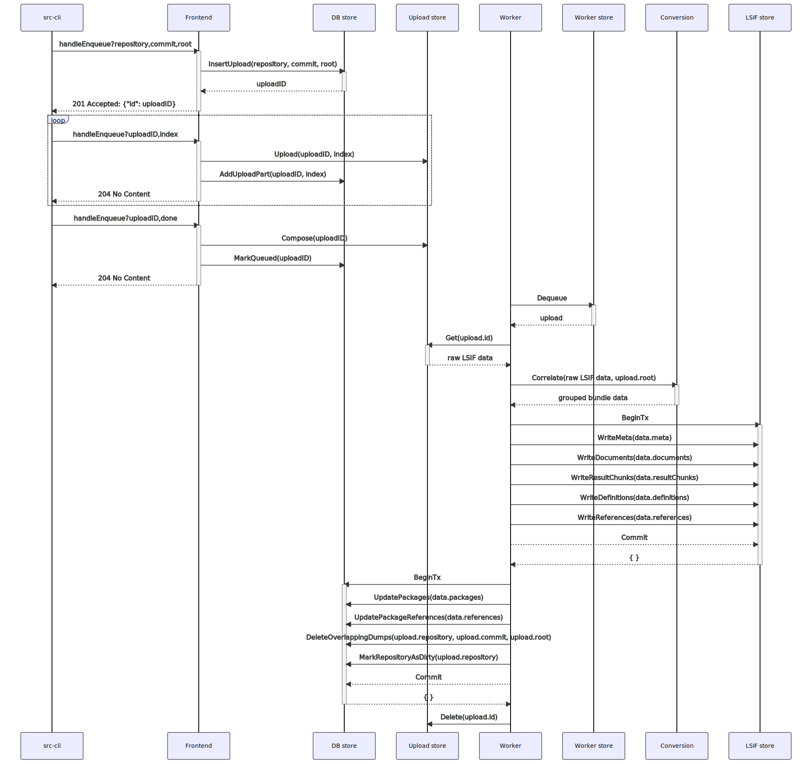

# How indexes are processed

An indexer produces a file containing the definition, reference, hover, and diagnostic data for a project. Users upload this index file to a Sourcegraph instance, which converts it into an internal format that can support [code navigation queries](./queries.md).

The sequence of actions required to upload and convert this data is shown below (click to enlarge).

## Uploading

The API used to upload an index is modeled after the [S3 multipart upload API](https://docs.aws.amazon.com/AmazonS3/latest/dev/mpuoverview.html). Many uploads can be fairly large and the [network is generally not reliable](https://aphyr.com/posts/288-the-network-is-reliable). To get around frequent failure of large uploads (and to get around uploads limits in Cloudflare), the upload is broken into multiple, independently gzipped chunks. Each chunk is uploaded in sequence to the instances, where it is concatenated into a single file on the remote end. This allows us to retry chunks independently in the case of an upload failure without sacrificing the entire operation.

An initial request adds an upload into the database with the `uploading` state and marks the number of upload chunks it expects to see. The subsequent requests specify the upload identifier (returned in the initial request), and the index of the chunk that is being uploaded. If this upload part successfully makes it to disk, it is marked as received in the upload record. The last request is a request marking upload completion from the client. At this point, the frontend ensures that all the expected chunks have been received and reside on disk. The frontend informs the blob storage server to concatenate the files, and the upload record is moved from the `uploading` state to the `queued` state, where it is made visible to the worker process.

## Processing

The worker process polls Postgres for upload records in the `queued` state. When such a record is available, it is marked as `processing` and is locked in a transaction to ensure that it is not double-processed by another worker instance. The worker asks the blob storage server for the raw upload data. Because this data is generally large, the data is streamed to the worker while it is being processed (and retry logic inside the client will retry the request from the last byte it received on transient failures).

The worker then converts the raw index into an internal representation which is inserted into the codeintel database:

- [correlateFromReader](https://sourcegraph.com/search?q=context:global+repo:%5Egithub%5C.com/sourcegraph/sourcegraph%24%40main+file:%5Elib/codeintel/lsif/conversion/correlate%5C.go+func+correlateFromReader%28&patternType=literal) step streams raw LSIF data from the blob storage server and produces a stream of JSON objects. Each object in the stream is interpreted as an LSIF vertex or edge. Objects are validated, then inserted into an in-memory representation of the graph.
- [canonicalize](https://sourcegraph.com/search?q=context:global+repo:%5Egithub%5C.com/sourcegraph/sourcegraph%24%40main+file:%5Elib/codeintel/lsif/conversion/canonicalize%5C.go+func+canonicalize%28&patternType=literal) step collapses the in-memory representation of the graph produced by the previous step. Most notably, it ensures that the data attached to a range vertex _transitively_ is now attached to the range vertex _directly_.
- [prune](https://sourcegraph.com/search?q=context:global+repo:%5Egithub%5C.com/sourcegraph/sourcegraph%24%40main+file:%5Elib/codeintel/lsif/conversion/prune%5C.go+func+prune%28&patternType=literal) step determines the set of documents that are present in the index but do not exist in git (via an efficient batch of calls to gitserver) and removes references to them from the in-memory representation of the graph. This prevents us from attempting to navigate to locations that are not visible within the instance (generated or vendored paths that are not committed).
- [groupBundleData](https://sourcegraph.com/search?q=context:global+repo:%5Egithub%5C.com/sourcegraph/sourcegraph%24%40main+file:%5Elib/codeintel/lsif/conversion/group%5C.go+func+groupBundleData%28&patternType=literal) step converts the canonicalized and pruned in-memory representation of the graph into the shape that will reside in the database. This _rotates_ the data so that it can be efficiently read based on our [query access patterns](./queries.md).

This process also produces a set of packages that the indexed source code _defines_ and a set of packages that the indexed source code _depends on_ which is inserted into the frontend (metadata) database to enable cross-repository definition and reference queries. The set of packages defined by and depended on by this index can be constructed from reading the package information attached to export and import monikers, respectively, from the correlated data.

Duplicate uploads (with the same repository, commit, and root) are removed to prevent the frontend from querying multiple indexes for the same data. This can happen if a user re-uploads the same index, or if an index is re-uploaded as part of a CI step that was re-run. In these cases we prefer to keep the newest upload.

The repository is marked as _dirty_, which informs a process that runs periodically to re-calculate the set of uploads visible to each commit. This process will refresh the commit graph for this repository stored in Postgres.

Finally, if the previous steps have all completed without error, the transaction is committed, moving the upload record from the `processing` state to the `completed` state, where it is made visible to the frontend to answer code navigation queries. On success, the input file that was processed is deleted from the blob storage server. If an error does occur, the upload record is instead moved to the `errored` state and marked with a failure reason.

## Code appendix

- src-cli: [lsif upload command](https://sourcegraph.com/search?q=context:global+repo:%5Egithub%5C.com/sourcegraph/src-cli%24%40main+file:%5Ecmd/src/lsif_upload%5C.go+func+handleLSIFUpload%28&patternType=literal)
- Frontend: [handleEnqueue](https://sourcegraph.com/search?q=context:global+repo:%5Egithub%5C.com/sourcegraph/sourcegraph%24%40main+file:%5Ecmd/frontend/internal/codeintel/httpapi/upload_handler%5C.go+func+%28h+*UploadHandler%29+handleEnqueue%28&patternType=literal)
- Worker store: [Dequeue](https://sourcegraph.com/search?q=context:global+repo:%5Egithub%5C.com/sourcegraph/sourcegraph%24%40main+file:%5Einternal/workerutil/dbworker/store/store%5C.go+func+%28s+*store%29+Dequeue%28&patternType=literal&case=yes)
- Worker: [Handle](https://sourcegraph.com/search?q=context:global+repo:%5Egithub%5C.com/sourcegraph/sourcegraph%24%40main+file:%5Eenterprise/cmd/precise-code-intel-worker/internal/worker/handler%5C.go+func+%28h+*handler%29+Handle%28&patternType=literal&case=yes), [writeData](https://sourcegraph.com/search?q=context:global+repo:%5Egithub%5C.com/sourcegraph/sourcegraph%24%40main+file:%5Eenterprise/cmd/precise-code-intel-worker/internal/worker/handler%5C.go+func+writeData%28&patternType=literal&case=yes)
- Conversion: [Correlate](https://sourcegraph.com/search?q=context:global+repo:%5Egithub%5C.com/sourcegraph/sourcegraph%24%4090b7985+file:%5Elib/codeintel/lsif/conversion/correlate%5C.go+func+Correlate%28&patternType=literal)
- DB store: [InsertUpload](https://sourcegraph.com/search?q=context:global+repo:%5Egithub%5C.com/sourcegraph/sourcegraph%24%40main+file:%5Einternal/codeintel/stores/dbstore/uploads%5C.go+func+%28s+*Store%29+InsertUpload%28&patternType=literal), [AddUploadPart](https://sourcegraph.com/search?q=context:global+repo:%5Egithub%5C.com/sourcegraph/sourcegraph%24%40main+file:%5Einternal/codeintel/stores/dbstore/uploads%5C.go+func+%28s+*Store%29+AddUploadPart%28&patternType=literal), [MarkQueued](https://sourcegraph.com/search?q=context:global+repo:%5Egithub%5C.com/sourcegraph/sourcegraph%24%40main+file:%5Einternal/codeintel/stores/dbstore/uploads%5C.go+func+%28s+*Store%29+MarkQueued%28&patternType=literal), [UpdatePackages](https://sourcegraph.com/search?q=context:global+repo:%5Egithub%5C.com/sourcegraph/sourcegraph%24%40main+file:%5Einternal/codeintel/stores/dbstore/packages%5C.go+func+%28s+*Store%29+UpdatePackages%28&patternType=literal), [UpdatePackageReferences](https://sourcegraph.com/search?q=context:global+repo:%5Egithub%5C.com/sourcegraph/sourcegraph%24%40main+file:%5Einternal/codeintel/stores/dbstore/references%5C.go+func+%28s+*Store%29+UpdatePackageReferences%28&patternType=literal), [DeleteOverlappingDumps](https://sourcegraph.com/search?q=context:global+repo:%5Egithub%5C.com/sourcegraph/sourcegraph%24%40main+file:%5Einternal/codeintel/stores/dbstore/dumps%5C.go+func+%28s+*Store%29+DeleteOverlappingDumps%28&patternType=literal), [MarkRepositoryAsDirty](https://sourcegraph.com/search?q=context:global+repo:%5Egithub%5C.com/sourcegraph/sourcegraph%24%40main+file:%5Einternal/codeintel/stores/dbstore/commits%5C.go+func+%28s+*Store%29+MarkRepositoryAsDirty%28&patternType=literal)
- LSIF store: [WriteMeta](https://sourcegraph.com/search?q=context:global+repo:%5Egithub%5C.com/sourcegraph/sourcegraph%24%40main+file:%5Einternal/codeintel/stores/lsifstore/data_write%5C.go+func+%28s+*Store%29+WriteMeta%28&patternType=literal), [WriteDocuments](https://sourcegraph.com/search?q=context:global+repo:%5Egithub%5C.com/sourcegraph/sourcegraph%24%40main+file:%5Einternal/codeintel/stores/lsifstore/data_write%5C.go+func+%28s+*Store%29+WriteDocuments%28&patternType=literal), [WriteResultChunks](https://sourcegraph.com/search?q=context:global+repo:%5Egithub%5C.com/sourcegraph/sourcegraph%24%40main+file:%5Einternal/codeintel/stores/lsifstore/data_write%5C.go+func+%28s+*Store%29+WriteResultChunks%28&patternType=literal), [WriteDefinitions](https://sourcegraph.com/search?q=context:global+repo:%5Egithub%5C.com/sourcegraph/sourcegraph%24%40main+file:%5Einternal/codeintel/stores/lsifstore/data_write%5C.go+func+%28s+*Store%29+WriteDefinitions%28&patternType=literal), [WriteReferences](https://sourcegraph.com/search?q=context:global+repo:%5Egithub%5C.com/sourcegraph/sourcegraph%24%40main+file:%5Einternal/codeintel/stores/lsifstore/data_write%5C.go+func+%28s+*Store%29+WriteReferences%28&patternType=literal)
- Upload store:
  - GCS: [Upload](https://sourcegraph.com/search?q=context:global+repo:%5Egithub%5C.com/sourcegraph/sourcegraph%24%40main+file:%5Einternal/codeintel/stores/uploadstore/gcs_client%5C.go+func+%28s+*gcsStore%29+Upload%28&patternType=literal), [Compose](https://sourcegraph.com/search?q=context:global+repo:%5Egithub%5C.com/sourcegraph/sourcegraph%24%40main+file:%5Einternal/codeintel/stores/uploadstore/gcs_client%5C.go+func+%28s+*gcsStore%29+Compose%28&patternType=literal), [Get](https://sourcegraph.com/search?q=context:global+repo:%5Egithub%5C.com/sourcegraph/sourcegraph%24%40main+file:%5Einternal/codeintel/stores/uploadstore/gcs_client%5C.go+func+%28s+*gcsStore%29+Get%28&patternType=literal), [Delete](https://sourcegraph.com/search?q=context:global+repo:%5Egithub%5C.com/sourcegraph/sourcegraph%24%40main+file:%5Einternal/codeintel/stores/uploadstore/gcs_client%5C.go+func+%28s+*gcsStore%29+Delete%28&patternType=literal)
  - S3: [Upload](https://sourcegraph.com/search?q=context:global+repo:%5Egithub%5C.com/sourcegraph/sourcegraph%24%40main+file:%5Einternal/codeintel/stores/uploadstore/s3_client%5C.go+func+%28s+*s3Store%29+Upload%28&patternType=literal), [Compose](https://sourcegraph.com/search?q=context:global+repo:%5Egithub%5C.com/sourcegraph/sourcegraph%24%40main+file:%5Einternal/codeintel/stores/uploadstore/s3_client%5C.go+func+%28s+*s3Store%29+Compose%28&patternType=literal), [Get](https://sourcegraph.com/search?q=context:global+repo:%5Egithub%5C.com/sourcegraph/sourcegraph%24%40main+file:%5Einternal/codeintel/stores/uploadstore/s3_client%5C.go+func+%28s+*s3Store%29+Get%28&patternType=literal), [Delete](https://sourcegraph.com/search?q=context:global+repo:%5Egithub%5C.com/sourcegraph/sourcegraph%24%40main+file:%5Einternal/codeintel/stores/uploadstore/s3_client%5C.go+func+%28s+*s3Store%29+Delete%28&patternType=literal)
