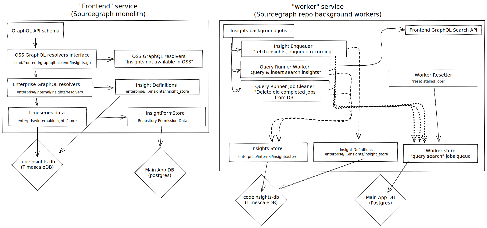

# Developing the code insights backend

- [State of the backend](#state-of-the-backend)
- [Architecture](#architecture)
- [Life of an insight](#life-of-an-insight)
    - [(1) User creates an insight](#1-a-user-creates-an-insight)
    - [(2) The _insight enqueuer_ detects the new insight](#2-the-insight-enqueuer-indexed-recorder-detects-the-new-insight)
    - [(3) The queryrunner worker gets work and runs the search query](#3-the-historical-data-enqueuer-historical-recorder-gets-to-work)
    - [(4) The historical data enqueuer gets to work](#4-the-queryrunner-worker-gets-work-and-runs-the-search-query)
    - [(5) Query-time and rendering!](#5-query-time-and-rendering)
    - [Storage format](#storage-format)
- [Running locally](#running-locally)
- [Debugging](#debugging)
    - [Accessing the Code Insights database](#accessing-the-code-insights-database)
    - [Finding logs](#finding-logs)
    - [Inspecting the Code Insights database](#inspecting-the-code-insights-database)
        - [Querying data](#querying-data)
        - [Inserting data](#inserting-data)
- [Creating DB migrations](#creating-db-migrations)

## State of the backend

* Supports running search- and compute- based insights over all indexable repositories on the Sourcegraph installation.
* Is backed by a separate Postgres instance. See the [database section](#database) below for more information.
* Optimizes unnecessary search queries by using commit history to query only for time periods that have had at least one commit.
* Supports filtering:
  * By repository regexp
  * By repositories included/excluded by a search context
  * By filter options: name, result count, date added, and number of data series
* Provides permissions restrictions by filtering of repositories that are not visible to the user at query time.

Up-to-date feature updates are added to the [Sourcegraph changelog](https://github.com/sourcegraph/sourcegraph/blob/main/CHANGELOG.md).

## Architecture

The following architecture diagram shows how the backend fits into the two Sourcegraph services "frontend" (the Sourcegraph monolithic service) and "worker" (the Sourcegraph "background-worker" service), click to expand:

[](https://raw.githubusercontent.com/sourcegraph/sourcegraph/main/doc/dev/background-information/insights/diagrams/architecture.svg)


## Feature Flags
Code Insights ships with an "escape hatch" feature flag that will completely disable the dependency on the Code Insights DB (named `codeinsights-db`). This feature flag is implemented as an environment variable that if set true `DISABLE_CODE_INSIGHTS=true` will disable the dependency and will not start the Code Insights background workers or GraphQL resolvers. This variable must be set on both the `worker` and `frontend` services to remove the dependency. If the flag is not set on both services, the `codeinsights-db` dependency will be required.

Implementation of this environment variable can be found in the [`frontend`](https://sourcegraph.com/search?q=context:global+repo:%5Egithub%5C.com/sourcegraph/sourcegraph%24+file:internal/insights/insights.go+DISABLE_CODE_INSIGHTS+&patternType=lucky) and [`worker`](https://sourcegraph.com/search?q=context:global+repo:%5Egithub%5C.com/sourcegraph/sourcegraph%24+file:internal/insights/background+DISABLE_CODE_INSIGHTS+&patternType=lucky) services.

This flag should be used judiciously and should generally be considered a last resort for Sourcegraph installations that need to disable Code Insights or remove the database dependency.

With version 3.31 this flag has moved from the `repo-updater` service to the `worker` service.

### Sourcegraph Setting
Code Insights is currently enabled by default on customer instances 3.32 and later, but can be disabled from appearing in the UI by setting this flag to false, either per-user config (`/users/your_username/settings`) or on site admin global settings (`/site-admin/global-settings`).

```json
  "experimentalFeatures": {
    "codeInsights": true
  },
```

## Insight Metadata
Code Insights data is stored entirely in the `codeinsights-db` database, and exposed through a GraphQL API. Settings are deprecated as a storage
option, although the text in the settings will persist unless deleted. In this release Code Insights shipped an [out of band migration](https://sourcegraph.com/github.com/sourcegraph/sourcegraph@b098cc6/-/blob/internal/insights/migration/migration.go) that automatically migrates
all data from settings to the database for the last time. 3.35 also disabled the previously running sync jobs by default, which can be re-enabled using an environment variable feature flag `ENABLE_CODE_INSIGHTS_SETTINGS_STORAGE` on the `worker` and `frontend` services. This flag is not meant to be used and is only provided as a last resort option for any users unable to use Code Insights.

## Life of an insight

#### (1) A user creates an insight

At the moment we support four types of insights:

* Search insights
* Capture-group insights
* Language usage insights (over a single repository only)
* Group-by insights ([experimental as of 3.42](https://github.com/sourcegraph/sourcegraph/blob/main/CHANGELOG.md#3420))

These can all be created from the UI and get resolved through the [GraphQL API](https://sourcegraph.com/search?q=context:global+repo:%5Egithub%5C.com/sourcegraph/sourcegraph%24+file:graphqlbackend/insights+createLineChartSearchInsight&patternType=lucky).

#### Unique ID
An Insight View is defined to have a globally unique referenceable ID. Each ID is [generated when the view is created](https://sourcegraph.com/search?q=context:global+repo:%5Egithub%5C.com/sourcegraph/sourcegraph%24+file:%5Einternal/insights/resolvers/insight_view_resolvers%5C.go+UniqueID:%5Cs*ksuid.New%28%29.String%28%29%2C&patternType=regexp).

[Read more about Insight Views](./insight_view.md)

#### A note about data series

Data series defined with a repository scope used to be executed just-in-time, with no data recorded on the database, whereas any series missing a repository scope were be assumed to be global and were recorded in the background.
As of Sourcegraph 3.42, all data series behave the same, in that they are all recorded in the background.

Data series are [uniquely identified by a randomly generated unique ID](https://sourcegraph.com/search?q=context:global+repo:%5Egithub%5C.com/sourcegraph/sourcegraph%24+file:%5Einternal/insights/resolvers/insight_view_resolvers%5C.go+SeriesID:%5Cs*ksuid.New%28%29.String%28%29%2C&patternType=regexp).
Data series are also identified by a [compound key](https://sourcegraph.com/search?q=context:global+repo:%5Egithub%5C.com/sourcegraph/sourcegraph%24+file:%5Einternal/insights/store/insight_store%5C.go+MatchSeriesArgs&patternType=lucky) that is used to preserve data series that have already been calculated. This will effectively share this data series among all users if the compound key matches.  Series data sharing only applies to series run over all repositories.

Data series are defined with a [recording interval](https://sourcegraph.com/search?q=context:global+repo:%5Egithub%5C.com/sourcegraph/sourcegraph%24+file:%5Einternal/insights/types/types%5C.go+SampleInterval&patternType=lucky) that will define the frequency of samples that are taken for the series.

Data series are also given a field that describes how the series can be populated, called [generation_method](https://sourcegraph.com/github.com/sourcegraph/sourcegraph/-/blob/internal/insights/types/types.go?L106-110#tab=references).
These `generation_method` types will allow the insights backend to select different behaviors depending on the series definition, for example, to execute a `compute` query instead of a standard search.

#### A note about capture group insight series
A standard search series will execute Sourcegraph searches, and tabulate the count based on the number of matches in the response. A highly requested feature from our customers
was to be able to derive the series themselves from the results; that is to say a result of `(result: 1.17, count: 5) (result: 1.13, count: 3)` would generate two individual time series,
one for each unique result.

### (1) Capturing historical data (backfilling)

If we only record data starting when the series were created, it would take months or longer for users to get any value out of insights. This introduces the need for us to backfill data by running search queries that answer "how many results existed in the past?" so we can populate historical data.

Backfilling relies on two background goroutines _[New Backfill](https://sourcegraph.com/github.com/sourcegraph/sourcegraph@175655dc14f60fb2e6387ec65e13ac8662114cec/-/blob/internal/insights/scheduler/backfill_state_new_handler.go?L88:96&popover=pinned#tab=references)_  and _[In Progress Backfill](https://sourcegraph.com/github.com/sourcegraph/sourcegraph@175655dc14f60fb2e6387ec65e13ac8662114cec/-/blob/internal/insights/scheduler/backfill_state_inprogress_handler.go?L123:29&popover=pinned#tab=references)_.

When an insight is created a new Backfill record is created for each series in the `new` state.

The _New Backfill_ processes backfills in the `new` state and determines which repositories are needed along with an estimated cost which determines the order in which it will be backfilled. It then moves the backfill record to the `in progress` state.

The _In Progress Backfill_ processes backfills in the `in progress` state by iterating over the repositories and completing the following:
  1. Determines the revisions to search for a specific date/time
  2. Execute the searches
  3. Record the results in the database

This process will repeat until all repositories for the series have been searched, checking at a [configurable interval of time](https://sourcegraph.com/github.com/sourcegraph/sourcegraph@175655dc14f60fb2e6387ec65e13ac8662114cec/-/blob/schema/schema.go?L2393:2&popover=pinned) to ensure no higher priority work has arrived.

Naively implemented, the backfiller would take a long time on any reasonably sized Sourcegraph installation. As an optimization,
the backfiller will only query for time periods that have recorded changes in each repository. This is accomplished by looking
at the repository's commits and determining if that time period is eligible for removal.
Read more [below](#Backfill-compression)

There is a rate limit associated with analyzing historical data frames. This limit can be configured using the site setting
`insights.historical.worker.rateLimit`. As a rule of thumb, this limit should be set as high as possible without performance
impact to `gitserver`. A likely safe starting point on most Sourcegraph installations is `insights.historical.worker.rateLimit=20`.

#### Backfill compression
Read more about the backfilling compression in the proposal [RFC 392](https://docs.google.com/document/d/1VDk5Buks48THxKPwB-b7F42q3tlKuJkmUmaCxv2oEzI/edit#heading=h.3babtpth82k2)

We query gitserver for commits and use that to filter out repositories and/or time periods that do not need any search queries.

#### Detecting if an insight is _complete_
Given the large possible cardinality of required queries to backfill an insight, it is clear this process can take some time. Through dogfooding we have found
on a Sourcegraph installation with ~36,000 repositories, we can expect to backfill an average insight in 20-30 minutes. The actual benchmarks of how long
this will take vary greatly depending on the commit patterns and size of the Installation.

One important piece of information that needs to be surfaced to users is the answer to the question `is my insight still processing?`, this can be determined my examining the Backfill records for all of the series contained in an insight.  When all backfills have reached a terminal state the processing is complete.

`When will my insight finish processing?` is a non-trivial question to answer because the processing of a series may be paused for an indefinite amount of time if a new insight with a higher priority is created.

### (2) The _insight enqueuer_ (indexed recorder) detects existing insights that need new data

The _insight enqueuer_ is a background goroutine running in the `worker` service of Sourcegraph ([code](https://sourcegraph.com/github.com/sourcegraph/sourcegraph@008d572e1e9c79b28d0feaf48b09b9dffb2f1152/-/blob/internal/insights/background/insight_enqueuer.go)), which runs all background goroutines for Sourcegraph - so long as `DISABLE_CODE_INSIGHTS=true` is not set on the `worker` container/process.

Its job is to periodically schedule a recording of 'current' values for Insights by enqueuing a recording using a global query. This only requires a single global query per insight regardless of the number of repositories,
and will return results for all the matched repositories. Each matched repository will still be recorded individually.

You can find these search queries for queued jobs on the (primary postgres) table `insights_query_runner_jobs.search_query`

Insight recordings are scheduled using the database field (codeinsights-db) `insight_series.next_recording_after` or `insight_series.next_snapshot_after`, and will only be taken if the field time is less than the execution time of the job.
Recordings are scheduled to occur one interval (per series definition) following the execution time. For example, if a recording was taken at `2021-08-27T15:29:00.000Z`
with an interval definition of 1 day, the next recording will be scheduled for `2021-08-28T15:29:00.000Z`. The first recording after insight creation will occur on the same interval.  Snapshots are scheduled to occur daily and are removed each time a new snapshot is captured.

### (3) The queryrunner worker gets work and runs the search query

The queryrunner ([code](https://sourcegraph.com/github.com/sourcegraph/sourcegraph@55be9054a2609e06a1d916cc2f782827421dd2a3/-/blob/internal/insights/background/queryrunner/worker.go)) is a background goroutine running in the `worker` service of Sourcegraph ([code](https://sourcegraph.com/github.com/sourcegraph/sourcegraph@55be9054a2609e06a1d916cc2f782827421dd2a3/-/blob/internal/insights/background/queryrunner/worker.go?L42:6)), it is responsible for:

1. Dequeueing search queries that have been queued by the `insight_enqueuer`. Queries are stored with a `priority` field that
   [dequeues](https://sourcegraph.com/github.com/sourcegraph/sourcegraph@55be905/-/blob/internal/insights/background/queryrunner/worker.go?L134) queries in ascending priority order (0 is higher priority than 100).
2. Executing a search against Sourcegraph with the provided query. These queries are executed against the `internal` API, meaning they are *unauthorized* and can see all results. This allows us to build global results and filter based on user permissions at query time.
3. Aggregating the search results, per repository and storing them in the `series_points` table.

The queue is managed by a common executor called `Worker` (note: the naming collision with the `worker` service is confusing, but they are not the same).

These queries can be executed concurrently by using the site setting `insights.query.worker.concurrency` and providing
the desired concurrency factor. With `insights.query.worker.concurrency=1` queries will be executed in serial.

There is a rate limit associated with the query worker. This limit is shared across all concurrent handlers and can be configured
using the site setting `insights.query.worker.rateLimit`. This value to set will depend on the size and scale of the Sourcegraph
installations `Searcher` service.  This rate limit is shared with `In Progress Backfiller`.


### (5) Query-time and rendering!

The webapp frontend invokes a GraphQL API which is served by the Sourcegraph `frontend` monolith backend service in order to query information about backend insights. ([code](https://sourcegraph.com/search?q=context:global+repo:%5Egithub%5C.com/sourcegraph/sourcegraph%24+file:enterprise/+lang:go+InsightConnectionResolver&patternType=literal))

1. A GraphQL resolver `insightViewResolver` returns all the distinct data series in a single insight (UI panel) ([code](https://sourcegraph.com/search?q=context:global+repo:%5Egithub%5C.com/sourcegraph/sourcegraph%24+type+insightViewResolver+struct&patternType=literal))
2. A [resolver is selected](https://sourcegraph.com/github.com/sourcegraph/sourcegraph@175655dc14f60fb2e6387ec65e13ac8662114cec/-/blob/internal/insights/resolvers/insight_view_resolvers.go?L141:31&popover=pinned) depending on the type of series, and whether or not dynamic search results need to be expanded.
3. A GraphQL resolver ultimately provides data points for a single series of data ([code](https://sourcegraph.com/search?q=context:global+repo:%5Egithub%5C.com/sourcegraph/sourcegraph%24+file:enterprise/+file:resolver+lang:go+Points%28&patternType=literal))
4. The _series points resolver_ merely queries the _insights store_ for the data points it needs, and the store itself merely runs SQL queries against the database to get the data points ([code](https://sourcegraph.com/search?q=context:global+repo:%5Egithub%5C.com/sourcegraph/sourcegraph%24+file:enterprise/+file:store+lang:go+SeriesPoints%28&patternType=literal))

Note: There are other better developer docs which explain the general reasoning for why we have a "store" abstraction. Insights usage of it is pretty minimal, we mostly follow it to separate SQL operations from GraphQL resolver code and to remain consistent with the rest of Sourcegraph's architecture.

Once the web client gets data points back, it renders them! For more information, please contact a @codeinsights frontend engineer.

#### User Permissions
We made the decision to generate data series for all repositories and restrict the information returned to the user at query time. There were a few driving factors
behind this decision:
1. We have split feedback between customers that want to share insights globally without regard for permissions, and other customers that want strict permissions mapped to repository visibility.
  In order to possibly support both (or either), we gain the most flexibility by performing query time limitations.
2. We can reuse pre-calculated data series across multiple users if they provide the same query to generate an insight. This not only reduces the storage overhead, but makes
  the user experience substantially better if the data series is already calculated.

Given the large possible cardinality of the visible repository set, it is not practical to select all repos a user has access to at query time. Additionally, this data does not live
in the same database as the timeseries data, requiring some network traversal.

User permissions are currently implemented by negating the set of repos a user does *not* have access to. This is based on the assumption that most users
of Sourcegraph have access to most repositories. This is a fairly highly validated assumption, and matches the premise of Sourcegraph to begin with (that you can search across all repos).
This may not be suitable for Sourcegraph installations with highly controlled repository permissions, and may need revisiting.

### Storage Format
The code insights time series are currently stored entirely within Postgres.

As a design, insight data is stored as a full vector of match results per unique time point. This means that for some time `T`, all of the unique timeseries that fall under
one insight series can be aggregated to form the total result. Given that the processing system will execute every query at-least once, the possibility of duplicates
exist within a unique timeseries. A simple deduplication is performed at query time.

Read more about the [history](https://github.com/sourcegraph/sourcegraph/issues/23690) of this format.

## Running locally

Using [`sg`](../sg.md), run the `enterprise-codeinsights` to run everything needed for code insights.
```
sg start enterprise-codeinsights
```

Insights can then be [created either via the locally running webapp](../../../code_insights/how-tos/creating_a_custom_dashboard_of_code_insights.md), or [created via the GraphQL API](../../../api/graphql/managing-code-insights-with-api.md).

## Debugging

This being a pretty complex, high cardinality, and slow-moving system—debugging can be tricky.

In this section, I'll cover useful tips I have for debugging the system when developing it or otherwise using it.

### `sg insights` tool

The `sg insights` tool is a developer-built tool to perform some common database queries used when debugging insight issues.

You can check available commands using the `sg insights -h` command.

### Finding logs

Since insights runs inside of the `frontend` and `worker` containers/processes, it can be difficult to locate the relevant logs. Best way to do it is to grep for `insights`.

The `frontend` will contain logs about e.g. the GraphQL resolvers and Postgres migrations being ran, while `worker` will have the vast majority of logs coming from the insights background workers.

#### Docker compose deployments

```
docker logs sourcegraph-frontend-0 | grep insights
```

and

```
docker logs worker | grep insights
```

#### Grafana

Logs can be inspected from Grafana with a query like:
```
{namespace="dogfood-k8s", app="worker"} |= `megarepo`
```

### Inspecting the Code Insights database

The table `series_points` in the insights database is the table where the actual search results data is stored.

#### Querying data

```sql
SELECT * FROM series_points ORDER BY time DESC LIMIT 100;
```

##### Query data the way we do for the frontend, but for every series

```sql
SELECT sub.series_id, sub.interval_time, SUM(sub.value) AS value, sub.metadata
FROM (
       SELECT sp.repo_name_id, sp.series_id, sp.time AS interval_time, MAX(value) AS value, NULL AS metadata
       FROM series_points sp
              JOIN repo_names rn ON sp.repo_name_id = rn.id
       GROUP BY sp.series_id, interval_time, sp.repo_name_id
       ORDER BY sp.series_id, interval_time, sp.repo_name_id DESC
     ) sub
GROUP BY sub.series_id, sub.interval_time, sub.metadata
ORDER BY sub.series_id, sub.interval_time DESC
```

#### Inserting data

##### Upserting repository names

The `repo_names` table contains a mapping of repository names to small numeric identifiers. You can upsert one into the database using e.g.:

```sql
WITH e AS(
    INSERT INTO repo_names(name)
    VALUES ('github.com/gorilla/mux-original')
    ON CONFLICT DO NOTHING
    RETURNING id
)
SELECT * FROM e
UNION
    SELECT id FROM repo_names WHERE name='github.com/gorilla/mux-original';
```


## Creating DB migrations

`migrations/codeinsights` in the root of this repository contains the migrations for the Code Insights database, they are executed when the frontend starts up (as is the same with e.g. codeintel DB migrations.)

Migrations can be created using [`sg`](../sg/index.md).
