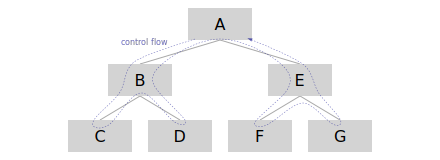
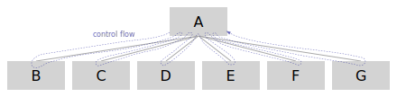

# Testing web code

This is the implementation of our [Testing Principles](testing_principles.md) for all code (TypeScript, stylesheets, ...) used on the web, such as our webapp, browser extension, or shared code.

## General Goals

1. **Our product and code works as intended when we ship it to customers.**

2. **Our product and code doesn't accidentally break as we make changes over time.**

3. **Failures are clear about _what_ is not working and give as many hints as possible to _why_ it's not working.**

4. **Tests do not commonly need manual updates when the implementation is changed.**
   If tests commonly need manual updates, it creates the potential to accidentally change the test so that it doesn't catch a regression introduced in the same change. It also puts more burden on the code reviewers. In addition, updating tests can feel daunting and reduces the motivation to make changes to that part of the codebase.

5. **Tests are easy to write and maintain.**

## Testing UI Code

When testing UI, there are several categories of things that should be tested.
These categories may be more or less important depending on the piece of UI.

### Render output

Depending on the component, it can be important to test the _render output_ of the component.
This encompasses the DOM structure and that the correct props are passed to other components.
This can be useful for tests where we **only** care about the DOM output.
For example, a component that renders a `<span>` or an `<a>` element depending on the props passed to it.

Snapshot diffs should be reviewed in pull request reviews the same way any other code or test diff should is reviewed and can be useful to highlight changes in render output to reviewers.

**Please note:** Snapshot testing should only be used for the simplest of components and should be avoided for most tests. There are some major caveats to this type of testing:

- Snapshots ultimately test the implementation details of a component. This is problematic as it is at odds with goal (4). We cannot refactor our component internals and rely on these tests to catch regressions effectively.
- Snapshots can often be very large and easily missed in code review. As they change so often, it can be quite common for developers to fall into the trap of ignoring the diffs and assuming that the snapshot is correct.
- Snapshots fall into a grey area between our typical behavior tests and our visual regression tests. It should usually be beneficial to chose the relevant alternative of those options that suits your use case instead of adding another snapshot.

[Learn how to write and debug these tests](../how-to/testing.md#react-component-snapshot-tests)

### Behavior

The most effective way we can test our React components is through our behavior tests. These tests should all follow the same core guiding principle:

> The more our tests resemble the way our software is used, the more confidence they will give us.

This means that our behavior tests should be designed to simulate a typical user journey **as closely as possible**.

Our tests should deal with the DOM directly, rather than component abstractions. For example, for an `<Input />` component, we should simulate actual keyboard events rather than calling an `onInput` prop with mock data.

Our tests should render as much of a single user journey as possible. Although it might be simpler to test a specific `<PageHeader />` component on its own, it is much closer to a typical user journey to test the entire `<Page />` component at once. The one exception here should be for components that are **intended** to be reusable, it is preferable to test these in isolation as they could be used in many different user journeys.

We use two different libraries for writing our behavior tests:

#### Testing-library
These tests run in a simulated, pure-JavaScript implementation of a browser called [JSDOM](https://github.com/jsdom/jsdom). They are fast and accurate, but cannot fully replicate a browser. Most of our behavior tests should be written in this way.

[Learn how to write and debug these tests](../how-to/testing.md#behavior-tests)

#### Puppeteer
These tests run in an actual browser, meaning they can fully replicate almost everything a user might be able to do. However, they are quite slow and can be very brittle. We should only write these tests for functionality that cannot be tested through testing-library.

[Learn how to write and debug these tests](../how-to/testing.md#browser-based-tests)


## Writing testable code

### Avoid globals

Relying on global variables makes dependencies hard to stub for testing (a variable exported from a module counts as a global).
It also means figuring out all transitive dependencies that need stubbing for a test is difficult.
Even if it results in more code, prefer passing in dependencies as parameters (or props for React components), which makes dependencies explicit.

### Favor flat & wide call trees over deep & narrow call trees

When writing deeply nested call trees, a test for a unit in the middle of the tree inevitably also tests every layer beneath it.
This means when a layer below is changed or breaks, the tests for the layers above it will likely break too.
It also means that the test doesn't just need to pass stubs for the immediate dependencies of the unit, but also for the dependencies of every unit beneath it in the call tree.
This directly means that if the interface of any unit beneath it changes, the tests of all units above it need to change too, violating goal (4).



In this simplified example call graph, to test unit B, we need to provide stubs for all the dependencies of C and D in addition to those of B itself.
If the interface of those dependencies for C or D change, we now need to update all unit tests of B in addition to those of C or D.
The tests for B and E also redundantly test C, D, F, and G.
If something is broken in C, D, F or G, it will likely also cause B and E to be broken, leading to test failures that are red herrings on the path to find the root cause.

Instead, strive to write functions that take only the data they need and return data that can be "piped" to the next function.
The top level takes care of composing these functions.
This way each function can be tested individually with minimal stubbing effort and minimal chance of violating goals (3) and (4).



In the updated example call graph, to test any of the units B-G, we now only need to pass stubs for their own respective dependencies.
If any of their interfaces change, it will only affect the unit tests of direct dependents.

For React components, this can mean writing components that take **children** instead of hard-coding them, which also makes snapshot tests assert fewer implementation details.

For RxJS code, this can mean implementing logic as _operators_ (functions taking an Observable and returning an Observable).

## Guidelines for writing tests

### Use specific assertion functions

Using specific assertion functions gives better error messages and insights when a test is failing into _why_ is it failing.

Examples:

- Use `assert.equal(value, 123)`/`expect(value).toBe(123)` instead of `assert(value === 123)`/`expect(value === 123).toBeTrue()`.
  The former will throw an assertion error like "expected 456 to be 123", while the latter will throw an unhelpful error like "expected false to be true".

- Use `assert.deepStrictEqual(object, { property: 123 })`/`expect(object).toEqual({ property: 123 })` over `assert.equal(object.property, 123)`/`expect(object.property).toBe(123)`.
  The former will print a diff of the actual and expected objects, while the latter may only throw an error like "expected undefined to equal 123".

- Use [`sinon.assert.calledOnce(spy)`](https://sinonjs.org/releases/latest/assertions/) instead of `expect(calledTimes).toBe(1)`.
  `expect(calledTimes).toBe(1)` will throw an assertion error "expected 0 to be 1", while `sinon` will give something like "expected function subscribe to be called 1 time, but was called 0 times".

- Use [`expectObservable()`](https://rxjs-dev.firebaseapp.com/guide/testing/marble-testing) instead of `sinon.assert.calledOnce(subscribe)`.
  If the `subscribe` callback is not called at all for example because it errored, `expectObservable()` will print a diff of the expected and actual emissions, including that error, which can give hints at the cause of the failure. `sinon` here would just fail with "expected function to be called once, but was called 0 times", which does not give any hint _why_ it failed.

- In rare cases where none of these are possible and boolean `assert()` is the only option, pass a custom assertion message.

### Avoid putting too much logic into test files

The more logic is in the test itself, the more likely it is there is a bug in the test itself.
If the logic is unavoidable, it may be moved into an external function outside the test file.
This also intentionally makes that utility subject to have tests itself (it will be included in coverage tracking since the file name will not end in `.test.ts`).

### Keep tests focused

It may be tempting to make many assertions as possible in one test to save repeating setup code.
Instead of making many assertions that test different things in one test, favor splitting the test into multiple.
For example, favor three separate tests for "Add X", "Update X" and "Remove X" with fewer assertions each over a single test like "CRUD feature X works" with many assertions.
This ensures that when one of them fails, the developer debugging can see whether the other two features are still working and therefor better narrow down where the problem is.
Use [`beforeEach()`/`afterEach()` hooks](https://vitest.dev/api/#setup-and-teardown) to avoid duplication of common setup and teardown logic and giving better errors when setup or teardown fails (as opposed to the test itself).

### Write clear test titles

Give tests titles that describe the behavior being tested of the unit like a specification (not unclear titles like "it works").
When tests fail, it should be clear which exact behaviors of the unit under test are broken (and which are not).

Prefer using the `it()` test function over `test()` as it affords wording the title like a specification of behavior (it affords following "it" with a verb, while `test()` does not).
When using `it()`, the title should read like an English statement in present tense starting with "it", where "it" refers to the unit under test.

Avoid repetition in test titles by nesting tests within `describe()` blocks.
For example, instead of a test suite like this:

```ts
describe('ExampleDetailsComponent', () => {
  it('shows the details of the example', ...)
  it('shows an edit button if in view mode and user has permissions', ...)
  it('shows a delete button if in view mode and user has permissions', ...)
  it('submits the form if submit button is clicked and in edit mode', ...)
  it('discards the form if discard button is clicked and in edit mode', ...)
  // ...
})
```

group tests like this:

```ts
describe('ExampleDetailsComponent', () => {
  describe('view mode', () => {
    it('shows the details of the example', ...)
    describe('user has edit permissions', () => {
      it('shows an edit button if user has permissions', ...)
      it('shows a delete button if user has permissions', ...)
    })
  })
  describe('edit mode', () => {
    it('submits the form if submit button is clicked', ...)
    it('discards the form if discard button is clicked', ...)
  })
  // ...
})
```

This also creates an opportunity to e.g. define common props for this context to avoid duplication.

### Treat tests with the same standards to type safety as application code

Using a static type system like TypeScript helps in detecting errors early and makes refactoring easier.
This is equally true for test code as it is for implementation code.
When defining stub objects to pass to a unit under test it may be tempting to only define the exact methods the unit is currently using and casting the object (to `any` or the required type) to circumvent the resulting compile errors.
This however quickly violates goals (3) and (4), as it will swallow type errors when making incompatible changes to the implementation in the future.
It also means automatic refactors like a simple "Rename symbol" will no longer rename the symbol everywhere (making the test fail and requiring a manual update).

Instead, strive to provide compliant stub implementations (this also excludes throwing a "Not implemented" error, but noop methods can be okay if they satisfy the type).
If this causes you to implement a lot of methods that are not actually used, consider refactoring the unit under test to not require those dependencies.
