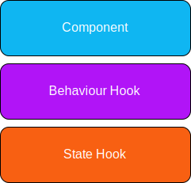

# Wildcard Component Library

Wildcard is a collection of design-approved, accessible and well-tested React components that are suitable for use within the Sourcegraph codebase.

## Usage

This library is setup as a `pnpm workspace` symlink.

You can import components from the library like so:

```javascript
import { PageSelector } from '@sourcegraph/wildcard'
```

## Architecture

We want our components to be composable and reusable, but we don't want to 'reinvent the wheel' for everything we build. To support this, we aim to build our components in consideration of the following architecture as inspired by [React Spectrum](https://react-spectrum.adobe.com/).



### State hook

These hooks should act as a 'headless component', it should be entirely focused on state management and should function irrespective of any UI elements. Essentially, this hook should be decoupled from the component file and should be importable and usable on its own.

These hooks will make it much easier to change styles whilst maintaining UX. In many scenarios we may find that it makes sense to use third-party libraries for common patterns here.

Simplified Example:

Fully featured PageSelector component:

```jsx
<PageSelector currentPage={page} onPageChange={setPage} totalPages={10} />
```

Alternative PageSelector making use of a state hook:

```jsx
const [page, setPage] = useState(1);
const pages = useOffsetPagination({ page, onChange: setPage, totalPages: 10 })

return (
  // Map over pages and render some UI!
)
```

### Behavior Hook

These hooks should capture key behavior and accessibility patterns that can be isolated from UI elements. For many simple components, this hook won't be necessary or required. For larger components this becomes more meaningful. Behavior hooks shouldn't be coupled to components in any way and should be importable on their own.

For example, a `<PageSelector>` component might use `useOffsetPagination` to determine which pages to render, but we might have additional _behavior_ like keyboard shortcuts to select a page. This is where something like `useKeyboard` might be used.

Often it will be clear when we have shared behaviour that should be extracted into these hooks. It may also make sense to use suitable third-party libraries for common patterns here just like our state hooks.

Simplified Example:

```jsx
const [page, setPage] = useState(1);
const status = useKeyboard({
  key: 'ArrowRight'
  onKeyDown: (e) => setPage(prev => prev + 1)
})
const pages = useOffsetPagination({ page, onChange: setPage, totalPages: 10 })

return (
  // Map over pages and render some UI!
)
```

### Component

Now we have extracted our state and behaviour into separate hooks, our UI component should just focus on displaying simple elements with specific styles. It should be able to make use of our hooks to enhance these elements with more complex behavior and state.

For most scenarios, **it doesn't make sense to use third-party libraries here.** When compared to other applications, it will ultimately be our UI that will significantly differ, not our UX.

## Contributing

Anyone can contribute to Wildcard:

- If you want to add a new component, consider starting a new [component proposal](https://github.com/sourcegraph/sourcegraph/issues/new?labels=team/frontend-platform&template=wildcard_proposal.md) for visibility.
- If you notice a bug, or want to change an existing component, simply make a PR if you are able to make this change, or create a new GitHub issue and add the label: `team/frontend-platform`.

## FAQ

### *Where can I view all of our current Wildcard components?*

You can view our components:

- On Storybook. The latest components are deployed at http://storybook.sgdev.org/.
- In the code. If you want to take a closer look, the component code lives in [this directory](https://github.com/sourcegraph/sourcegraph/tree/main/client/wildcard).

### *Can I use these components in a different codebase?*

Currently our Wildcard components are not published on npm, if this is a requirement please create a new issue and add the label: `team/frontend-platform`.
