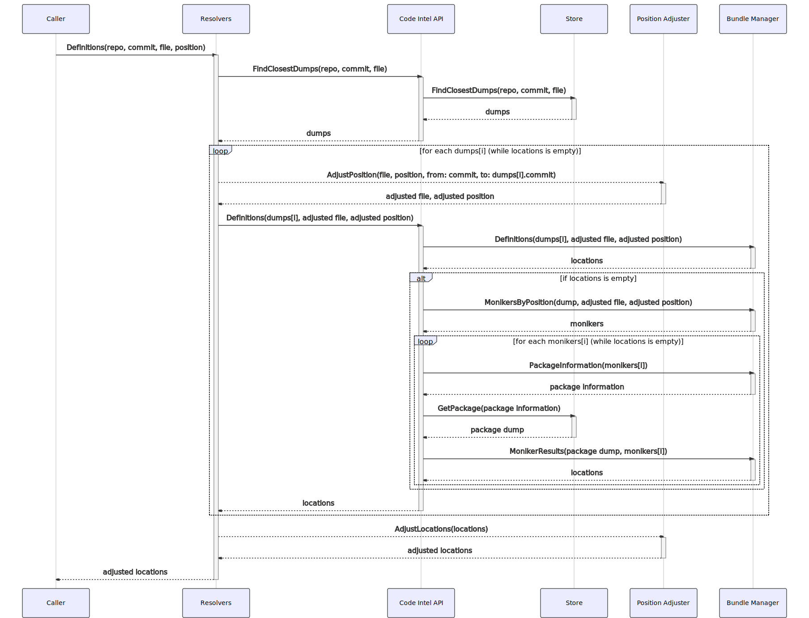
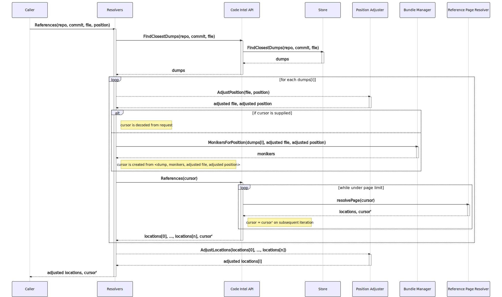
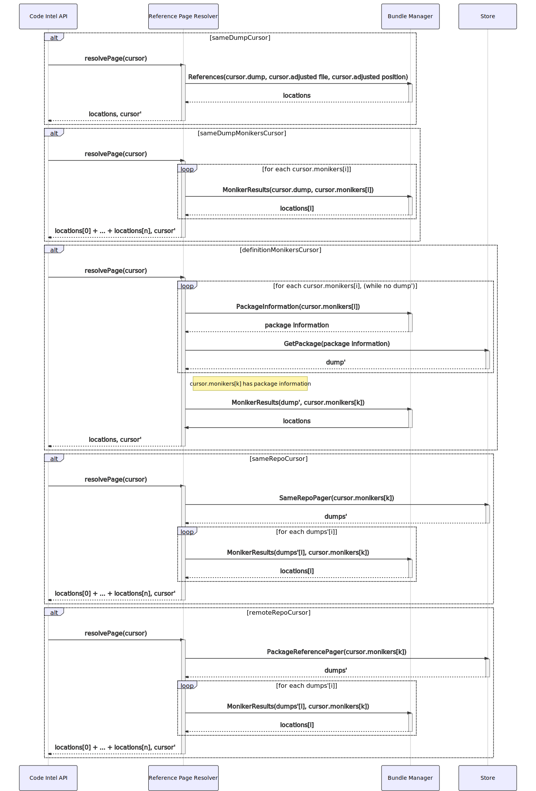
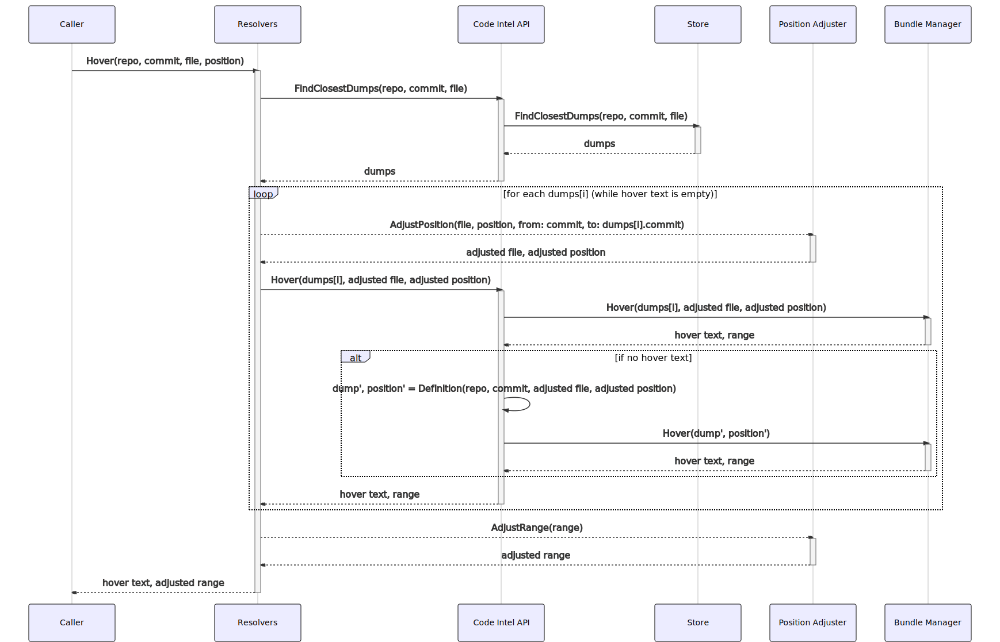

# How precise code intelligence queries are resolved

Precise code intelligence results are obtained by making [GraphQL requests](https://sourcegraph.com/api/console#%7B%22operationName%22%3A%22DefinitionAndHover%22%2C%22query%22%3A%22query%20DefinitionAndHover\(%24repository%3A%20String!%2C%20%24commit%3A%20String!%2C%20%24path%3A%20String!%2C%20%24line%3A%20Int!%2C%20%24character%3A%20Int!\)%20%7B%5Cn%20%20repository\(name%3A%20%24repository\)%20%7B%5Cn%20%20%20%20commit\(rev%3A%20%24commit\)%20%7B%5Cn%20%20%20%20%20%20blob\(path%3A%20%24path\)%20%7B%5Cn%20%20%20%20%20%20%20%20lsif%20%7B%5Cn%20%20%20%20%20%20%20%20%20%20definitions\(line%3A%20%24line%2C%20character%3A%20%24character\)%20%7B%5Cn%20%20%20%20%20%20%20%20%20%20%20%20nodes%20%7B%5Cn%20%20%20%20%20%20%20%20%20%20%20%20%20%20resource%20%7B%5Cn%20%20%20%20%20%20%20%20%20%20%20%20%20%20%20%20path%5Cn%20%20%20%20%20%20%20%20%20%20%20%20%20%20%20%20repository%20%7B%5Cn%20%20%20%20%20%20%20%20%20%20%20%20%20%20%20%20%20%20name%5Cn%20%20%20%20%20%20%20%20%20%20%20%20%20%20%20%20%7D%5Cn%20%20%20%20%20%20%20%20%20%20%20%20%20%20%20%20commit%20%7B%5Cn%20%20%20%20%20%20%20%20%20%20%20%20%20%20%20%20%20%20oid%5Cn%20%20%20%20%20%20%20%20%20%20%20%20%20%20%20%20%7D%5Cn%20%20%20%20%20%20%20%20%20%20%20%20%20%20%7D%5Cn%20%20%20%20%20%20%20%20%20%20%20%20%20%20range%20%7B%5Cn%20%20%20%20%20%20%20%20%20%20%20%20%20%20%20%20start%20%7B%5Cn%20%20%20%20%20%20%20%20%20%20%20%20%20%20%20%20%20%20line%5Cn%20%20%20%20%20%20%20%20%20%20%20%20%20%20%20%20%20%20character%5Cn%20%20%20%20%20%20%20%20%20%20%20%20%20%20%20%20%7D%5Cn%20%20%20%20%20%20%20%20%20%20%20%20%20%20%20%20end%20%7B%5Cn%20%20%20%20%20%20%20%20%20%20%20%20%20%20%20%20%20%20line%5Cn%20%20%20%20%20%20%20%20%20%20%20%20%20%20%20%20%20%20character%5Cn%20%20%20%20%20%20%20%20%20%20%20%20%20%20%20%20%7D%5Cn%20%20%20%20%20%20%20%20%20%20%20%20%20%20%7D%5Cn%20%20%20%20%20%20%20%20%20%20%20%20%7D%5Cn%20%20%20%20%20%20%20%20%20%20%7D%5Cn%20%20%20%20%20%20%20%20%20%20hover\(line%3A%20%24line%2C%20character%3A%20%24character\)%20%7B%5Cn%20%20%20%20%20%20%20%20%20%20%20%20markdown%20%7B%5Cn%20%20%20%20%20%20%20%20%20%20%20%20%20%20text%5Cn%20%20%20%20%20%20%20%20%20%20%20%20%7D%5Cn%20%20%20%20%20%20%20%20%20%20%20%20range%20%7B%5Cn%20%20%20%20%20%20%20%20%20%20%20%20%20%20start%20%7B%5Cn%20%20%20%20%20%20%20%20%20%20%20%20%20%20%20%20line%5Cn%20%20%20%20%20%20%20%20%20%20%20%20%20%20%20%20character%5Cn%20%20%20%20%20%20%20%20%20%20%20%20%20%20%7D%5Cn%20%20%20%20%20%20%20%20%20%20%20%20%20%20end%20%7B%5Cn%20%20%20%20%20%20%20%20%20%20%20%20%20%20%20%20line%5Cn%20%20%20%20%20%20%20%20%20%20%20%20%20%20%20%20character%5Cn%20%20%20%20%20%20%20%20%20%20%20%20%20%20%7D%5Cn%20%20%20%20%20%20%20%20%20%20%20%20%7D%5Cn%20%20%20%20%20%20%20%20%20%20%7D%5Cn%20%20%20%20%20%20%20%20%7D%5Cn%20%20%20%20%20%20%7D%5Cn%20%20%20%20%7D%5Cn%20%20%7D%5Cn%7D%5Cn%22%2C%22variables%22%3A%22%7B%5Cn%20%20%5C%22repository%5C%22%3A%20%5C%22github.com%2Fsourcegraph%2Fsourcegraph%5C%22%2C%5Cn%20%20%5C%22commit%5C%22%3A%20%5C%2288ba1ebe3422fd93c07cbf0084dc177dea393df4%5C%22%2C%5Cn%20%20%5C%22path%5C%22%3A%20%5C%22monitoring%2Fprecise_code_intel_indexer.go%5C%22%2C%5Cn%20%20%5C%22line%5C%22%3A%2012%2C%5Cn%20%20%5C%22character%5C%22%3A%2012%5Cn%7D%22%7D) to the frontend service. The [code intelligence extensions](https://github.com/sourcegraph/code-intel-extensions) are example consumer of this API, and its [documentation](./extensions.md) details how code intelligence results are used.

<!-- TODO(efritz): range queries -->
<!-- TODO(efritz): diagnostic queries -->

## Definitions

A definitions request returns the set of locations that define the symbol at a particular location (defined uniquely by a repository, commit, path, line offset, and character offset). The sequence of actions required to resolve a definitions query is shown below (click to enlarge).

First, the repository, commit, and path inputs are used to determine the set of LSIF uploads that can answer queries for that data. Such an upload may have been indexed on another commit. In this case, the output of `git diff` between the two commits is used to adjust the input path and line number.

The adjusted path and position is used to query the definitions at that position using the selected upload data. If a definition is local to the upload, the bundle manager can resolve the query without any additional data. If the definition is remote (defined in a different root of the same repository, or defined in a different repository), the _import_ monikers of the symbol at the adjusted path and position in the selected upload are determined, as are the package information data of those monikers. Using an upload that provides one of the selected packages, definitions of the associated moniker are queried from the bundle manager.

Finally, if the resulting locations were provided by an upload that was indexed on a commit distinct from the input commit, `git diff` is used to again re-adjust the results to the target commit.

### Code appendix

- Resolvers: [QueryResolver](https://sourcegraph.com/github.com/sourcegraph/sourcegraph/-/blob/enterprise/internal/codeintel/resolvers/resolver.go#L73:20), [Definitions](https://sourcegraph.com/github.com/sourcegraph/sourcegraph/-/blob/enterprise/internal/codeintel/resolvers/query.go#L138:25)
- CodeIntelAPI: [FindClosestDumps](https://sourcegraph.com/github.com/sourcegraph/sourcegraph/-/blob/enterprise/internal/codeintel/api/exists.go#L18:26), [Definitions](https://sourcegraph.com/github.com/sourcegraph/sourcegraph/-/blob/enterprise/internal/codeintel/api/definitions.go#L21:26)
- Store: [FindClosestDumps](https://sourcegraph.com/github.com/sourcegraph/sourcegraph/-/blob/enterprise/internal/codeintel/store/dumps.go#L99:17), [GetPackage](https://sourcegraph.com/github.com/sourcegraph/sourcegraph/-/blob/enterprise/internal/codeintel/store/packages.go#L11:17)
- Position Adjuster: [AdjustPosition](https://sourcegraph.com/github.com/sourcegraph/sourcegraph/-/blob/enterprise/internal/codeintel/resolvers/position.go#L63:28), [AdjustRange](https://sourcegraph.com/github.com/sourcegraph/sourcegraph/-/blob/enterprise/internal/codeintel/resolvers/position.go#L77:28)
- Bundle Manager: [Definitions](https://sourcegraph.com/github.com/sourcegraph/sourcegraph/-/blob/enterprise/cmd/precise-code-intel-bundle-manager/internal/database/database.go#L166:25), [MonikersByPosition](https://sourcegraph.com/github.com/sourcegraph/sourcegraph/-/blob/enterprise/cmd/precise-code-intel-bundle-manager/internal/database/database.go#L284:25), [PackageInformation](https://sourcegraph.com/github.com/sourcegraph/sourcegraph/-/blob/enterprise/cmd/precise-code-intel-bundle-manager/internal/database/database.go#L358:25), [MonikerResults](https://sourcegraph.com/github.com/sourcegraph/sourcegraph/-/blob/enterprise/cmd/precise-code-intel-bundle-manager/internal/database/database.go#L316:25)

## References

A references request returns the set of locations that reference the symbol at a particular location (defined uniquely by a repository, commit, path, line offset, and character offset). Unlike the set of definitions, which should generally have only member, the set of references can unbounded for popular repositories. The resolution of references is therefore done in chunks, allowing the user to request reference results page-by-page. The sequence of actions required to resolve a references query is shown below (click to enlarge).

First, the repository, commit, and path inputs are used to determine the set of LSIF uploads that can answer queries for that data. Such an upload may have been indexed on another commit. In this case, the output of `git diff` between the two commits is used to adjust the input path and line number.

A references request optionally supplies a cursor that encodes the state of the previous request (the first request supplies no cursor). If a cursor is supplied, it is decoded and validated. Otherwise, one is created with the input repository, commit, adjusted path, adjusted position, the selected upload identifier, and the monikers of the symbol at the adjusted path and position in the selected, upload. Note that this step may be repeated over multiple uploads: each upload returned in the previous step will have its own cursor, encoded/decoded independently at the GraphQL resolver layer.

The cursor decoded or created above is used to drive the resolution of the current page of results. While the number of results in the current page is less than the requested number of results, another batch of locations is requested using the current cursor and append it to the current page. Resolving a page also returns a new cursor. This cursor is ultimately sent back to the client so they can make a subsequent request, and is also used as the new _current_ cursor if a subsequent batch of locations is requested.

Finally, if the resulting locations were provided by an upload that was indexed on a commit distinct from the input commit, `git diff` is used to again re-adjust the results to the target commit.

---

The sequence of actions required to resolve a page of references given a cursor is shown below (click to enlarge).

The cursor can be in one of five _phases_, ordered as follows. Each phase handles a distinct segment of the result set. A phase may return no results, or it may return multiple pages worth of results. In the later case, the cursor encodes sufficient information (e.g. number of uploads, references previously returned in the phase) to be able to skip duplicate results.

1. The `sameDumpCursor` phase retrieves reference results from the upload in which the target symbol is indexed. This phase will return local references to symbols defined in the same upload. This phase will also, for some but not all indexer output, return references to remote symbols.
1. The `sameDumpMonikersCursor` phase retrieves reference results by the moniker of the target symbol from the upload in which the target the symbol is indexed. This excludes the reference results that are returned from the previous phase. This phase is necessary as not all indexer output uniquely correlates the references of symbols defined externally.
1. The `definitionMonikersCursor` phase retrieves reference results by moniker from the upload in which the symbol definition is indexed (if it is distinct from the upload in which the target symbol is indexed).
1. The `sameRepoCursor` phase retrieves references results by moniker from all uploads for the same repository. This includes uploads only for roots which are distinct from the root of the upload in which the target symbol is indexed. This handles results from large repositories that are split into multiple, separately-indexed projects.
1. The `remoteRepoCursor` phase retrieves reference results by moniker from all uploads for distinct repositories. This enables true cross-repository reference results.

### Code appendix

- PositionAdjuster: [AdjustPosition](https://sourcegraph.com/github.com/sourcegraph/sourcegraph/-/blob/enterprise/internal/codeintel/resolvers/position.go#L63:28), [AdjustRange](https://sourcegraph.com/github.com/sourcegraph/sourcegraph/-/blob/enterprise/internal/codeintel/resolvers/position.go#L77:28)
- Resolvers: [QueryResolver](https://sourcegraph.com/github.com/sourcegraph/sourcegraph/-/blob/enterprise/internal/codeintel/resolvers/resolver.go#L73:20), [References](https://sourcegraph.com/github.com/sourcegraph/sourcegraph/-/blob/enterprise/internal/codeintel/resolvers/query.go#L167:25)
- CodeIntelAPI: [FindClosestDumps](https://sourcegraph.com/github.com/sourcegraph/sourcegraph/-/blob/enterprise/internal/codeintel/api/exists.go#L18:26), [References](https://sourcegraph.com/github.com/sourcegraph/sourcegraph/-/blob/enterprise/internal/codeintel/api/references.go#L24:26), [DecodeOrCreateCursor](https://sourcegraph.com/github.com/sourcegraph/sourcegraph/-/blob/enterprise/internal/codeintel/api/cursor.go#L54:6)
- Bundle Manager: [References](https://sourcegraph.com/github.com/sourcegraph/sourcegraph/-/blob/enterprise/cmd/precise-code-intel-bundle-manager/internal/database/database.go#L189:25), [MonikersByPosition](https://sourcegraph.com/github.com/sourcegraph/sourcegraph/-/blob/enterprise/cmd/precise-code-intel-bundle-manager/internal/database/database.go#L284:25), [PackageInformation](https://sourcegraph.com/github.com/sourcegraph/sourcegraph/-/blob/enterprise/cmd/precise-code-intel-bundle-manager/internal/database/database.go#L358:25), [MonikerResults](https://sourcegraph.com/github.com/sourcegraph/sourcegraph/-/blob/enterprise/cmd/precise-code-intel-bundle-manager/internal/database/database.go#L316:25)
- Store: [FindClosestDumps](https://sourcegraph.com/github.com/sourcegraph/sourcegraph/-/blob/enterprise/internal/codeintel/store/dumps.go#L99:17), [GetPackage](https://sourcegraph.com/github.com/sourcegraph/sourcegraph/-/blob/enterprise/internal/codeintel/store/packages.go#L11:17), [SameRepoPager](https://sourcegraph.com/github.com/sourcegraph/sourcegraph/-/blob/enterprise/internal/codeintel/store/references.go#L39:17), [PackageReferencePager](https://sourcegraph.com/github.com/sourcegraph/sourcegraph/-/blob/enterprise/internal/codeintel/store/references.go#L77:17)
- ReferencePageResolver: [resolvePage](https://sourcegraph.com/github.com/sourcegraph/sourcegraph/-/blob/enterprise/internal/codeintel/api/references.go#L50:33), [handleSameDumpCursor](https://sourcegraph.com/github.com/sourcegraph/sourcegraph/-/blob/enterprise/internal/codeintel/api/references.go#L91:33), [handleSameDumpMonikersCursor](https://sourcegraph.com/github.com/sourcegraph/sourcegraph/-/blob/enterprise/internal/codeintel/api/references.go#L137:33), [handleDefinitionMonikersCursor](https://sourcegraph.com/github.com/sourcegraph/sourcegraph/-/blob/enterprise/internal/codeintel/api/references.go#L218:33), [handleSameRepoCursor](https://sourcegraph.com/github.com/sourcegraph/sourcegraph/-/blob/enterprise/internal/codeintel/api/references.go#L283:33), [handleRemoteRepoCursor](https://sourcegraph.com/github.com/sourcegraph/sourcegraph/-/blob/enterprise/internal/codeintel/api/references.go#L311:33)

## Hover

A hover request returns the hover text associated with the symbol at a particular location (defined uniquely by a repository, commit, path, line offset, and character offset), as well as the range of the hovered symbol. The sequence of actions required to resolve a hover query is shown below (click to enlarge).

First, the repository, commit, and path inputs are used to determine the set of LSIF uploads that can answer queries for that data. Such an upload may have been indexed on another commit. In this case, the output of `git diff` between the two commits is used to adjust the input path and line number.

The adjusted path and position is used to query the hover at that position using the selected upload data. For most indexers, this is enough to completely resolve the hover data; we have, however, seen indexes in which cross-repository symbols do not link their hover text correctly. In these cases, the definition of the symbol at the same location is determined, and another hover query is performed using the definition symbol's position (if exactly one such definition is found).

Finally, if the resulting locations were provided by an upload that was indexed on a commit distinct from the input commit, `git diff` is used to again re-adjust the results to the target commit.

### Code appendix

- Resolvers: [QueryResolver](https://sourcegraph.com/github.com/sourcegraph/sourcegraph/-/blob/enterprise/internal/codeintel/resolvers/resolver.go#L73:20), [Hover](https://sourcegraph.com/github.com/sourcegraph/sourcegraph/-/blob/enterprise/internal/codeintel/resolvers/query.go#L236:25)
- CodeIntelAPI: [FindClosestDumps](https://sourcegraph.com/github.com/sourcegraph/sourcegraph/-/blob/enterprise/internal/codeintel/api/exists.go#L18:26), [Hover](https://sourcegraph.com/github.com/sourcegraph/sourcegraph/-/blob/enterprise/internal/codeintel/api/hover.go#L13:26)
- Store: [FindClosestDumps](https://sourcegraph.com/github.com/sourcegraph/sourcegraph/-/blob/enterprise/internal/codeintel/store/dumps.go#L99:17)
- PositionAdjuster: [AdjustPosition](https://sourcegraph.com/github.com/sourcegraph/sourcegraph/-/blob/enterprise/internal/codeintel/resolvers/position.go#L63:28), [AdjustRange](https://sourcegraph.com/github.com/sourcegraph/sourcegraph/-/blob/enterprise/internal/codeintel/resolvers/position.go#L77:28)
- Bundle Manager: [Hover](https://sourcegraph.com/github.com/sourcegraph/sourcegraph/-/blob/enterprise/cmd/precise-code-intel-bundle-manager/internal/database/database.go#L213:25)
