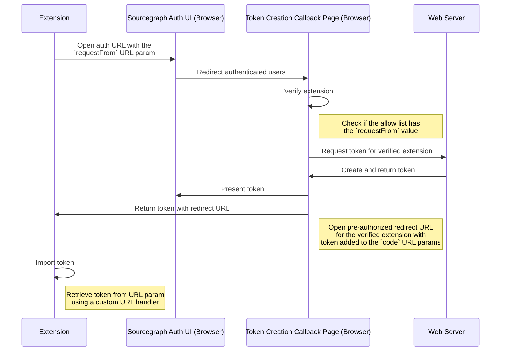

# Authentication for IDE

This document will go through the current auth flow for our IDE extensions, and how to implement them in other extensions.

## Personal Access Token

In general, users are required to provide each IDE extension with their Sourcegraph Personal Access Token to make certain requests to the Sourcegraph API.

### Default Steps

Before the token creation callback page was introduced, users had to retrieve a Sourcegraph Personal Access Token from their Sourcegraph instance manually in order to proceed with the authentication process for each IDE extension.

Here are the default steps for an IDE extension to authenticate an account:
1. Redirect users to the auth page in browser from the extension
1. Complete the authentication process
1. Navigate to the `User setting` page
1. Move to `Access Tokens` page
1. Click `Generate new token`
1. Fill in the description 
1. Click `+ Generate token`
1. Copy the new token 
1. Move back to the extension UI
1. Import the new token

## Token Creation Callback Page

The [Token Creation Callback Page](https://sourcegraph.com/github.com/sourcegraph/sourcegraph@main/-/blob/client/web/src/user/settings/accessTokens/UserSettingsCreateAccessTokenCallbackPage.tsx) was introduced in PR#35339.  The page acts as a callback URL after the authentication process has been completed by a user in the web app, and can be shared among different integrations as long as the value that is being passed in using the 'requestFrom' param is on the [REQUESTERS allow list](https://sourcegraph.com/github.com/sourcegraph/sourcegraph@7533ada4fd47e82d95f7258cbb88ca76f414e53d/-/blob/client/web/src/user/settings/accessTokens/UserSettingsCreateAccessTokenCallbackPage.tsx?L59-69). 

> SECURITY NOTE:
> - Only callback requests from requesters specified on the allowed list are allowed
> - Only local contexts are allowed, which means tokens should never be sent back to non-local servers

More detail can be found in [PR#35339](https://github.com/sourcegraph/sourcegraph/pull/35339).

### Architecture Overview

The process begins with the extension taking a user to the Sourcegraph Web App for the account authentication process using a redirect URL that would take the user to the [Token Creation Callback Page](https://sourcegraph.com/user/settings/tokens/new/callback) once they are authorized. 

> EXAMPLE: Redirect URL from extension to the Token Creation Callback Page:
> - https://sourcegraph.example/sign-in?returnTo=user/settings/tokens/new/callback?requestFrom=$SOURCE
> - $SOURCE must be a verified source on the [allow list](https://sourcegraph.com/github.com/sourcegraph/sourcegraph@7533ada4fd47e82d95f7258cbb88ca76f414e53d/-/blob/client/web/src/user/settings/accessTokens/UserSettingsCreateAccessTokenCallbackPage.tsx?L59-69).

The [Token Creation Callback Page](https://sourcegraph.com/user/settings/tokens/new/callback) will then verify if the request is sent by an allowed requester by checking if it is on the [allow list](https://sourcegraph.com/github.com/sourcegraph/sourcegraph@7533ada4fd47e82d95f7258cbb88ca76f414e53d/-/blob/client/web/src/user/settings/accessTokens/UserSettingsCreateAccessTokenCallbackPage.tsx?L59-69).

 Once the request has been validated, the user will then be redirected back to the verified extension with the newly created token passing in as a new URL param called `code`, using the redirect URL associated with the allowlisted requester 

> EXAMPLE: Redirect URL from the Token Creation Callback Page to the extension: 
> - http://localhost:8323?code=$TOKEN
> - The redirect URL is generated with the redirect URL listed under the verified source from the [allow list](https://sourcegraph.com/github.com/sourcegraph/sourcegraph@7533ada4fd47e82d95f7258cbb88ca76f414e53d/-/blob/client/web/src/user/settings/accessTokens/UserSettingsCreateAccessTokenCallbackPage.tsx?L59-69).

The token should then be processed by the extension's URL handler.

### Architecture Diagram

### How to use the Token Creation Callback Page with an extension

To implement the streamlined auth-flow:

Web App
- Add all the required information for the extension to the [Allow List for Token Creation Callback](https://sourcegraph.com/github.com/sourcegraph/sourcegraph@7533ada4fd47e82d95f7258cbb88ca76f414e53d/-/blob/client/web/src/user/settings/accessTokens/UserSettingsCreateAccessTokenCallbackPage.tsx?L59-69)

Extension
- Create a custom URL handler to retrieve the token from the URL param `code`
  - You may need to create a new local server for the extension if a built-in URL handler is not provided

### Backward Compatibility

- The token creation callback page is only supported by instances on version 3.41.0.
- Users on instances prior to 3.41.0 must create a token manually using the [default steps](#default-steps) for the authentication process. 

### Example: VS Code Extension

Steps to authenticate an account in VSCE using the token callback page:
1. Redirect users to the auth page in browser from the extension
1. Complete the authentication process
1. Redirect authorized user to the token creation callback page automatically
  1. The token callback page reads the url params and look for the `requestFrom` URL param value, and checks if it is on the [allow list](https://sourcegraph.com/github.com/sourcegraph/sourcegraph@7533ada4fd47e82d95f7258cbb88ca76f414e53d/-/blob/client/web/src/user/settings/accessTokens/UserSettingsCreateAccessTokenCallbackPage.tsx?L59-69)
1. Redirect user to the extension and the extension will import the token using a [custom URL handler](https://sourcegraph.com/github.com/sourcegraph/sourcegraph@7533ada4fd47e82d95f7258cbb88ca76f414e53d/-/blob/client/vscode/src/webview/commands.ts?L40-52&utm_source=chrome-extension&utm_campaign=open-on-sourcegraph)
