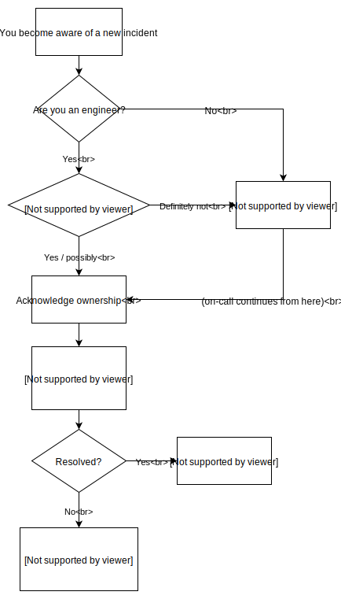

# Incidents

This document describes how we deal with operational incidents.

## Identification

An incident is anything that requires a time sensitive response. Here are some examples:

- sourcegraph.com is down or a critical feature is broken (e.g. sign-in, search, code intel).
- A customer reports that their own Sourcegraph instance is down or a critical feature is broken.
- There is a security issue with Sourcegraph.
- The `master` build is broken.

Incidents can be reported by anyone (e.g. customers, Sourcegraph teammates) by any means (e.g. Twitter, GitHub, Slack). The first Sourcegraph teammate (regardless of their role) that becomes aware of an incident is responsible for taking a few actions:

1. If the incident was reported by someone outside of Sourcegraph, acknowledge that the incident is being handled.
2. Start an internal communication thread about this incident in the #incidents channel in Slack.
    - All subsequent communication about this issue should happen in that Slack _thread_ (not in the top level #incidents channel).
3. Identify an engineer to triage the incident.
    - If you are an engineer and available for 30 minutes, then you should [triage the incident](#triage).
    - If you are not an engineer or are not available to triage the incident, then ask the on-call engineer to triage the incident.
        - You can find out who is on-call by typing `/genie whoisoncall` in Slack.
        - If you are not able to immediately get in contact with the on-call engineer, then manually create a new OpsGenie alert by typing `/genie <description of incident and link to Slack thread> with ops_team`.
    
## Triage

The goal of triage is to either quickly resolve the incident using basic procedures, or quickly identify the right owner.

1. **Acknowledge ownership** of the incident in the relevant Slack thread in the #incidents channel (i.e. "I'm on it").
2. Attempt to resolve the incident by rolling back to a known good state instead of trying to identify and fix the exact issue. **Communicate your intentions in the Slack thread.**
    - [Rollback sourcegraph.com](https://github.com/sourcegraph/deploy-sourcegraph-dot-com/blob/release/README.info.md#how-to-rollback-sourcegraphcom) 
    - Revert a broken commit out of master. If a bad commit has already been deployed to sourcegraph.com and is causing problems, rollback the deploy _before_ reverting the commit in master.
        - Revert the commit in a branch and open a PR.
        - Tag the owner of the reverted commit as a reviewer of the PR.
        - Merge the PR as soon as CI passes (don't block on review).
    - [Fix failed database migration on sourcegraph.com](https://github.com/sourcegraph/sourcegraph/tree/master/migrations#dirty-db-schema)
3. If rolling back and or reverting commits doesn't resolve the incident, then identify the most logical [resolution owner](#ownership) given what you know (this may be yourself) and have that person **acknowledge ownership** in the Slack thread (i.e. "I'm on it").
    - The person who has made recent changes to the affected product/code/system.
    - The person who owns the affected product/code/system.
    - The on-call engineer.
        - You can find out who is on-call by typing `/genie whoisoncall` in Slack.
        - If you are not able to immediately get in contact with the on-call engineer, then manually create a new OpsGenie alert by typing `/genie alert "description of incident and link to Slack thread" for ops_team`.

## Go-to-market (license and subscription) issues

If a customer is experiencing an issue related to their license key or subscription status, any member of the Sourcegraph team has authority to generate a new, valid license key for any customer for any number of users that is **valid for up to 7 days** in the [site-admin Subscriptions page on Sourcegraph.com](https://sourcegraph.com/site-admin/dotcom/product/subscriptions). This will prevent the initial incident responder from being bottlenecked on a member of the go-to-market team that can validate the customer's subscription status.

The incident responder will need to select a Sourcegraph.com account to attach the subscription to (typically the account should belong to the customer, so they can access the license key directly from their user profile, but in an emergency, the incident responder can use their own account in lieu of asking the customer), and can then manually generate a license key. No license "tags" are necessary.

## Resolution owner

The resolution owner is responsible for resolving the incident as quickly and safely as possible. 

1. **Acknowledge ownership** of the incident in the relevant Slack thread in the #incidents channel (i.e. "I'm on it").
2. **Communicate** intended next steps (e.g. "I plan to...") and post regular updates (e.g. "I tried ... which resulted in ...") in the Slack thread.

The owner of the incident may delegate tasks to other available/working engineers if necessary but should make a best effort to minimize the number of other engineers who get interrupted by the incident. This delegated work preempts work unrelated to operational incidents.

If the issue can not be quickly resolved (via rollback or other means) and if it is a severe problem with sourcegraph.com, then create an issue on sourcegraph/sourcegraph and tweet from the Sourcegraph account (e.g. https://twitter.com/srcgraph/status/1101603205203484672, https://twitter.com/srcgraph/status/1101606401753792512, https://twitter.com/srcgraph/status/1101621105620529153).

## Post-mortem

After the incident is resolved:

1. Update and close and relevant public GitHub issues.
1. If the Sourcegraph account Tweeted about the incident, Tweet that the incident has been resolved.
1. Document the incident in the [ops log](https://docs.google.com/document/d/1dtrOHs5STJYKvyjigL1kMm6u-W0mlyRSyVxPfKIOfEw/edit).
1. Create GitHub issues for any appropriate followup work.
1. Schedule a [retrospective](retrospectives/index.md) if you think it would be valuable.

## Flowchart

Here is the high level flow:

Source: https://drive.google.com/file/d/1kTZ-_N1ulx9Kf0vZyn5BWTrtipbvN9jH/view?usp=sharing
