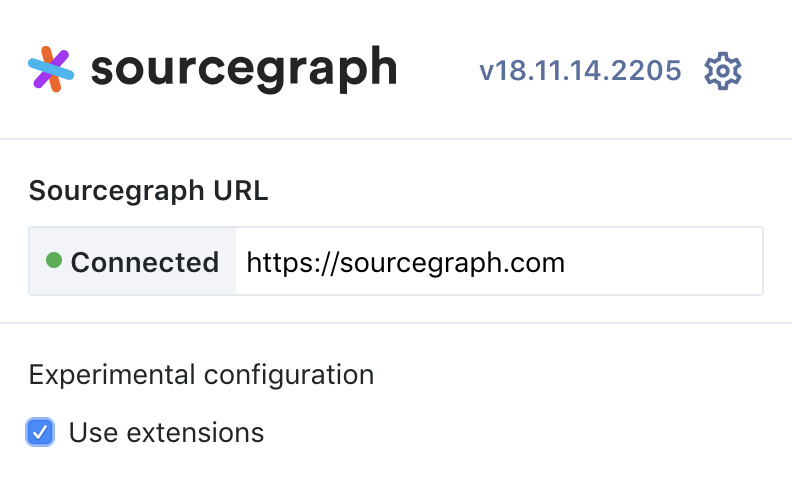

# Set Up Your Development Environment

<!--
Purpose: To provide a source of truth for setting up a development environment for extensions. This can then be linked to from reference documentation and tutorials.
-->

Sourcegraph extensions are usually written in TypeScript and are distributed as a single bundled JavaScript file that runs on the client. Let's start by installing and configuring the required software.

## Node.js

Install [Node.js](https://nodejs.org) to build and package your extension.

## Sourcegraph.com Account and the Sourcegraph CLI

Publishing an extension requires a [Sourcegraph.com account](https://sourcegraph.com/sign-up). Sourcegraph Enterprise instances support a [private extension registry](https://docs.sourcegraph.com/extensions).

Install the [Sourcegraph CLI (`src`)](https://github.com/sourcegraph/src-cli#installation), then [configure `src` with an access token](https://github.com/sourcegraph/src-cli#authentication).

## Sourcegraph Browser Extension

Bring your extension's features for code viewed on GitHub, GitLab and other code hosts by [installing the Sourcegraph browser extension](https://docs.sourcegraph.com/integration/browser_extension).

### Enabling Sourcegraph Extensions Outside a Sourcegraph Instance

As Sourcegraph extensions are in alpha, you must manually enable them in the browser extension:

1. Click the Sourcegraph icon to the right of the address bar.
1. Click the gear ⚙️ icon.
1. Check the **Use extensions** checkbox.

