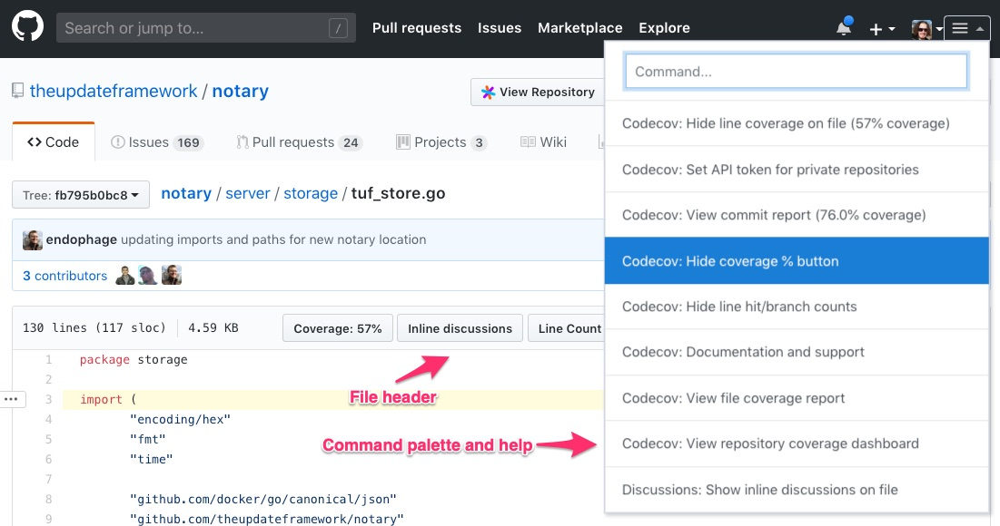
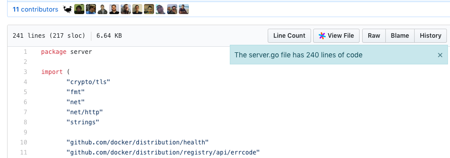
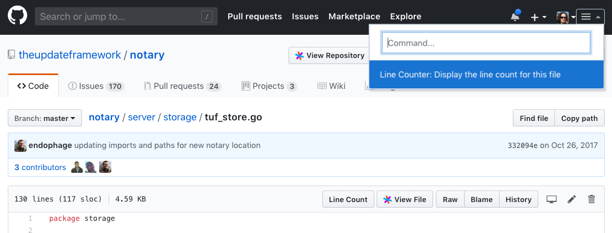

# Sourcegraph extension buttons and custom commands

This tutorial will teach you how to add a button to the **file header** and a menu item to the **command palette**.



You'll learn by building a **line counter** extension that displays the file name and number of lines of code when its button or menu item is clicked.



**Note**: If you get stuck at any point or just want the code, get it from the [Sourcegraph extensions sample repository](https://github.com/sourcegraph/sourcegraph-extension-samples/tree/master/line-counter).

## Prerequisites

This tutorial presumes you have created and published an extension. If not, complete the [Hello world tutorial](hello_world.md) first.

It also presumes you have the [Sourcegraph browser extension](https://docs.sourcegraph.com/integration/browser_extension) installed.

## Set up

Create the line counter extension you'll use for this tutorial:

```
mkdir line-counter
cd line-counter
npm init sourcegraph-extension
```

Then publish your extension:

`src extension publish`

Confirm your extension is enabled and working by:

- Opening the extension detail page.
- Viewing a file on Sourcegraph.com and seeing your extensions hover message appearing.

## Adding a button

Add the following code to the `contributes` object in `package.json`:

```json
{
  "actions": [
    {
      "id": "linecounter.displayLineCountAction",
      "command": "linecounter.displayLineCount",
      "actionItem": {
        "label": "Line Count",
        "description": "The line count for this file"
      }
    }
  ],
  "menus": {
    "editor/title": [
      {
        "action": "linecounter.displayLineCountAction",
        "when": "resource"
      }
    ],
    "commandPalette": []
  },
  "configuration": {}
}
```

The object in the [`actions` array](../contributions.md#actions) configures the button display properties and what `command` to call on button click.

The object in the [`editor/title` array](../contributions.md#menus) means the action it refers to should be placed in the file header. The value of `resource` for `when` means display a button only if there is a resource (file) present.

See the [menu contributions documentation](../contributions.md#menus) for additional menu locations, such as `commandPalette` and `directory/page`.

## Check for button display

Now publish the extension to see the button in action:

```
src extension publish
```

As an example, view the [`tuf_store.go`](https://github.com/theupdateframework/notary/blob/master/server/storage/tuf_store.go) file on GitHub and you should see the **Line Count** button in the file header.

Click on the **View File** button in the file header to view [`tuf_store.go` on Sourcegraph](https://sourcegraph.com/github.com/theupdateframework/notary@master/-/blob/server/storage/tuf_store.go). You'll also see the **Learn Count** button in the Sourcegraph file header.

Extensions are powerful because they work on Sourcegraph and any code host supported by the Sourcegraph browser extension, e.g. GitHub.

Now let's make the button work!

## Displaying the notification on button click

Now that we have the button, the next step is to display the notification. Remove all of the code from the TypeScript file in the `src` directory and replace it with:

```typescript
import * as sourcegraph from 'sourcegraph'

/**
 * Returns a CodeEditor instance (if a Window is active) that provides access to
 * the document being viewed.
 */
function activeEditor(): sourcegraph.CodeEditor | undefined {
  return sourcegraph.app.activeWindow ? sourcegraph.app.activeWindow.visibleViewComponents[0] : undefined
}

/**
 * Display a notification with the filename and line count of the document being viewed.
 * @param editor
 */
function displayLineCount(editor: sourcegraph.CodeEditor | undefined = activeEditor()): void {
  if (!editor) {
    return
  }

  const lineCount = editor.document.text.split(/\n/).length - 1
  const fileName = editor.document.uri
    .substring(editor.document.uri.lastIndexOf('/') + 1)
    .split('#')
    .slice(-1)[0]
  const message = `The ${fileName} file has ${lineCount} line${lineCount > 1 ? 's' : ''} of code `

  sourcegraph.app.activeWindow!.showNotification(message)
}

/**
 * The activate function is called when one of the extensions `activateEvents`
 * conditions in package.json are satisfied.
 */
export function activate(ctx: sourcegraph.ExtensionContext): void {
  // Add each subscription to the extension's context so they can unsubscribed upon deactivation
  ctx.subscriptions.add(sourcegraph.commands.registerCommand('linecounter.displayLineCount', displayLineCount))
}
```

Now publish and use the extension to see the line counter in action!

## What if we wanted to add an item to the Command palette?

Let's say we want one action to be in the file header and the command palette.

We first need to add two fields to the action object, `title` and `category`. The `title` field allows you to specify different text for the command palette and file header button, and the `category` value makes it clear which item belongs to which extension.

Now that the action object is configured for the command palette, we add the exact same object that we added to `editor/title` to `commandPalette`.

Replace the contents of the `contributes` object with the following:

```json
{
  "actions": [
    {
      "id": "linecounter.displayLineCountAction",
      "command": "linecounter.displayLineCount",
      "title": "Display the line count for this file",
      "category": "Line Counter",
      "actionItem": {
        "label": "Line Count",
        "description": "The line count for this file"
      }
    }
  ],
  "menus": {
    "editor/title": [
      {
        "action": "linecounter.displayLineCountAction",
        "when": "resource"
      }
    ],
    "commandPalette": [
      {
        "action": "linecounter.displayLineCountAction",
        "when": "resource"
      }
    ]
  },
  "configuration": {}
}
```

Publish the extension, then trigger the notification from the command palette.



## Summary

You've now learned how to add a button and command palette item that calls a custom method defined by your extension.

## Next Steps

- [Extension contribution points](../contributions.md)
- [Built-in Sourcegraph extension commands](../builtin_commands.md)
- [Cookbook for writing Sourcegraph extensions](../cookbook.md)
- [Debugging a Sourcegraph extension](../debugging.md)
