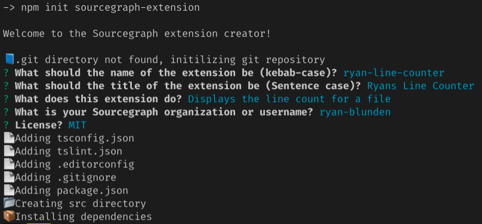

# Sourcegraph extension contributions tutorial

Difficulty | Time
---- |:--------:|
Intermediate | 30 minutes

Sourcegraph extension contributions, is the functionality an extension contributes via commands invoked from menu items (e.g. button) configured in the [extension manifest](../manifest.md). These commands can be invoked manually in extension code, as well as from other extensions.

Menu items can be injected into pre-defined UI locations such as:

- The file header
- Command palette
- Help menu


<!-- **Note**: Here is the complete list of [contribution points](https://sourcegraph.com/github.com/sourcegraph/sourcegraph/-/blob/shared/src/api/protocol/contribution.ts#L192:13).  -->

<!-- TODO: Ryan What `ContributableMenu` points are supported in Sourcegraph and code hosts. -->

<!-- Sourcegraph extensions can create buttons and menu items on Sourcegraph.com, GitHub and other supported code hosts. -->
<!-- 
UI contributions are pre-defined in `package.json` at `.contributions`, and through template expressions, can react to changes in the context, e.g. only showing a button if the language of a file is Go. -->

## What you will be building

This tutorial will have you build an extension that:

- Displays a button in the file header.
- Defines a custom method for displaying a notification with the file name and number of lines of code.
- Calls the custom method on button click.

While this tutorial focusses on adding a button to the file header, the process is the same for the other contribution types.

If you get stuck at any point or just want to look at the code, you can get it from the [Sourcegraph extensions sample repository](https://github.com/sourcegraph/sourcegraph-extension-samples/tree/master/line-counter).

## Prerequisites

This tutorial presumes you have created and published an extension. If not, complete the [Hello world tutorial](hello-world.md) first.

## Create and publish an extension for this tutorial

Create the extension, adding a prefix to the name to ensure it is unique.



Publish your extension:

```src ext publish```

Then confirm your extension is enabled and working by:

- Opening the extension detail page.
- Viewing a file on Sourcegraph.com and seeing your extensions hover message appearing.

## Actions and menus

At a high level:

1. An **action** is created with a unique identifier.
1. A **menu item** is created that references the action using the unique identifier.
1. The **action** method is invoked when the menu item is in its active state.



## Adding an action

Add the following code to `package.json` in the `.contributions.actions` array:

```json
{
  "id": "linecounter.get",
  "command": "UpdateConfiguration",
  "actionItem": {
    "label": "Line Count",
    "description": "Get line count for this file"
  }
}
```

This `JSON` is processed by the extension runtime to create an [`ActionContribution`]((https://sourcegraph.com/github.com/sourcegraph/sourcegraph/-/blob/shared/src/api/protocol/contribution.ts#L22:18)) object:

- `id`: Unique identifier for this action (must be unique for all actions).
- `command`: The command will be invoked in its active state (this will change to a custom method later).
- `actionItem.label`: The item text.
- `actionItem.description`: The text in the button tooltip on focus or hover.

**Note**: The [`actionItem`](https://sourcegraph.com/github.com/sourcegraph/sourcegraph/-/blob/shared/src/api/protocol/contribution.ts#L161:18) field is only required for actions in `editor/title`.

## Adding the item to a menu

Now that an action exists, we must choose a menu for it. We have chosen the file header because it's the most easily accessible and close to the code.

Add the following code to `package.json` in the `.contributions.menus.editor/title` array:

```json
{
  "action": "linecounter.get",
  "when": "resource"
}
```

This `JSON` is processed by the extension runtime to create a [`MenuItemContribution`](https://sourcegraph.com/github.com/sourcegraph/sourcegraph/-/blob/shared/src/api/protocol/contribution.ts#L217:18) object.

- `action`: The action to invoke when the item is in its active state. Must match the `id` field of the action.
- `when`: An (optional) expression that must evaluate to true (or a truthy value).

Setting `"when"` to `"resource"` means the menu item will display only when a resource (document) is available.

<!--TDO Ryan Check out the [extension activation tutorial](activation.md) for a more complex usage of the `when` field.-->

## Testing the extension for button display

You now have the code required to display a button so let's test it by:

- Publishing the extension.
- Viewing a file on Sourcegraph or GitHub.
- You should see a **Line Count** button in the header above the file.

Clicking the button does nothing so now, let's write the application code for the extension.

## Extension application code

Our goal is to click the **Line Counter** button to display the file name and number of lines of code in a notification. We'll code this in 3 parts.

## Extension code part 1. Registering a custom method

We'll use [`sourcegraph.commands.registerCommand(command: string, callback: function)`](https://unpkg.com/sourcegraph/dist/docs/modules/_sourcegraph_.commands.html#registercommand) to register a callback invoked by the menu item action.

Open the TypeScript file in `src` and delete all of its code. Then replace it with:

```typescript
import * as sourcegraph from 'sourcegraph'

export function activate(): void {
  const commandKey = 'linecounter.displayLineCount'

  sourcegraph.commands.registerCommand(commandKey, (uri:string, text: string) => {
    // Call to display notification here
  })
}
```

Using [`sourcegraph.commands.registerCommand`](https://unpkg.com/sourcegraph/dist/docs/modules/_sourcegraph_.commands.html#registercommand), we register a callback that can be invoked by our action.

## Extension code part 2. Configure the action to call the custom method

To configure the action, open the `package.json` replace the contents of the item in `.contributes.actions` with:

```json
{
  "id": "linecounter.get",
  "command": "linecounter.displayLineCount",
  "commandArguments": [
    "${resource.uri}",
    "${resource.textContent}"
  ],
  "actionItem": {
    "label": "Get line count",
    "description": "The line count for this file"
  }
}
```

The value of the `command` field now matches the custom method identifier and the `commandArguments` array provides the values required.

<!--
TODO: Ryan Link to template lang docs
The syntax to get the argument values is a *template expression** which is a simple and very limited template language.
-->

The `resource` object is defined because our button will display only **when** there is a **resource**. The `resource` object is similar to a `TextDocument`, but with more, and slightly different field names. You can find the complete list of resource keys [from this switch statement](https://sourcegraph.com/github.com/sourcegraph/sourcegraph/-/blob/shared/src/api/client/context/context.ts#L60:9).

## Extension code part 3. Showing the notification

The last step is to write the code that shows the file name and line count in a notification.

In your TypeScript extension file, replace `// Call to display notification here` with:

```typescript
    const activeWindow: sourcegraph.Window | undefined = sourcegraph.app.activeWindow
    if(!activeWindow) {
        return;
    }

    const lineCount = text.split(/\n/).length - 1;
    const fileName = uri.substring(uri.lastIndexOf('/') + 1);

    activeWindow.showNotification(`The ${fileName} file has ${lineCount} line${lineCount > 1 ? 's' : ''} of code `)
```

This code:

- Checks a `Window` object exists as it's responsible for displaying the notification.
- Gets the file name and line count values.
- Displays a notification.

Now publish the extension see the line counter extension in action.

## Summary

As a result of completing this tutorial, you've learnt:

- How to register a custom method.
- How to create an action that supplies arguments to the custom method.
- How to create a menu item.
- How to display a notification.

## Next Steps

- [Cookbook for writing Sourcegraph extensions]
- [Sourcegraph extension activation]
- [Debugging a Sourcegraph extension]
