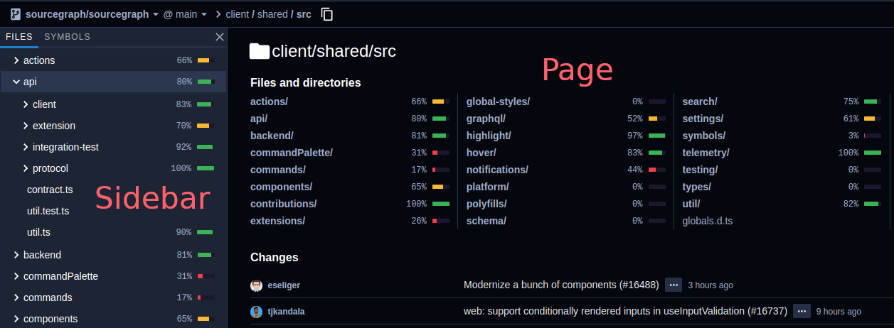

# File decorations tutorial



Extensions can decorate files in the file tree and/or directory page with text content and/or a `<meter/>` element. In this tutorial, you'll build an extension that decorates directories with the length of their names.

> Note: This feature was introduced in Sourcegraph version 3.23. Extensions should check if `sourcegraph.app.registerFileDecorationProvider` is defined to prevent errors on older versions of Sourcegraph. 
> Currently, file decorations are only displayed on Sourcegraph, not on code hosts.

## Prerequisites

This tutorial presumes you have created and published an extension. If not, complete the [Hello world tutorial](hello_world.md) first.

## Register a file decoration provider

On [activation](../activation.md), register a [file decoration provider](https://unpkg.com/sourcegraph/dist/docs/interfaces/_sourcegraph_.filedecorationprovider.html): 

```ts
import * as sourcegraph from 'sourcegraph'

export function activate(context: sourcegraph.ExtensionContext): void {
    context.subscriptions.add(
        // Register a file decoration provider whose `provideFileDecorations` method is called
        // with a list of files that can be decorated
        sourcegraph.app.registerFileDecorationProvider({
            // `provideFileDecorations` should return an array of file decorations
            provideFileDecorations: ({ files }) => (
                    files
                        // Let's only decorate directories
                        .filter(file => file.isDirectory)
                        .map(file => ({
                            // We must include the file's resource identifier
                            uri: file.uri,
                            // Decorate entries with text content with the `after` property
                            after: {
                                contentText: `length: ${file.path.split('/').pop()?.length ?? 0}`,
                            },
                        }))
                ),
        })
    )
}
```

File decoration providers are called with a new list of files whenever a user expands the file tree or visits new directory pages.

### `after`

As we've seen in the previous section, file decorations can add text content after filenames with the [`after`](https://unpkg.com/sourcegraph/dist/docs/interfaces/_sourcegraph_.filedecoration.html#after) property. File decorations can [customize text color](https://unpkg.com/sourcegraph/dist/docs/interfaces/_sourcegraph_.filedecorationattachmentrenderoptions.html) and specify color overrides for dark and/or light themes.

### `meter`

A file decoration can render a [`<meter/>`](https://unpkg.com/sourcegraph/dist/docs/interfaces/_sourcegraph_.filedecoration.html#meter) element after filenames as well.

The `<meter/>` element represents a scalar measurement within a known range, or a fractional value, such as [code coverage](https://docs.codecov.io/docs/about-code-coverage#what-is-code-coverage). They can represent optimum, suboptimum, and bad values with different colors based on the following attributes:

- `min`: Lower bound of the range
- `max`: Upper bound of the range
- `low`: Upper bound of the low end of the range
- `high`: Lower bound of the high end of the range
- `optimum`: Optimal numeric value. If `optimum` is between `min` and `low`, then the low end of the range is considered preferable. If `optimum` is between `high` and `max`, then the high end of the range is considered preferable.

File decorations `meter` objects must specify a `value` between `min` and `max`, and can optionally specify a `hoverMessage` string to display in a hover tooltip.

Read through the [Codecov Sourcegraph extension](https://sourcegraph.com/github.com/codecov/sourcegraph-codecov/-/blob/src/extension.ts#L227-309) to see how `meter` is used in real-world extensions.

### Asynchronous or streaming file decorations

File decoration providers don't have to synchronously return an array of file decorations. 

**If you need to perform asynchronous operations before resolving your file decorations:**

You provider function (`provideFileDecorations`) can return a `Promise` for an array of file decorations.

```ts
import * as sourcegraph from 'sourcegraph'
import { getMeters, getDescription } from 'utils'

export function activate(context: sourcegraph.ExtensionContext): void {
    context.subscriptions.add(
        sourcegraph.app.registerFileDecorationProvider({
            async provideFileDecorations({ files }) {
                // `getMeters` returns a Promise for an object of meter objects keyed by file path
                const meters = await getMeters(files)
                return files.map(file => ({
                    uri: file.uri,
                    after: {
                        contentText: getDescription(file.path),
                    },
                    meter: meters[file.path],
                }))
            },
        })
    )
}
```

**If you need to update your file decorations over time (streaming):**

Your provider function can be an [async generator function](https://javascript.info/async-iterators-generators#async-generators-finally), or any function that returns an [`AsyncIterable`](https://developer.mozilla.org/en-US/docs/Web/JavaScript/Reference/Global_Objects/Symbol/asyncIterator#User-defined_Async_Iterables):

```ts
import * as sourcegraph from 'sourcegraph'
import { getDescription, getMeters } from './utils'

export function activate(context: sourcegraph.ExtensionContext): void {
  context.subscriptions.add(
    sourcegraph.app.registerFileDecorationProvider({
      async *provideFileDecorations({ files }) {
                // The file decorations will be re-rendered each time `yield` keyword is called 
                // with an array of file decorations 
                yield files.map(file => ({ uri: file.uri, after: { contentText: getDescription(file.path) } }))
                // `getMeters` returns a Promise for an object of meter objects keyed by file path
                const meters = await getMeters(files)
                yield files.map(file => ({
                    uri: file.uri,
                    after: {
                      contentText: getDescription(file.path),
                    },
                    meter: meters[file.path],
                }))
            },
        })
    )
}
```

Your provider function can also return a [`Subscribable`](https://unpkg.com/sourcegraph/dist/docs/interfaces/_sourcegraph_.subscribable.html), like an RxJS Observable:

```ts
import * as sourcegraph from 'sourcegraph'
import { getDescription, getMeters } from './utils'
import { concat, Observable, of } from 'rxjs'
import { map } from 'rxjs/operators'

export function activate(context: sourcegraph.ExtensionContext): void {
    context.subscriptions.add(
        sourcegraph.app.registerFileDecorationProvider({
          // The file decorations will be re-rendered each time the `Subscribable`
          // emits an array of file decorations 
            provideFileDecorations: ({ files }) =>
                concat(
                    of(files.map(file => ({ uri: file.uri, contentText: getDescription(file.path) }))),
                    // `getMeters` returns an Observable that emits objects of meter objects keyed by file path
                    getMeters(files).pipe(
                        map(meters =>
                            files.map(file => ({
                                uri: file.uri,
                                after: {
                                  contentText: getDescription(file.path),
                                },
                                meter: meters[file.path],
                            }))
                        )
                    )
                ),
        })
    )
}

```

[See the types of supported provider results](https://unpkg.com/sourcegraph/dist/docs/index.html#providerresult)

## Decoration location

You can restrict where an individual file decoration is displayed by setting the [`where`](https://unpkg.com/sourcegraph/dist/docs/interfaces/_sourcegraph_.filedecoration.html#where) property:

- `"sidebar"`: Only display the decoration on the file tree sidebar
- `"page"`:  Only display the decoration on the directory page
- If `where` isn't defined, the decoration will be displayed on both the file tree sidebar and the directory page

## Summary

You've now learned how to decorate files on Sourcegraph with Sourcegraph extensions!

## Next Steps

- [Extension activation](../builtin_commands.md)
- [Buttons and custom commands tutorial](button_custom_commands.md)
- [Extension contribution points](../contributions.md)
- [Builtin commands](../builtin_commands.md)
