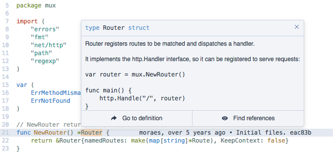
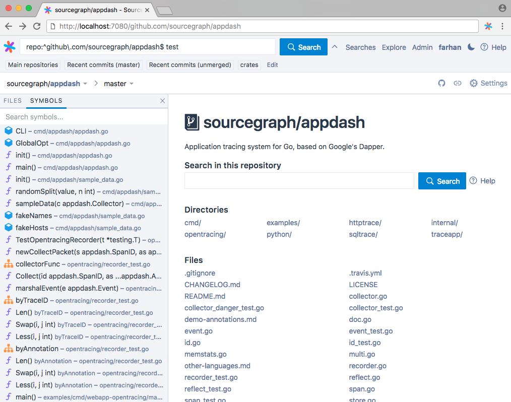

# Code intelligence overview

Code intelligence provides advanced code navigation and cross-references for your code on Sourcegraph, your code host, and your code review tools:

- Hover tooltips with documentation and type signatures
- Go-to-definition
- Find references
- Symbol search

Code intelligence is provided by language servers that run securely in your self-hosted Sourcegraph instance. These language servers perform advanced, scalable code analysis and are derived from our popular open-source language servers in use by hundreds of thousands of developers in editors and on Sourcegraph.com.

By spinning up Sourcegraph, you can get code intelligence:

- On the Sourcegraph web interface
- On code files on your code host, via our [integrations](../../integration/index.md)
- On diffs in your code review tool, via our [integrations](../../integration/index.md)
- Via the Sourcegraph API (for programmatic access)

**Hover tooltips with documentation and type signatures**

**Go to definition**

**Find references**

**GitHub pull request and file integration**

**Symbol search**

**Symbol sidebar**

---

## Languages

Sourcegraph's code intelligence supports code written in the following programming languages:

- [Go](go.md)
- [JavaScript](javascript.md)
- [TypeScript](typescript.md)
- [Python](python.md)
- [Java](java.md)
- [PHP](php.md)
- [Bash](experimental_language_servers.md)
- [Clojure](experimental_language_servers.md)
- [C++](experimental_language_servers.md)
- [C#](experimental_language_servers.md)
- [CSS](experimental_language_servers.md)
- [Dockerfile](experimental_language_servers.md)
- [Elixir](experimental_language_servers.md)
- [HTML](experimental_language_servers.md)
- [Lua](experimental_language_servers.md)
- [OCaml](experimental_language_servers.md)
- [R](experimental_language_servers.md)
- [Ruby](experimental_language_servers.md)
- [Rust](experimental_language_servers.md)
- [Swift](swift.md)

Interested in a language that's not listed here? Post or subscribe to an issue for the language on the [Sourcegraph issue tracker](https://github.com/sourcegraph/issues/issues). [Contact us](https://about.sourcegraph.com/contact) if your organization would like to expedite development of a particular language.

### Open standards

Code intelligence is powered by language servers based on the open-standard Language Server Protocol (published by Microsoft, with participation from Facebook, Google, Sourcegraph, GitHub, RedHat, Twitter, Salesforce, Eclipse, and others).

Hundreds of thousands of developers already use Sourcegraph's language servers in their editor or while browsing public code on [Sourcegraph.com](https://sourcegraph.com). Microsoft's [Visual Studio Code](https://code.visualstudio.com) and GitHub's [Atom](https://atom.io) editors both use Sourcegraph language servers in official editor extensions. The language servers used for code intelligence on Sourcegraph are based on our widely used language servers, with extensive improvements for performance, cross-repository definitions and references, security, isolation, type/build inference, and robustness.

For more information about the Language Server Protocol (LSP), visit [Microsoft's official LSP site](https://microsoft.github.io/language-server-protocol/). For a more detailed list of existing language servers, visit [langserver.org](https://langserver.org) (maintained by Sourcegraph).

If you're a language server developer, see [documentation on adapting a language server to work with Sourcegraph](adapting_existing_language_servers.md).

---

## Getting started

- [Set up code intelligence (for single-node `sourcegraph/server` deployments)](install/index.md)
- [Set up code intelligence (for Kubernetes cluster deployments)](https://github.com/sourcegraph/deploy-sourcegraph/blob/master/docs/install.md#add-language-servers-for-code-intelligence)

Interested in trying it out on public code? See [this sample file](https://sourcegraph.com/github.com/dgrijalva/jwt-go/-/blob/token.go#L37:6$references) on Sourcegraph.com.
