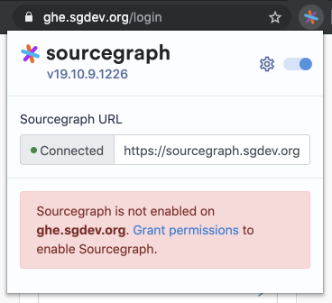
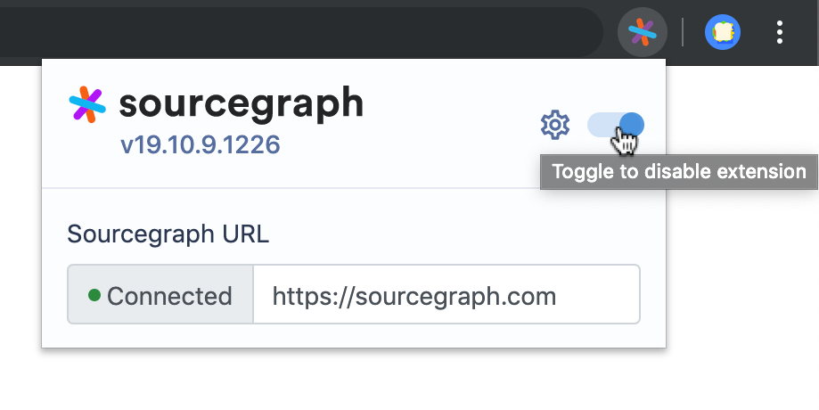

# Google Workspace and Chrome Enterprise integration

> NOTE: Company-wide deployment via Google Workspace is a [paid upgrade](https://about.sourcegraph.com/pricing)

You can install and preconfigure the Sourcegraph Chrome extension for all members of a Google Workspace organization or organizational unit, so that they can get code navigation on files and diffs.

By default, the browser extension only has access to github.com. Access to additional sites is granted by the user, on a site-by-site basis.

The Sourcegraph browser extension is open source and never sends any logs, pings, usage statistics or telemetry to Sourcegraph.com. Read more about browser extension privacy [here](../references/privacy.md).

## Automatically install with Google Workspace

Using the Google Admin Console, you can [automatically install](https://support.google.com/chrome/a/answer/6306504?hl=en) the Sourcegraph browser extension for all users in your organization. To do so:

1. Visit the Google Admin Console [Chrome management](https://admin.google.com/u/2/ac/chrome/apps/user) page, and click "Apps and extensions".
2. Select the desired organizational unit in the left-hand menu.
3. Click the **+** button to add an extension, select "Add Chrome app or extension by ID", and paste in the ID of the Sourcegraph browser extension: `dgjhfomjieaadpoljlnidmbgkdffpack`.
4. In "Installation Policy", select "Force install".
5. In the "Policy for extensions" field, fill in a JSON value containing the URL of your self-hosted Sourcegraph instance:

```
{
    "sourcegraphURL": {
        "Value": "https://sourcegraph.example.com"
    }
}
```
6. Click "Save".

The Sourcegraph browser extension will then be rolled out to all managed browsers in your organization, preconfigured to point to your self-hosted Sourcegraph instance. The roll-out may take some time.

Users will need to have valid accounts and be signed in to your Sourcegraph instance for the browser extension to provide code navigation.

Users may also need to grant additional permissions to the Sourcegraph browser extension in order for it to provide code navigation on your code host. To check if Sourcegraph is properly configured, navigate to any page on your code host, and click the Sourcegraph icon in the browser toolbar. The popup will prompt you to grant additional permissions if needed:




Users can disable Sourcegraph at any time by using the toggle in the extension settings:


