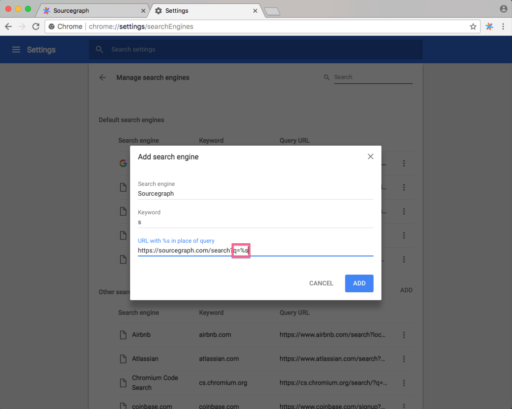

# Browser search engine shortcuts

You can add Sourcegraph as a browser search engine to quickly search Sourcegraph from your browser's location bar when you type a special shortcut, such as <kbd>src</kbd>. This is one of the most common ways to initiate a search on Sourcegraph.

---

## Adding Sourcegraph as a browser search engine

### With the Sourcegraph browser extension (recommended)

The easiest way is to install the [Sourcegraph browser extension](browser_extension.md), which automatically configures the location bar <kbd>src</kbd> shortcut to search Sourcegraph.

### Google Chrome

1. Perform a code search on the Sourcegraph instance you want to add as a search engine.
1. Copy the URL of the search results page.
1. Go to [`chrome://settings`](chrome://settings.md). Under **Search engine**, click **Manage search engines**. Next to **Other search engines**, click **ADD**.
   
1. In the **Add search engine** form, paste the URL you copied (in step 1) in the **URL with %s in place of query** field. Insert the string `%s` into the URL's `?q=` query parameter (and remove any parts of the query that you don't want to keep).
1. Fill in the keyword field with the keyboard shortcut you want for searching on Sourcegraph. In this example, it's set to <kbd>Tab</kbd>.

5.Click **ADD**.

To use the shortcut, focus in the browser address bar, type in the keyword you chose (such as <kbd>src</kbd>), and press <kbd>Space</kbd>. Now type your Sourcegraph code search query and hit enter. You'll be taken to the search results page on your Sourcegraph instance.

For more information on setting Chrome search engines, [see Chrome's help page](https://support.google.com/chrome/answer/95426?co=GENIE.Platform%3DDesktop&hl=en).

### Firefox

To add Sourcegraph as a search engine in Firefox:

1. Visit any page on the Sourcegraph instance you want to add as a search engine.
1. Click the magnifying glass icon in the toolbar's search field.
1. Click **Add "Sourcegraph Search"**.

To configure a shortcut (keyword) for quicker access:

1. Click the magnifying glass icon in the toolbar's search field.
1. Click **Change Search Settings**.
1. In the **One-Click Search Engines** list, double-click the **Keyword** cell for **Sourcegraph Search** and type in a shortcut (such as <kbd>src</kbd>).

To use the search engine, type <kbd>src</kbd> <kbd>Space</kbd> in the location bar, then your Sourcegraph search query. Pressing <kbd>Enter</kbd> will go to the Sourcegraph search results page for your query.

See "[Add or remove a search engine in Firefox](https://support.mozilla.org/en-US/kb/add-or-remove-search-engine-firefox)" for more information.

### Other web browsers

Consult your web browser's documentation or settings page for information on how to add custom search engines. Most web browsers support this feature.
