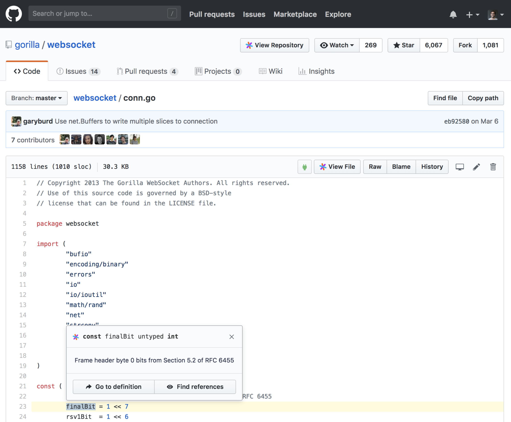

# G Suite and Chrome Enterprise integration

> NOTE: Company-wide deployment via G Suite is a [paid upgrade](https://about.sourcegraph.com/pricing)

You can now install and preconfigure the Sourcegraph Chrome extension for all users in your G Suite organization.

This means that everyone in your organization will get code intelligence in
files, diffs, and PRs on GitHub.com, GitHub Enterprise, GitLab, and Phabricator. After
the admin configures G Suite automatic installation of the Chrome extension,
each user's Chrome browser will install and configure the Sourcegraph Chrome
extension automatically. (It may take a few hours to fully propagate the Chrome
settings.) Then all users will see code intelligence like this:



## Automatically install with G Suite

1.  Open the [G Suite admin settings page for the Sourcegraph Chrome extension](https://admin.google.com/AdminHome#ChromeAppDetails:appId=dgjhfomjieaadpoljlnidmbgkdffpack&appType=CHROME&flyout=reg). (Check that the link opens the correct G Suite account, if you're signed in with multiple accounts.)
2.  Click **User settings**.
3.  Click the name of the organization in the list.
4.  Enable **Force installation**.
5.  Configure the extension by replacing `https://sourcegraph.example.com` in the following code block with your Sourcegraph instance's URL:

```
{
    "sourcegraphURL": {
        "Value": "https://sourcegraph.example.com"
    }
}
```

For more information, see "[Configuring Apps and Extensions by Policy](http://www.chromium.org/administrators/configuring-policy-for-extensions)".
