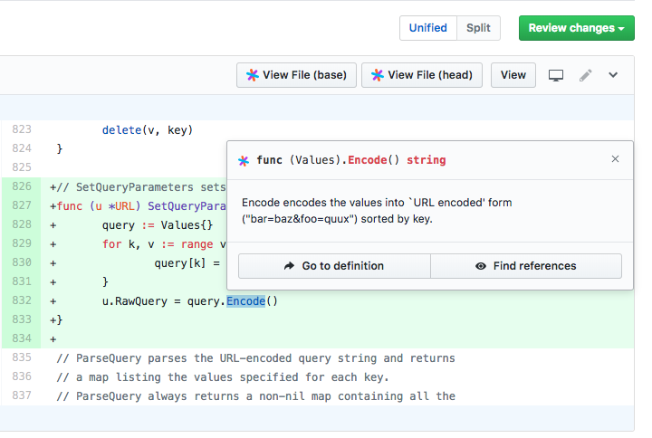

# Integrations

Sourcegraph integrates with your other tools to help you search, navigate, and review your code.

- [Browser extension](browser_extension.md): go-to-definitions and hovers in your code host and code reviews
- 3rd-party services (for syncing repositories, user authentication, etc.):
  - [GitHub](github.md)
  - [GitLab](gitlab.md)
  - [Bitbucket Server](bitbucket_server.md)
  - [Phabricator](phabricator.md)
  - [AWS CodeCommit](aws_codecommit.md)
  - [Gitolite](gitolite.md)
  - [Other Git repository hosts](../admin/external_service/other.md)
- [Editor plugins](editor.md): jump to Sourcegraph from your editor
- [Search shortcuts](browser_search_engine.md): quickly search from your browser
- [GraphQL API](../api/graphql/index.md): create custom tools using Sourcegraph data

