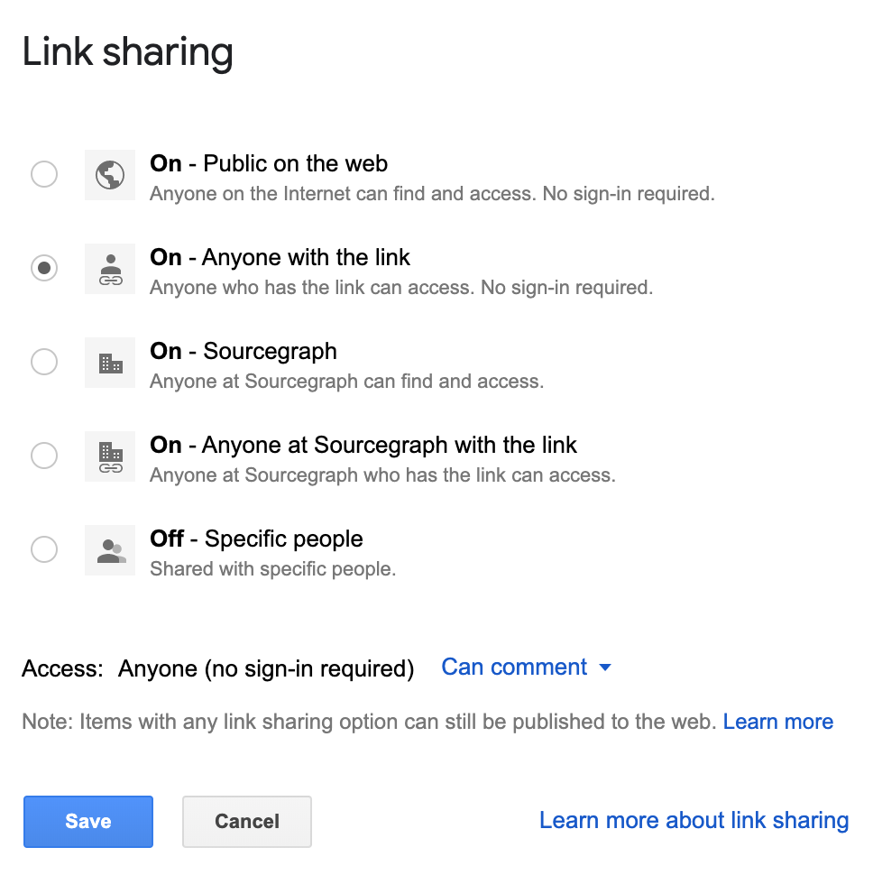
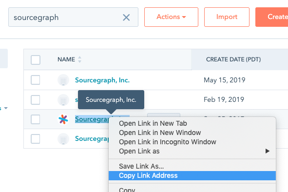

# Requests for comments (RFCs)

We value writing down plans so that we can asynchronously communicate to and solicit feedback from our remote-first team. A good plan communicates what problem is being solved, why that problem is being prioritized now, and what the plan is to solve the identified problem.

This document describes how we operationalize written planning through our RFC process. RFC literally means "Request for Comments" and you can think about it as exactly that, no more, no less.

This process is designed to be lightweight so that it can be used for many purposes (e.g. product specs, policy decisions, technical discussion), and it is optimized for facilitating collaboration and feedback. In contrast, GitHub issues are best for tracking concrete bug reports or work that has already been scoped and planned (i.e. there isn't much remaining to discuss).

_All RFCs are in a [public Google Drive folder](https://drive.google.com/drive/folders/1bip_pMeWePyNNdCEETRzoyMdLtntcNKR)._

## Status

Each RFC has a status that is in the title of the RFC (e.g. "RFC 1 WIP: Title"). The author is responsible for keeping the status updated.

| Status | Description |
|-------|-------------|
| WIP | The author is still drafting the RFC and it is not ready for review. |
| REVIEW | The RFC is ready to be reviewed. The RFC explicitly lists whose approvals are required and a requested timeline for those approvals. |
| APPROVED | All comment threads are resolved and the RFC has been approved by all required approvers. Just because an RFC is approved doesn't mean it will definitely be implemented (e.g. priorities may change, or new information might be discovered during implementation or code review that causes a change in plan). It is in the author's best interest to avoid suprises at code review time by ensuring the RFC has a sufficient level of detail and has approval from all relevant stakeholders. |
| ABANDONED | There are no plans to move forward with this RFC. The particular reason is communicated in the metadata section of the RFC. For example, the RFC may have failed to get the necessary approvals, it may be been superseded by another RFC, priorities may have changed, or we may not have resources to work on this RFC in the forseeable future. |
| IMPLEMENTED | This RFC has been implemented. |

A prose description of the status appears in the [metadata](#RFC-structure) of an RFC.

## RFCs are sequentially numbered

Each RFC is assigned a unique sequential number that appears in the title (e.g. "RFC 27: Standardizing RFCs"). This makes it easier to quickly reference specific RFCs in informal conversation (e.g. Slack, GitHub issues) and easier for readers to quickly find that document in a shared location (e.g. Google Drive). The sequential numbers also provides valuable information about the order in which RFCs were created.

## RFCs are Google Docs

It is valuable to standardize on a single system for publishing RFCs.

- It gives everyone on the team and outside of the team (i.e. customers) a consistent experience when authoring, commenting or reading RFCs.
- It is easier to ensure that everyone has access to all RFCs if they are all in a single system.
- It makes it easy to determine the next available RFC number when creating a new RFC.
- It makes it easy/accessible for anyone to see what RFCs have been published recently.

We have standardized on using Google Docs for RFCs.

- We use G Suite at Sourcegraph so everyone already has access to all RFCs by default.
- Google Docs is a common tool that many people (both current and future teammates) are already familiar with.
- It provides a commenting experience that is better than the evaluated alternatives.

Accepted tradeoffs:

- Google Docs does not support markdown and does not provide an ideal experience for embedding code snippets.
  - Many RFCs don't require code snippets because they are higher level than "how are we going to implement this in code".
  - Even RFCs about technical implementation details don't seem to be hindered by Google Docs lack of good snippet support.
    - RFC 16 discusses the structure of the search API without getting into the weeds of the actual API.
    - RFC 29 also discusses the structure of the search API without explicit code snippets. It is actually a rewrite of a Notion doc that did have a lot of snippets, and the Google Doc is actually much easier to understand.
  - You can still put code snippets in Google Docs and get your point across. Using a monospace font helps.
  - You can link to another tool where the code snippet can be better formatted (e.g. Gist, PR).

Rejected alternatives:

- [Notion](https://www.notion.so)
  - Comments on documents are too hidden and easy to miss.
  - We would have to manage a separate account system or pay for SSO.
- Markdown in git
  - We actually [tried this for over a year](https://github.com/sourcegraph/docs-private) and stopped.
  - GitHub PRs don't provide a good commenting experience.
    - Can only comment on lines, not words.
    - Suggestions are cumbersome to make/read.
    - Even with recent improvements to collapse old threads, the PR activity page becomes cumbersome after a lot of discussion has happened on a document.
  - It is higher friction to author and/or contribute to multiple RFCs due to either (1) the necessary git workflow or (2) the clunky editing experience in GitHub's UI.

## RFC structure

Effective RFCs contain the following information:

- Title that includes the RFC number.
  - The title is inlined in the Google Doc so that it is more visible and will not disappear if exported to a different format.
- Metadata about the state of the RFC. Including but not limited to:
  - Editor: The person responsible for iterating on the content of the RFC.
    - Generally this is the author of the Google Doc but it is possible for ownership to be transferred.
  - Status: A description of the current state or outcome of the RFC. Illustrative examples:
    - "Still drafting this. I expect to share this with the web team September 6."
    - "Collecting feedback. I will update the RFC on September 8 based on the feedback collected.
    - "Updating RFC based on collected feedback. I expect to reshare the updated doc September 9.
    - "We aren't going to pursue this RFC for the following reasons..."
    - "The web team is going to implement this RFC in 3.8."
    - "This RFC has been implemented."
  - Required approvers: The list of people that the RFC author is requesting a review from and a requested deadline for those reviews (e.g. "Required approvers: Alice and Bob can you please review by 10am PT 10/21"). The author is responsible for ensuring that the reviewers aware of the review request (e.g. by sending them a Slack message or tagging them in a comment on the Google Doc).
  - Approvals: A list of people who approve of this RFC. Anyone can express approval for an RFC, even if they are not in the "Required approvers" list; however, a RFC is not APPROVED until the RFC author receives approval from the people on the "Required approvers" list.
  - (optional) Links to any GitHub issues that capture work being done to implement this RFC.
- Background/Situation: A sufficient, but minimal, amount of context necessary to frame the rest of the RFC. The content should be indisputable facts, not opinions or arguments. The facts should support the chosen definition of the problem and the constraints in the next section.
- Problem/Goals/Complication/Constraints: A description of the problem that this RFC is trying to address, the constraints that this RFC trying to satisfy, and why this problem is worth solving now.
- (optional) Proposed solution/implementation: A description of HOW to solve the problem. It is ok to omit this section if you just want to define a problem. This can be useful if you want help thinking of solutions or want to handoff ownership of this problem to someone else.

The precise format is not as important as the content itself. Ultimately RFCs are a tool to communicate and gather feedback, so optimize for that.

## RFCs are public

[We value openness](https://docs.sourcegraph.com/team/product-dev/open_source_open_company). Transparency helps us communicate with and gather feedback from our customers, and it holds everyone accountable to a higher quality bar.

The default sharing state of documents in our [Google Drive's RFCs](https://drive.google.com/drive/folders/1bip_pMeWePyNNdCEETRzoyMdLtntcNKR) folder will allow everyone to publicly read/comment, and all Sourcegraph teammates to edit.

Sometimes there is information relevant to an RFC, but that information can't be made public.

- RFCs should never reference customer names directly, even if they are listed on our homepage. Instead, you can use a Hubspot link or an arbitrary code name (e.g. "ACME", "Customer X") for each customer that you need to reference in the document. Code names do not need to be consistent across documents. The first usage of each code name should be linked to the actual company's profile in Hubspot.
    - To make this easy, add a search engine to your browser so that you can quickly type `h ACME` or `h sourcegraph` to find the company in         - Use this URL [https://app.hubspot.com/contacts/2762526/companies/list/view/all/?query=%s](https://app.hubspot.com/contacts/2762526/companies/list/view/all/?query=%s)
    
            - Don't share the link to the search results (it has the company name in the search)! Instead, share the direct link to the company; it should look like this: [https://app.hubspot.com/contacts/2762526/company/557690851/](https://app.hubspot.com/contacts/2762526/company/557690851/)
    
- If there is strategic information that shouldn't be public, you can post it in Slack and link to it from the public RFC.
- If a material amount of the content is non-public then it is ok to make the RFC only accessible to the Sourcegraph team.

Only Sourcegraph teammates are able to see the revision history of RFCs (because edit access is required for that). This means if sensitive information is found in the document all you need to do is remove that information. Comments that accidentally contain sensitive info can be deleted.

## References

- [Scaling Engineering Teams via Writing Things Down and Sharing - aka RFCs](https://blog.pragmaticengineer.com/scaling-engineering-teams-via-writing-things-down-rfcs/)
- [Shape Up](https://basecamp.com/shapeup/0.1-foreword)
- [RFC 27: Standardizing RFCs](https://docs.google.com/document/d/1ym5c8G5JcrFf5s0QXJqQKBcZRziVAZZsxWdcUJ7Ukfw/edit?ts=5d77618b#)
