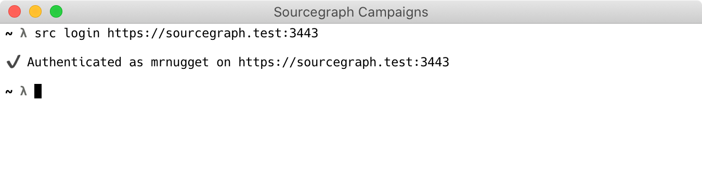
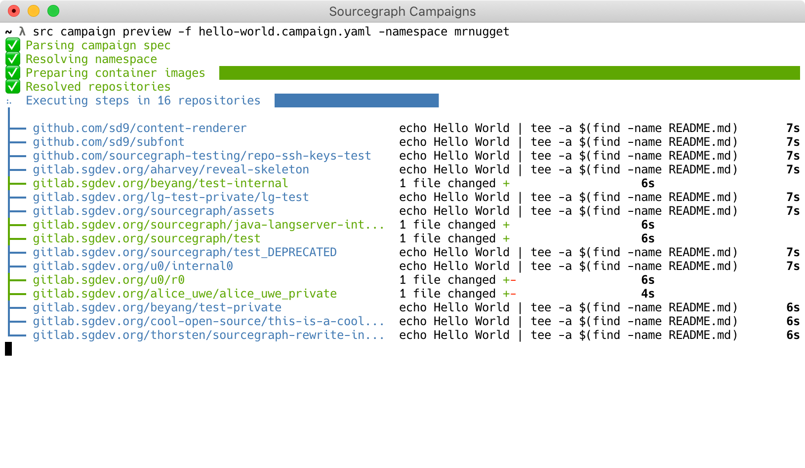
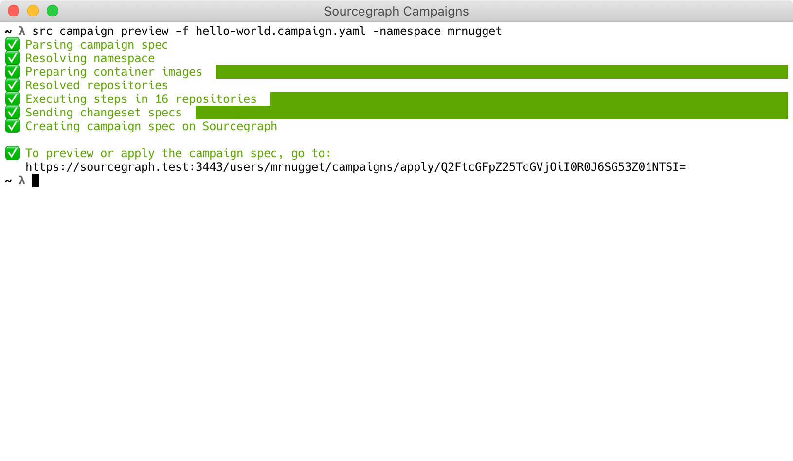
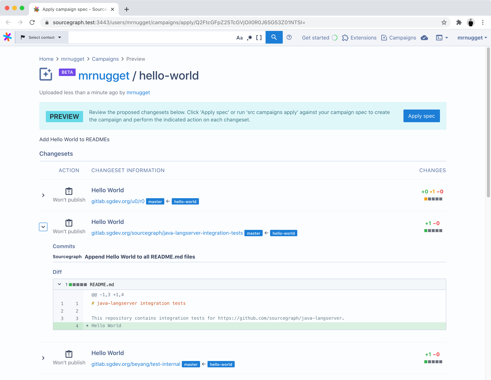
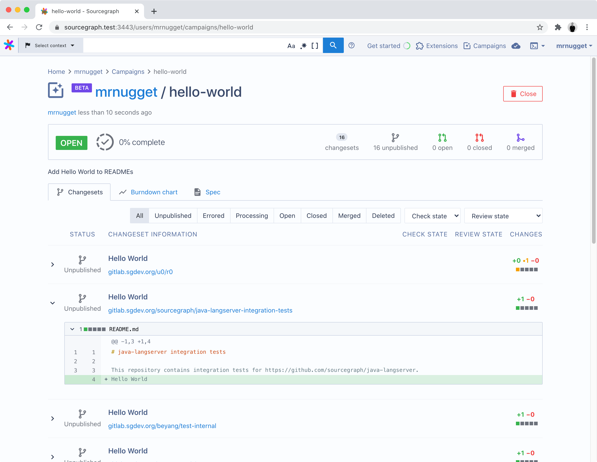
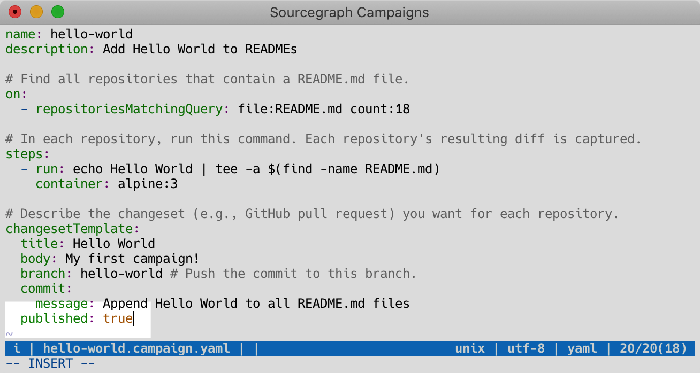
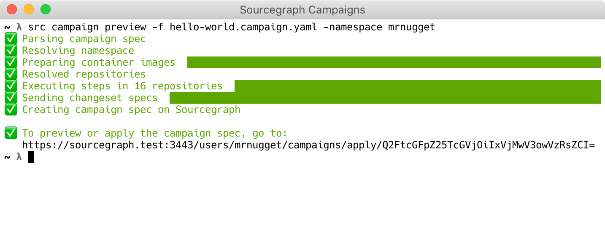
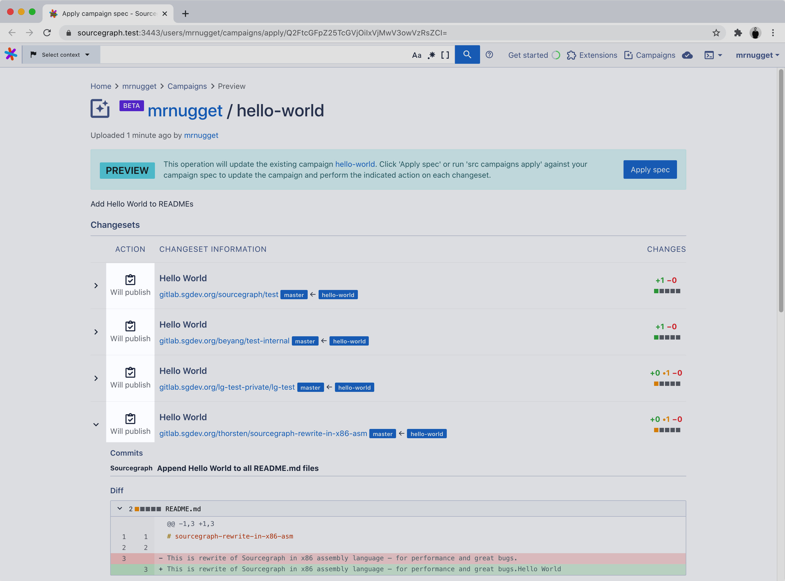
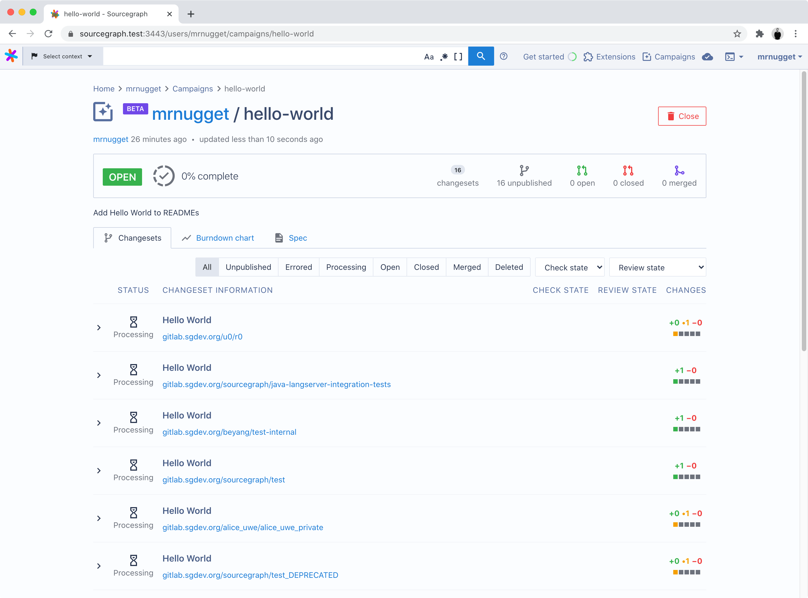

# Quickstart for Campaigns

Get started and create your first [Sourcegraph campaign](index.md) in 10 minutes or less.

## Introduction

In this guide, you'll create a Sourcegraph campaign that appends text to all `README.md` files in all of your repositories.

The only requirement is a Sourcegraph instance with a some repositories in it. See the ["Quickstart"](../../index.md#quickstart) guide on how to setup a Sourcegraph instance.

For more information about campaigns see the ["Campaigns"](index.md) documentation and watch the [campaigns demo video](https://www.youtube.com/watch?v=EfKwKFzOs3E).

## Install the Sourcegraph CLI

In order to create campaigns we need to [install the Sourcegraph CLI](https://github.com/sourcegraph/src-cli) (`src`).

1. Install the version of `src` that's compatible with your Sourcegraph instance:

    **macOS**:
    ```
    curl -L https://YOUR-SOURCEGRAPH-INSTANCE/.api/src-cli/src_darwin_amd64 -o /usr/local/bin/src
    chmod +x /usr/local/bin/src
    ```
    **Linux**:
    ```
    curl -L https://YOUR-SOURCEGRAPH-INSTANCE/.api/src-cli/src_linux_amd64 -o /usr/local/bin/src
    chmod +x /usr/local/bin/src
    ```
    **Windows**: see ["Sourcegraph CLI for Windows"](https://github.com/sourcegraph/src-cli/blob/main/WINDOWS.md)
2. Authenticate `src` with your Sourcegraph instance by running **`src login`** and following the instructions:

    ```
    src login https://YOUR-SOURCEGRAPH-INSTANCE
    ```
    


Once `src login` reports that you're authenticated, we're ready for the next step.

## Write a campaign spec

A **campaign spec** is a YAML file that defines a campaign. See the ["Campaign spec YAML reference"](campaign_spec_yaml_reference.md) for details.

Save the following campaign spec as `hello-world.campaign.yaml`:

```yaml
name: hello-world
description: Add Hello World to READMEs

# Find all repositories that contain a README.md file.
on:
  - repositoriesMatchingQuery: file:README.md

# In each repository, run this command. Each repository's resulting diff is captured.
steps:
  - run: echo Hello World | tee -a $(find -name README.md)
    container: alpine:3

# Describe the changeset (e.g., GitHub pull request) you want for each repository.
changesetTemplate:
  title: Hello World
  body: My first campaign!
  branch: hello-world # Push the commit to this branch.
  commit:
    message: Append Hello World to all README.md files
  published: false
```

## Create the campaign

Let's see the changes that will be made. Don't worry---no commits, branches, or changesets will be published yet (the repositories on your code host will be untouched).

1. In your terminal, run this command:

    <pre>src campaign preview -f hello-world.campaign.yaml -namespace <em>USERNAME_OR_ORG</em></pre>

    > The `namespace` can be your Sourcegraph username or the name of a Sourcegraph organisation under which you want to create the campaign.
1. Wait for it to run and compute the changes for each repository.
    
1. When it's done, click the displayed link to see all of the changes that will be made.
    
1. Make sure the changes look right.
    

    >NOTE: If you want to run the campaign on fewer repositories, change the roots query in `hello-world.campaign.yaml` to something like `file:README.md repo:myproject` (to only match repositories whose name contains `myproject`).
1. Click the **Apply spec** button to create the campaign.
    

You created your first campaign! The campaign's changesets are still unpublished, which means they exist only on Sourcegraph and haven't been pushed to your code host yet.

## Publish the changes (optional)

So far, nothing has been created on the code hosts yet. For that to happen, we need to publish the changesets in our campaign.

Publishing causes commits, branches, and pull requests/merge requests to be created on your code host.

_You probably don't want to publish these toy "Hello World" changesets to actively developed repositories, because that might confuse people ("Why did you add this line to our READMEs?")._

On a real campaign, you would do the following:

1. Change the `published: false` in the `hello-world.campaign.yaml` to `published: true`
    
1. Run the `src campaign preview` command again and open the URL
    
1. Apply the campaign spec by clicking the **Apply spec** button
    

    > NOTE: You can also create or update a campaign by running `src campaign apply`! This skips the preview stage, and is especially useful when updating an existing campaign.
1. The changesets will now be published asynchronously
    

You can also [publish only some of the changesets by setting `published` to an array](campaign_spec_yaml_reference.md#publishing-only-specific-changesets).


## Congratulations!

You've created your first campaign! 🎉🎉

You can customize your campaign spec and experiment with making other types of changes.

To update your campaign, edit `hello-world.campaign.yaml` and run `src campaign preview` again. (As before, you'll see a preview before any changes are applied.)

To learn what else you can do with campaigns, see "[Campaigns](index.md)" in Sourcegraph documentation.
