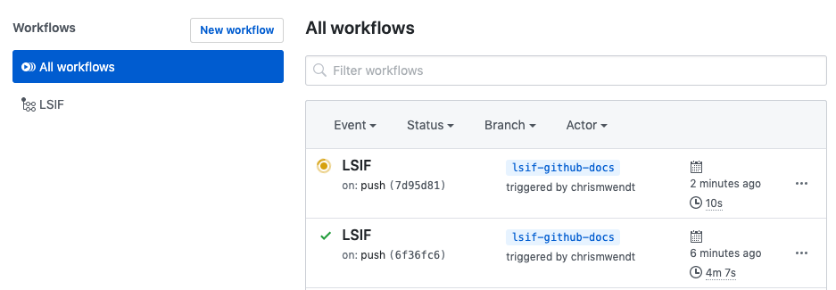

# Adding LSIF to your workflows

## LSIF in continuous integration

After walking through the [LSIF quickstart guide](./lsif_quickstart.md), add a job to your CI so code intelligence keeps up with the changes to your repository.

### Generating and uploading LSIF in CI

#### Set up your CI machines

Your CI machines will need two command-line tools installed. Depending on your build system setup, you can do this as part of the CI step, or you can add it directly to your CI machines for use by the build.

1. The [Sourcegraph CLI (`src`)](https://github.com/sourcegraph/src-cli).
1. The [LSIF indexer](https://lsif.dev) for your language.

#### Add steps to your CI

1. **Generate the LSIF file** for a project within your repository by running the LSIF indexer in the project directory (see docs for your LSIF indexer).
1. **[Upload that generated LSIF file](./lsif_quickstart.md#upload-the-data)** to your Sourcegraph instance.

### Recommended upload frequency

We recommend that you start with a CI job that runs on every commit (including branches).

If you see too much load on your CI, your Sourcegraph instance, or a rapid decrease in free disk space on your Sourcegraph instance, you can instead index only the default branch, or set up a periodic job (e.g. daily) in CI that indexes your default branch.

With periodic jobs, you should still receive precise code intelligence on non-indexed commits on lines that are unchanged since the nearest indexed commit. This requires that the indexed commit be a direct ancestor or descendant no more than [100 commits](https://github.com/sourcegraph/sourcegraph/blob/e7803474dbac8021e93ae2af930269045aece079/lsif/src/shared/constants.ts#L25) away. If your commit frequency is too high and your index frequency is too low, you may find commits with no precise code intelligence at all. In this case, we recommend you try to increase your index frequency if possible.

## LSIF on GitHub

You can use [GitHub Actions](https://help.github.com/en/github/automating-your-workflow-with-github-actions/about-github-actions) to (1) generate LSIF data and (2) upload it to a Sourcegraph instance, like [Sourcegraph.com](#uploading-lsif-data-to-sourcegraph-com).

1. Actions to **Generate LSIF index data** for each language:

    - [Go indexer action](https://github.com/marketplace/actions/sourcegraph-go-lsif-indexer)
    - ...and more coming soon!

2. Action to **[upload LSIF data](https://github.com/marketplace/actions/sourcegraph-lsif-uploader)**.

### Setup

Create a [workflow file](https://help.github.com/en/github/automating-your-workflow-with-github-actions/configuring-a-workflow#creating-a-workflow-file) `.github/workflows/lsif.yaml` in your repository.

You will need configure two actions to (1) generate the LSIF data and (2) upload it to Sourcegraph. Here's an example for generating LSIF data for a Go project:

```yaml
name: LSIF
on:
  - push
jobs:
  index:
    runs-on: ubuntu-latest
    steps:
      - uses: actions/checkout@v1
      - name: Generate LSIF data
        uses: sourcegraph/lsif-go-action@master
      - name: Upload LSIF data
        uses: sourcegraph/lsif-upload-action@master
        with:
          github_token: ${{ secrets.GITHUB_TOKEN }}
          endpoint: https://sourcegraph.com # use sourcegraph.com, or alternatively, your own instance
```

Depending on your code requirements, you may need to add additional steps after checkout but before indexing (installing dependencies, generating indexable assets, etc).

Once that workflow is committed to your repository, you will start to see LSIF workflows in the Actions tab of your repository (e.g. https://github.com/sourcegraph/sourcegraph/actions).



After the workflow succeeds, you should see LSIF-powered code intelligence on your repository on Sourcegraph.com or on GitHub with the [Sourcegraph browser extension](../../integration/browser_extension.md).

## Uploading LSIF data to Sourcegraph.com

LSIF data can be uploaded to a self-hosted Sourcegraph instance or to [Sourcegraph.com](https://sourcegraph.com). Using the [Sourcegraph.com](https://sourcegraph.com) endpoint will surface code intelligence for your public repositories directly on GitHub via the [Sourcegraph browser extension](https://docs.sourcegraph.com/integration/browser_extension) and at `https://sourcegraph.com/github.com/<your-username>/<your-repo>`. 

Using the [Sourcegraph.com](https://sourcegraph.com) endpoint is free and your LSIF data is treated as User-Generated Content (you own it, as covered in our [Sourcegraph.com terms of service](https://about.sourcegraph.com/terms-dotcom#3-proprietary-rights-and-licenses)). If you run into trouble, or a situation arises where you need all of your LSIF data expunged, please reach out to us at [support@sourcegraph.com](mailto:support@sourcegraph.com).
