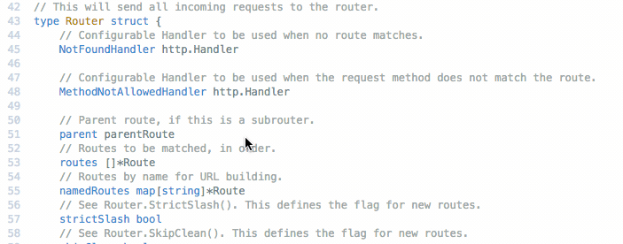
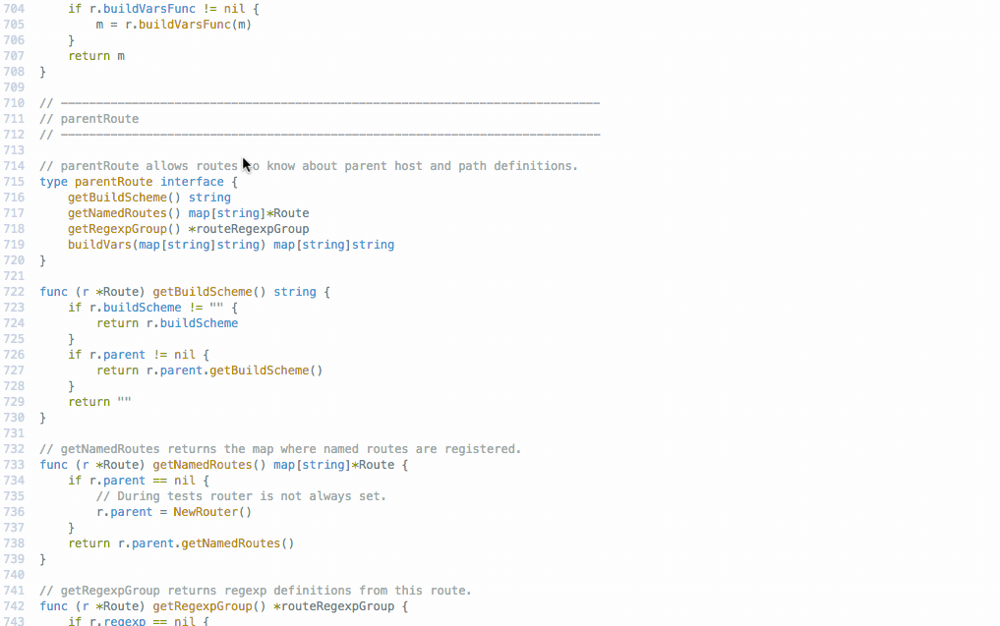
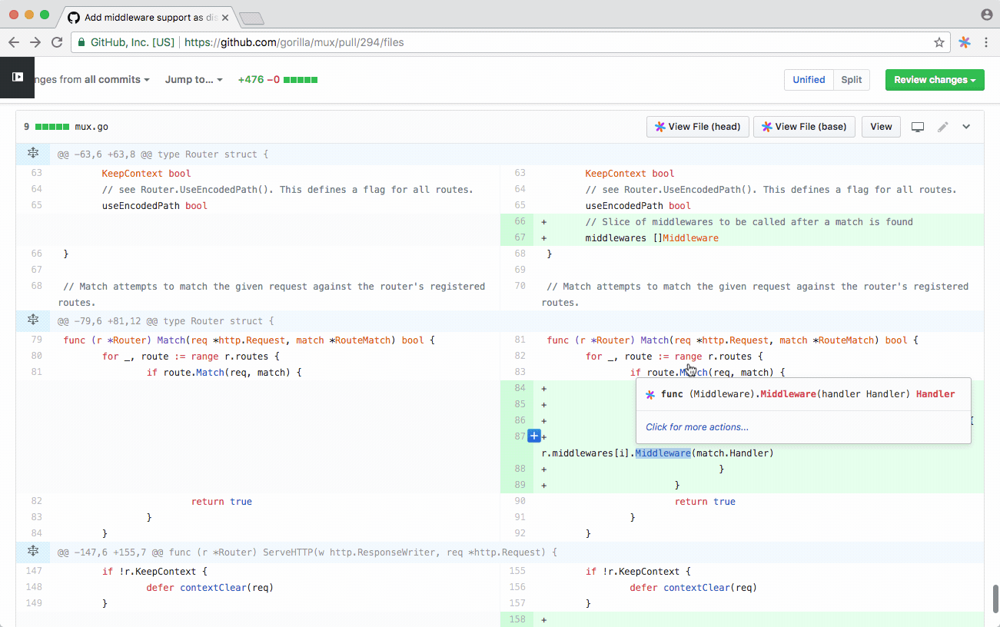
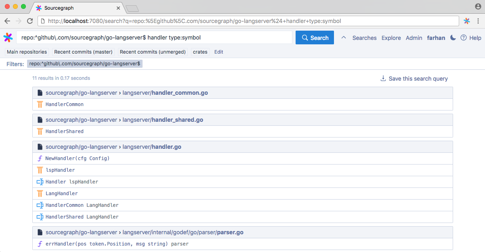
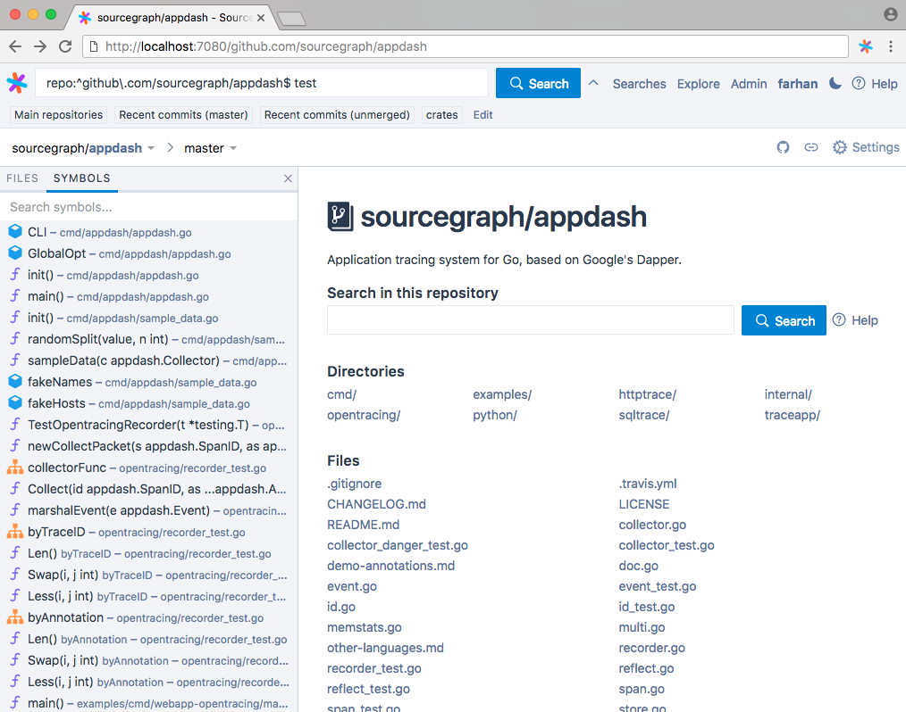

# Code intelligence overview

Code intelligence provides advanced code navigation and cross-references for your code on Sourcegraph, your code host, and your code review tools:

- Hover tooltips with documentation and type signatures
- Go-to-definition
- Find references
- Symbol search

Code intelligence works out of the box with all of the most popular [programming language extensions](https://sourcegraph.com/extensions?query=category%3A%22Programming+languages%22).

You can get more accurate (but usually slower) code intelligence by enabling a dedicated language extension and setting up the corresponding language server:

- [Go](https://sourcegraph.com/extensions/sourcegraph/go)
- [TypeScript](https://sourcegraph.com/extensions/sourcegraph/typescript)
- [Python](https://sourcegraph.com/extensions/sourcegraph/python)
- Check the [extension registry](https://sourcegraph.com/extensions?query=category%3A%22Programming+languages%22) for more

Code intelligence is provided by [Sourcegraph extensions](../../extensions/index.md) and language servers that run securely in your self-hosted Sourcegraph instance. The extensions (and associated language servers) perform advanced, scalable code analysis and are derived from our popular open-source language servers in use by hundreds of thousands of developers in editors and on Sourcegraph.com.

By spinning up Sourcegraph, you can get code intelligence:

- On the Sourcegraph web interface
- On code files on your code host, via our [integrations](../../integration/index.md)
- On diffs in your code review tool, via our [integrations](../../integration/index.md)
- Via the Sourcegraph API (for programmatic access)

**Hover tooltips with documentation and type signatures**

**Go to definition**

**Find references**

**GitHub pull request and file integration**

**Symbol search**

**Symbol sidebar**

## Language server deployment

Most Sourcegraph extensions that provide code intelligence require a server component, called a language server. These language servers are usually deployed alongside other Sourcegraph services in another Docker container or within the same Kubernetes cluster. Check the corresponding extension documentation for deployment instructions.

---

### Open standards

Code intelligence is powered by [Sourcegraph extensions](../index.md) and language servers based on the open-standard Language Server Protocol (published by Microsoft, with participation from Facebook, Google, Sourcegraph, GitHub, RedHat, Twitter, Salesforce, Eclipse, and others).

Hundreds of thousands of developers already use Sourcegraph's language servers in their editor or while browsing public code on [Sourcegraph.com](https://sourcegraph.com). Microsoft's [Visual Studio Code](https://code.visualstudio.com) and GitHub's [Atom](https://atom.io) editors both use Sourcegraph language servers in official editor extensions. The language servers used for code intelligence on Sourcegraph are based on our widely used language servers, with extensive improvements for performance, cross-repository definitions and references, security, isolation, type/build inference, and robustness.

For more information about the Language Server Protocol (LSP), visit [Microsoft's official LSP site](https://microsoft.github.io/language-server-protocol/). For a more detailed list of existing language servers, visit [langserver.org](https://langserver.org) (maintained by Sourcegraph).

---

## Getting started

- [Set up Sourcegraph](../../admin/install/index.md), then enable the [Sourcegraph extension](../index.md) for each language you want to use.
- To get code intelligence on your code host and/or code review tool, see the [browser extension documentation](../../../integration/browser_extension.md).
- Interested in trying it out on public code? See [this sample file](https://sourcegraph.com/github.com/dgrijalva/jwt-go/-/blob/token.go#L37:6$references) on Sourcegraph.com.
