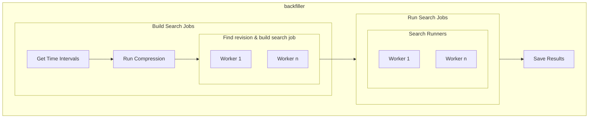

This is an exploration into reimagining what the backfilling or potentially even all query running could look like for insights.

Below is a diagram to explain the flow this approach takes.

```mermaid
flowchart TB

subgraph backfiller

subgraph BuildSearchJob[Build Search Jobs]
  GetTimeIntervals[Get Time Intervals] --> CompressTimeIntervals[Run Compression]
  subgraph FindRevisionBuildSearch[Find revision & build search job]
    Worker1[Worker 1]
    Workern[Worker n]
  end
  CompressTimeIntervals --> FindRevisionBuildSearch
end


subgraph RunSearchJobs[Run Search Jobs]
  subgraph SearchRunners[Search Runners]
    SearchWorker1[Worker 1]
    SearchWorkern[Worker n]
  end
end

FindRevisionBuildSearch --> RunSearchJobs
RunSearchJobs --> SaveResults[Save Results]

end

```
