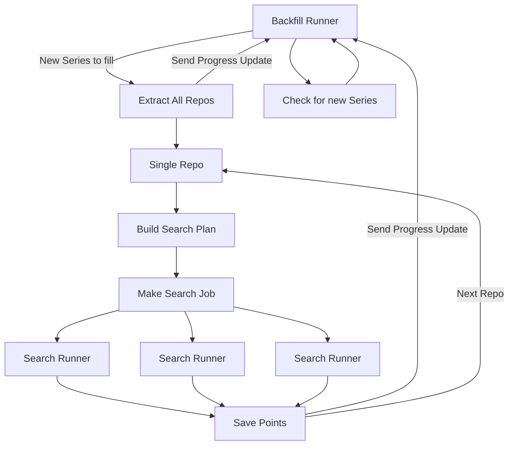

This is an exploration into reimagining what the backfilling or potentially even all query running could look like for insights.

This approach combines the process of determining what work (searches) needs to be done with the act of doing to work. It also maintains it own state so that progress can be determined. Since we can estimate the total work that needs to be done and how much progress has been made it will now be possible to report that information back to users. Additional another process can (de)prioritize backfilling of a series if it can be determined that completing the remaining work for another series is more benifical.

Below is a rough diagram to explain the current flow this approach takes. The important parts to note are that each "pipeline" plans and executes work for 1 series, 1 repo at a time and maintains and shares it's progress.

