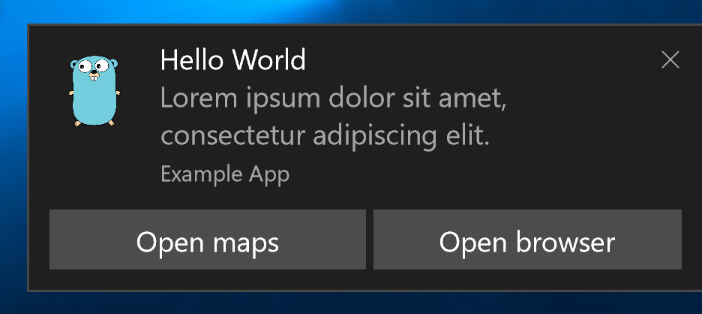
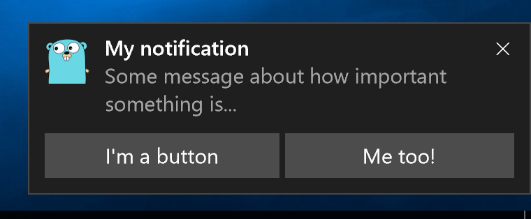
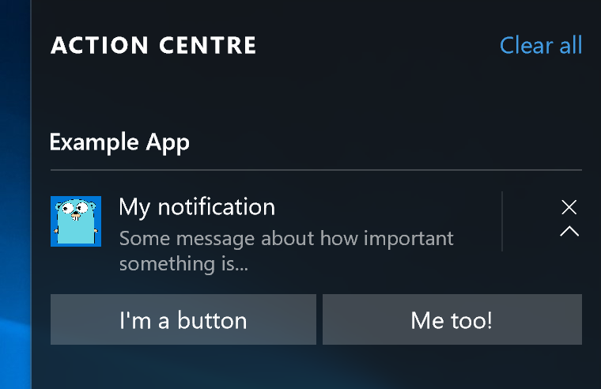

# Toast

A go package for Windows 10 toast notifications.

As seen in [jacobmarshall/pokevision-cli](https://github.com/jacobmarshall/pokevision-cli).

## CLI

As well as using go-toast within your Go projects, you can also utilise the CLI - for any of your projects.

Download [64bit](https://go-toast-downloads.s3.amazonaws.com/v1/toast64.exe) or [32bit](https://go-toast-downloads.s3.amazonaws.com/v1/toast32.exe)

```cmd
C:\Users\Example\Downloads\toast64.exe \
  --app-id "Example App" \
  --title "Hello World" \
  --message "Lorem ipsum dolor sit amet, consectetur adipiscing elit." \
  --icon "C:\Users\Example\Pictures\icon.png" \
  --audio "default" --loop \
  --duration "long" \
  --activation-arg "https://google.com" \
  --action "Open maps" --action-arg "bingmaps:?q=sushi" \
  --action "Open browser" --action-arg "http://..."
```



## Example

```go
package main

import (
    "log"

    "gopkg.in/toast.v1"
)

func main() {
    notification := toast.Notification{
        AppID: "Example App",
        Title: "My notification",
        Message: "Some message about how important something is...",
        Icon: "go.png", // This file must exist (remove this line if it doesn't)
        Actions: []toast.Action{
            {"protocol", "I'm a button", ""},
            {"protocol", "Me too!", ""},
        },
    }
    err := notification.Push()
    if err != nil {
        log.Fatalln(err)
    }
}
```

## Screenshots




